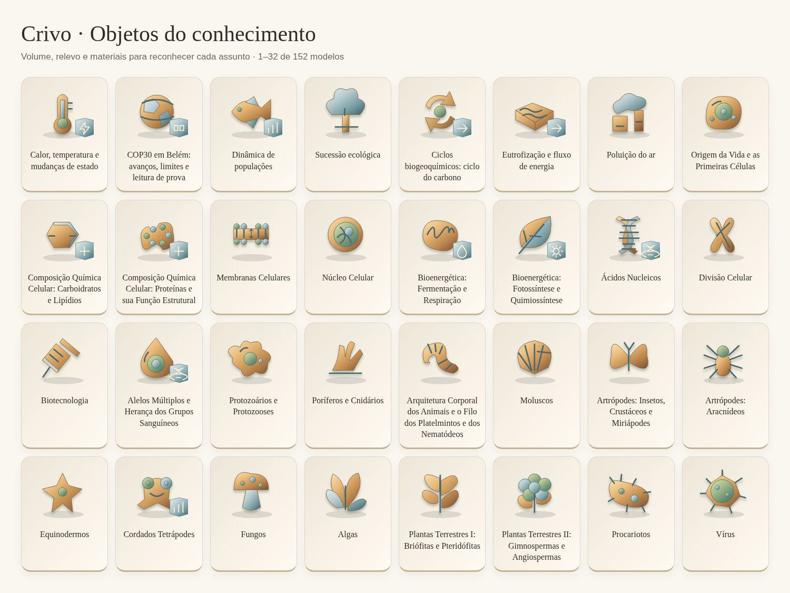
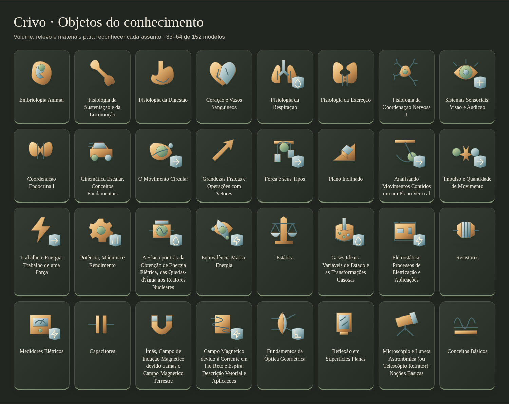
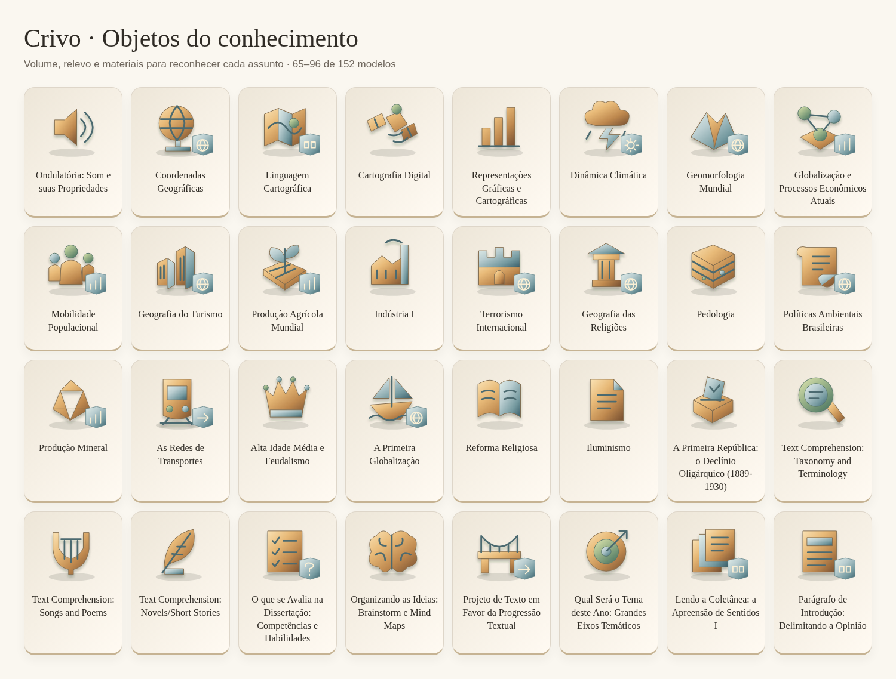
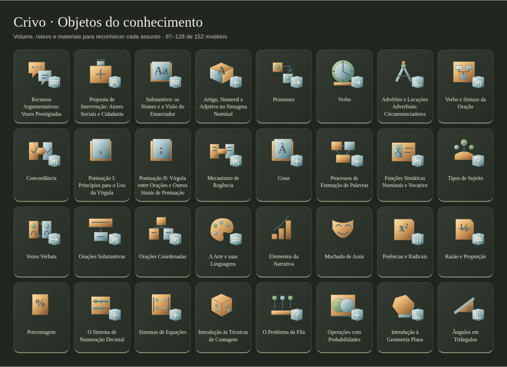
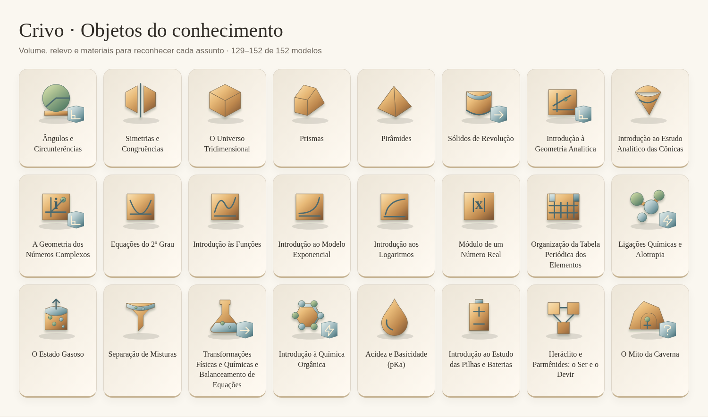

# Objetos por assunto

152 modelos em relevo associados aos 613 capítulos. Os materiais e as sombras criam a estética 3D em SVG. Os capítulos relacionados podem compartilhar um objeto; a associação individual está no índice.

