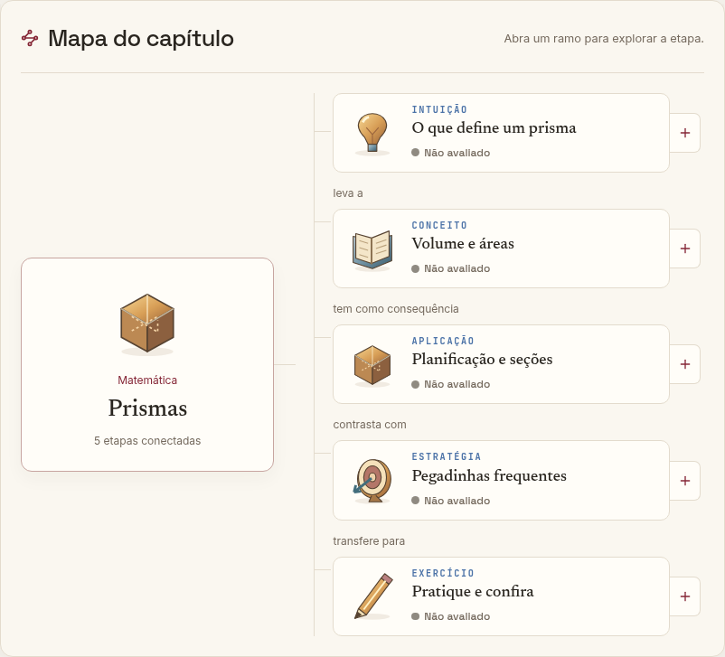

# Visual: mapas expansíveis e objetos com profundidade

A aba Visual combina a direção editorial clara, em papel e vinho, com ícones desenhados em SVG, volume, sombra e mapas que abrem os conceitos do capítulo. A cena de estudo aparece primeiro; o mapa permite expandir uma etapa e abrir o conceito no inspetor existente. Explorar, Testar e Reconstruir continuam usando os mesmos dados, evidências e progresso.

A implementação começou por Matemática. A interface compartilhada aplica o mapa e os ícones aos 83 capítulos de Matemática e aos demais capítulos existentes, incluindo Física, Química e Biologia. Os 613 artefatos primários existentes permanecem associados aos seus capítulos; esta entrega não declara que todos foram redesenhados individualmente.

## Objetos 3D de Matemática

Cinco instrumentos ganharam geometria tridimensional projetada em SVG, rotação por arraste e controles acessíveis por teclado. As medidas e cálculos existentes comandam a geometria. A vista “Desenho anotado” continua disponível e preserva os valores ao alternar.

- Cubos e paralelepípedos: arestas e diagonais.
- Prismas: bases regulares e inclinação lateral.
- Pirâmides: base, altura e seção proporcional.
- Sólidos de revolução: cilindro, cone e esfera.
- Razões entre volumes de sólidos: comparação de cubos semelhantes.

Não há dependência nova, animação contínua nem WebGL. Gráficos bidimensionais mantêm a representação adequada ao conteúdo. As transições finitas respeitam a preferência por movimento reduzido; o tema escuro continua disponível.

## Verificação

- Lint e build de produção aprovados.
- 938 testes de lógica e 1.393 testes de componentes: 2.331 aprovados.
- Quatro testes novos verificam conservação das medidas sob rotação, prisma oblíquo, seção da pirâmide e projeções finitas em todos os limites dos controles.
- Navegador: rotação e inclinação preservam os cálculos; alternância de vistas, expansão e seleção de conceitos, fechamento do inspetor no celular, Testar sem consulta, Reconstruir, larguras de 390/834/1440 pixels, tema escuro e movimento reduzido.
- Checagem automatizada de acessibilidade na tela de prismas: nenhuma violação encontrada no escopo da aba Visual.
- A varredura no navegador passou em 96 capítulos: todos os 83 de Matemática e representantes das 14 matérias. O resultado está documentado em `verificacao-capitulos.json`. Esta verificação de funcionamento não substitui revisão pedagógica individual.

## Capturas e continuidade

[Matemática](capturas/matematica.png) · [Celular](capturas/matematica-celular.png) · [Tema escuro](capturas/matematica-escuro.png) · [Física](capturas/fisica.png) · [Química](capturas/quimica.png) · [Biologia](capturas/biologia.png)

Ordem de aplicação: Matemática → Física → Química → Biologia → demais matérias. A base compartilhada já atende essa sequência. Futuras cenas específicas devem manter o mecanismo fiel de cada tema, os artefatos SVG e a integração com as evidências existentes. O ponto de retomada dos refinamentos está em `CONTINUIDADE.json`.

## Continuação em Ciências

A entrega seguinte refina o pistão adiabático, adiciona modelos espaciais de cinco moléculas ao capítulo de polaridade e uma vista de dupla-hélice ao instrumento de ácidos nucleicos. Código, limites, capturas e continuidade estão em [Ciências](ciencias/README.md).

## Aplicação ao currículo completo

A composição editorial, os ícones por assunto e a exploração em foco chegam aos 613 capítulos das 14 matérias. Inventário, verificação capítulo a capítulo, capturas e limites em [Todos os capítulos](todos-capitulos/README.md).

## Fundo personalizado

A composição de caderno agora usa mapas de ideias e ícones com volume por matéria. Ver [direção, personalização, capturas e validação](fundo-personalizado/README.md).

## Revisão individual dos mecanismos

Depois da composição visual e do fundo, a [revisão de 09/10/2026](../revisao-individual-capitulos-2026-10-09/README.md) registra os 613 capítulos separadamente e corrige casos conceituais reproduzidos em Matemática, Química e Biologia.
