# Capturas atuais para revisão visual

Fonte: 67175c5b628e0ac81c90f82a40b43496ff36c1a0; execução 38001506933. As folhas mostram as aberturas em movimento reduzido. Ainda não representam aprovação estética ou pedagógica. Amplie figuras quando houver dúvida; capturas completas estão nos artefatos da execução.

### Folha 0 — 360 px / dark

- fis-termologia-calor
- atu-cop30-belem
- bio-ecologia-introducao
- bio-ecologia-dinamica-populacoes
- bio-ecologia-invasoras-controle-biologico
- bio-ecologia-sucessao
- bio-ecologia-ciclo-carbono
- bio-ecologia-ciclo-nitrogenio

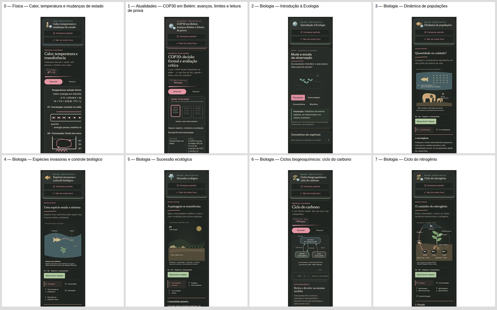

### Folha 1 — 360 px / dark

- bio-ecologia-ciclo-hidrologico-poluicao-agua
- bio-ecologia-eutrofizacao
- bio-ecologia-poluicao-ar
- bio-ecologia-biomagnificacao
- bio-ecologia-aquecimento-global-pops-biorremediacao
- summary-biologia-origem-da-vida-e-as-primeiras-celulas
- summary-biologia-composicao-quimica-celular-compostos-inorganicos
- summary-biologia-composicao-quimica-celular-carboidratos-e-lipidios

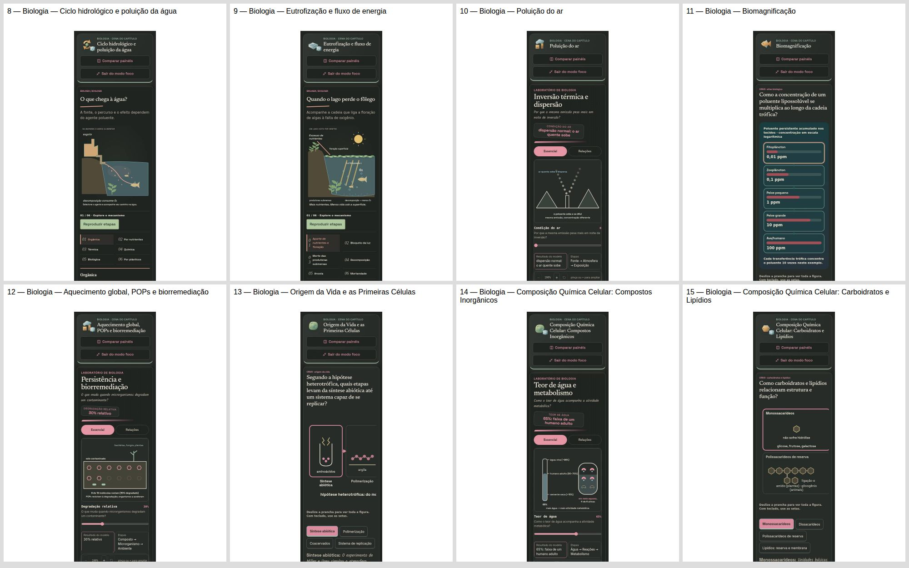

### Folha 2 — 360 px / dark

- summary-biologia-composicao-quimica-celular-proteinas-e-sua-funcao-estrutural
- summary-biologia-membranas-celulares
- summary-biologia-citoplasma-estrutura-e-componentes-i
- summary-biologia-citoplasma-estrutura-e-componentes-ii
- summary-biologia-nucleo-celular
- summary-biologia-proteinas-enzimas
- summary-biologia-bioenergetica-fermentacao-e-respiracao
- summary-biologia-bioenergetica-fotossintese-e-quimiossintese

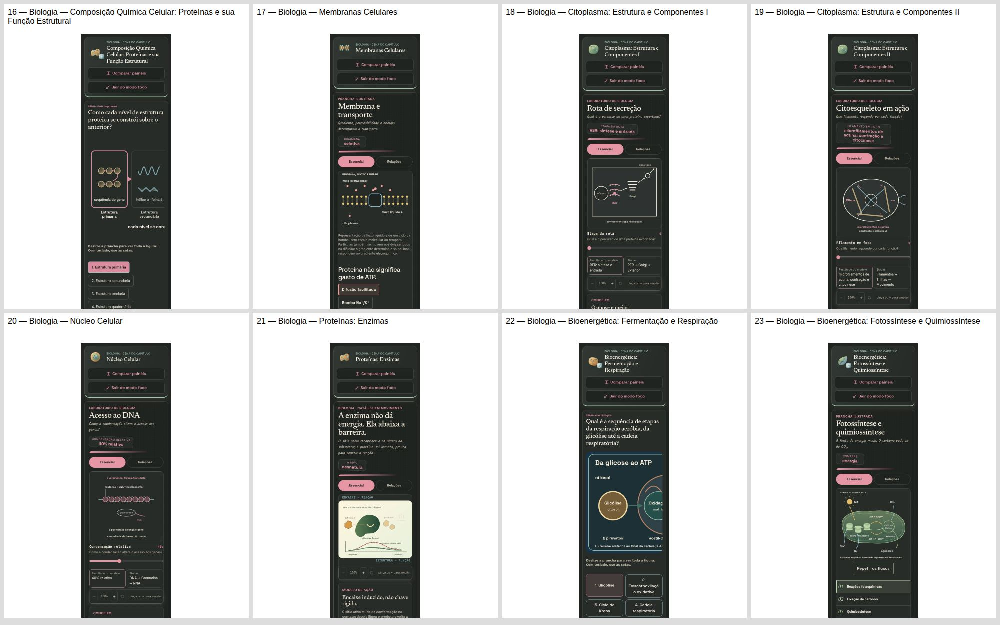

### Folha 3 — 360 px / dark

- summary-biologia-acidos-nucleicos
- summary-biologia-divisao-celular
- summary-biologia-mutacoes-cromossomicas-e-gametogenese
- summary-biologia-biotecnologia
- summary-biologia-introducao-a-genetica
- summary-biologia-alelos-multiplos-e-heranca-dos-grupos-sanguineos
- summary-biologia-heranca-sexual
- summary-biologia-segunda-lei-de-mendel

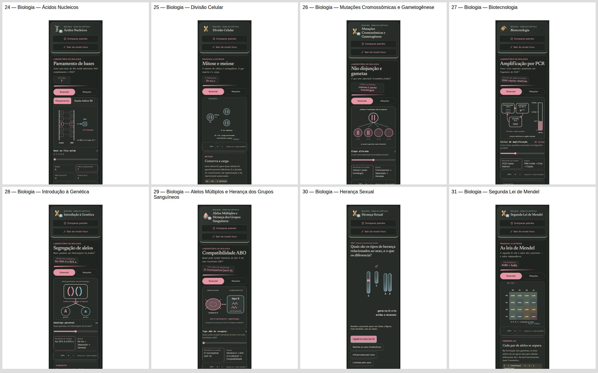

### Folha 4 — 360 px / dark

- summary-biologia-segunda-lei-de-mendel-e-interacao-genica
- summary-biologia-ligacao-genica
- summary-biologia-mutacoes-genicas
- summary-biologia-evolucao-biologica-construcao-historica
- summary-biologia-mecanismos-da-evolucao-biologica
- summary-biologia-biomas-brasileiros
- summary-biologia-classificacao-biologica-nomenclatura-cientifica-e-nocoes-de-sistematica-filogenetica
- summary-biologia-protozoarios-e-protozooses

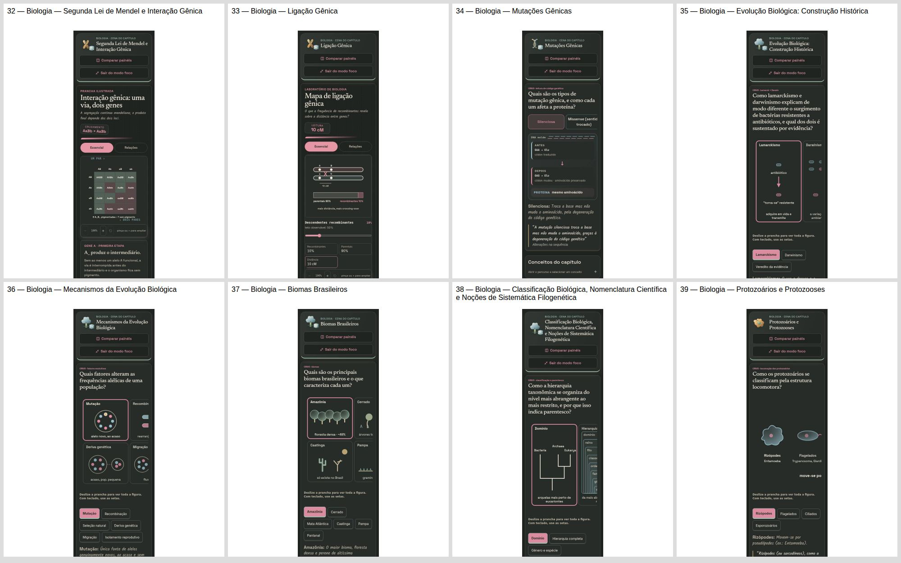

### Folha 5 — 360 px / dark

- summary-biologia-poriferos-e-cnidarios
- summary-biologia-arquitetura-corporal-dos-animais-e-o-filo-dos-platelmintos-e-dos-nematodeos
- summary-biologia-moluscos
- summary-biologia-anelideos
- summary-biologia-artropodes-insetos-crustaceos-e-miriapodes
- summary-biologia-artropodes-aracnideos
- summary-biologia-equinodermos
- summary-biologia-introducao-aos-cordados-e-os-peixes

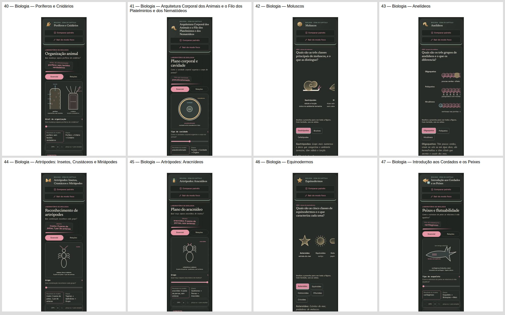

### Folha 6 — 360 px / dark

- summary-biologia-cordados-tetrapodes
- summary-biologia-fungos
- summary-biologia-algas
- summary-biologia-ciclos-de-vida
- summary-biologia-plantas-terrestres-i-briofitas-e-pteridofitas
- summary-biologia-plantas-terrestres-ii-gimnospermas-e-angiospermas
- summary-biologia-procariotos
- summary-biologia-virus

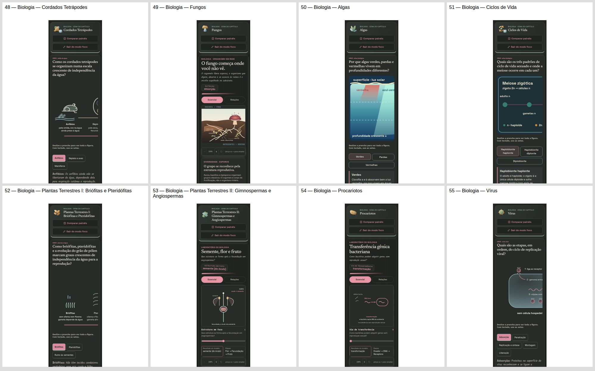

### Folha 7 — 360 px / dark

- summary-biologia-embriologia-animal
- summary-biologia-fisiologia-da-sustentacao-e-da-locomocao
- summary-biologia-fisiologia-da-digestao
- summary-biologia-sangue-e-imunologia
- summary-biologia-coracao-e-vasos-sanguineos
- summary-biologia-fisiologia-da-respiracao
- summary-biologia-fisiologia-da-excrecao
- summary-biologia-fisiologia-da-coordenacao-nervosa-i

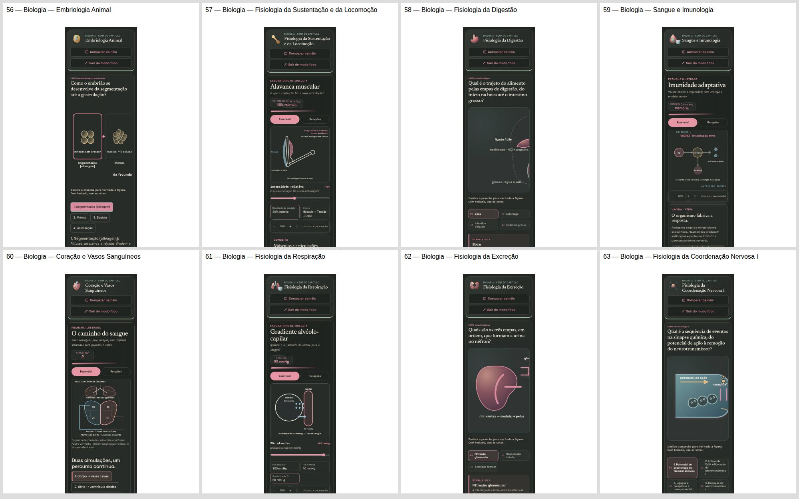

### Folha 8 — 360 px / dark

- summary-biologia-coordenacao-nervosa-ii
- summary-biologia-sistemas-sensoriais-visao-e-audicao
- summary-biologia-coordenacao-endocrina-i
- summary-biologia-coordenacao-endocrina-ii
- summary-biologia-reproducao-humana-e-metodos-contraceptivos
- summary-biologia-histologia-e-morfologia-vegetal
- summary-biologia-morfofisiologia-vegetal-caules-e-folhas
- summary-biologia-traqueofitas-transpiracao-e-reposicao-rapida-de-agua

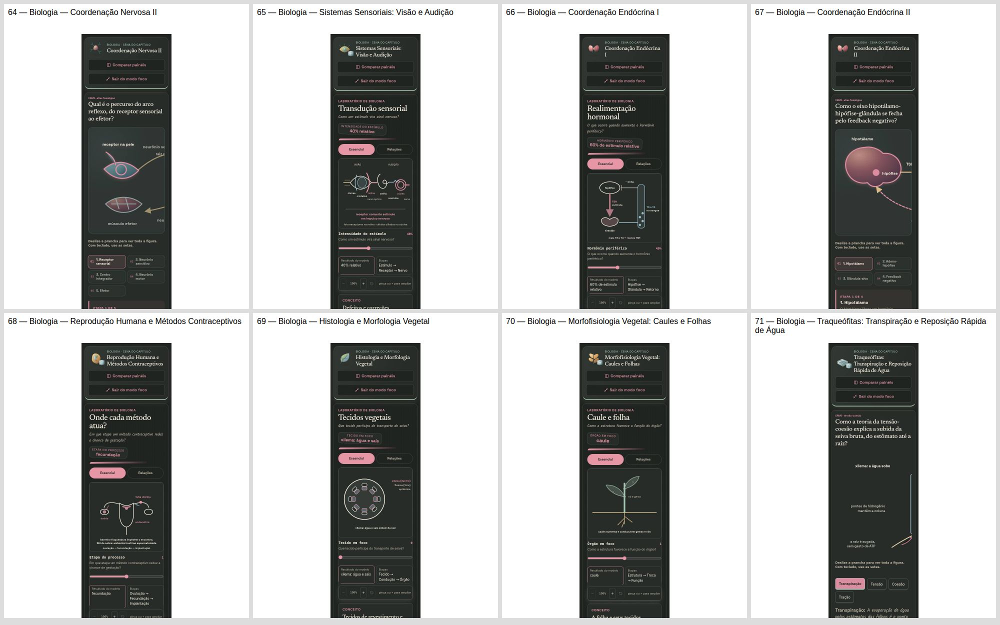

### Folha 9 — 360 px / dark

- summary-biologia-fisiologia-vegetal-transporte-no-floema
- summary-biologia-fisiologia-vegetal-hormonios-vegetais
- summary-fisica-cinematica-escalar-conceitos-fundamentais
- summary-fisica-movimento-uniforme
- summary-fisica-movimento-uniformemente-variado
- summary-fisica-o-movimento-circular
- summary-fisica-grandezas-fisicas-e-operacoes-com-vetores
- summary-fisica-velocidade-vetorial

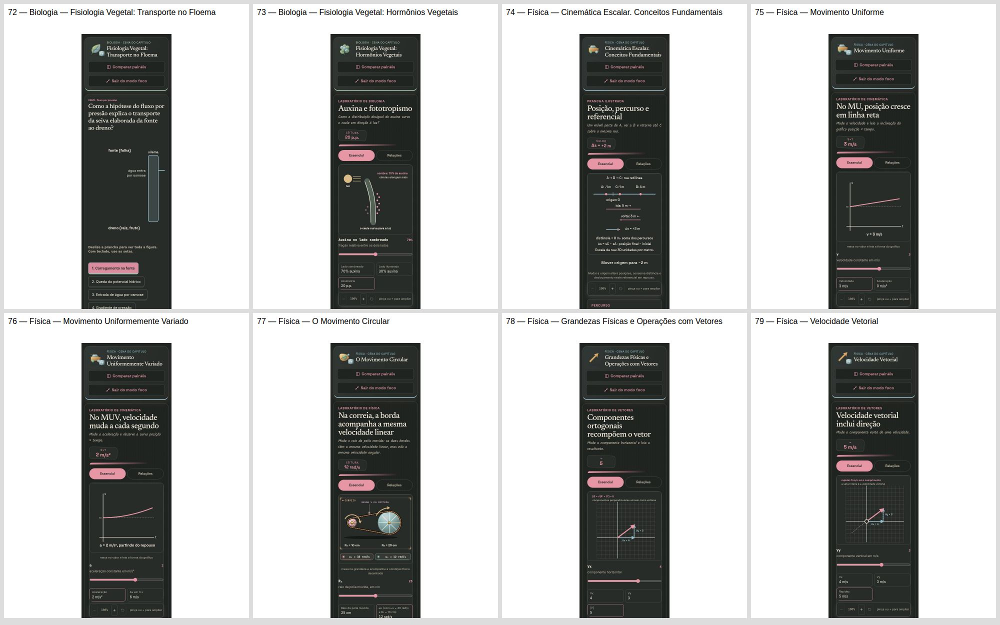

### Folha 10 — 360 px / dark

- summary-fisica-composicao-de-movimentos
- summary-fisica-aceleracao-vetorial
- summary-fisica-forca-e-seus-tipos
- summary-fisica-resultante-de-um-sistema-de-forcas
- summary-fisica-as-leis-de-newton
- summary-fisica-a-forca-de-contato
- summary-fisica-sistema-de-corpos-interagindo-e-os-elementos-transmissores-de-forca
- summary-fisica-plano-inclinado

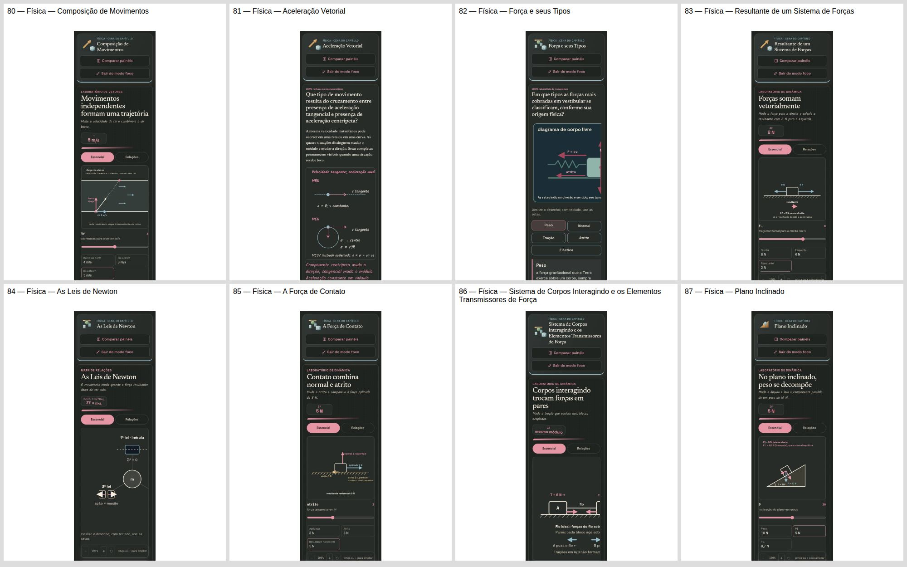

### Folha 11 — 360 px / dark

- summary-fisica-leis-da-gravitacao
- summary-fisica-dinamica-do-movimento-circular
- summary-fisica-analisando-movimentos-contidos-em-um-plano-vertical
- summary-fisica-orbitas
- summary-fisica-balistica
- summary-fisica-movimento-harmonico-simples-mhs
- summary-fisica-impulso-e-quantidade-de-movimento
- summary-fisica-sistemas-isolados-e-a-conservacao-da-quantidade-de-movimento

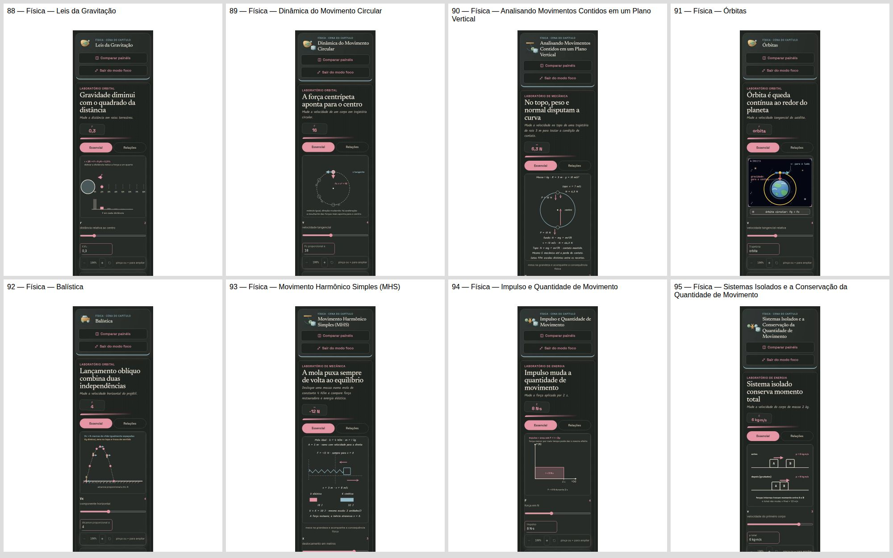

### Folha 12 — 360 px / dark

- summary-fisica-colisoes
- summary-fisica-trabalho-e-energia-trabalho-de-uma-forca
- summary-fisica-trabalho-e-energia-teorema-da-energia-cinetica
- summary-fisica-trabalho-e-energia-o-teorema-da-energia-potencial
- summary-fisica-sistemas-conservativos-e-sistemas-nao-conservativos
- summary-fisica-potencia-maquina-e-rendimento
- summary-fisica-a-fisica-por-tras-da-obtencao-de-energia-eletrica-das-quedas-d-agua-aos-reatores-nucleares
- summary-fisica-equivalencia-massa-energia

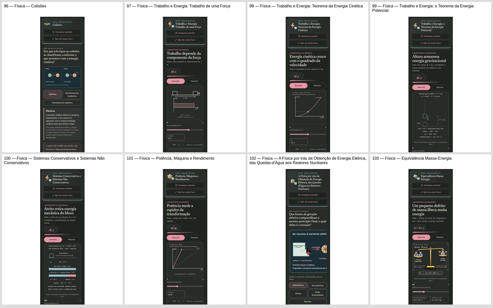

### Folha 13 — 360 px / dark

- summary-fisica-estatica
- summary-fisica-hidrostatica-densidade-e-pressao
- summary-fisica-dilatacao-ou-contracao-termica-dos-solidos-e-liquidos
- summary-fisica-calor-sensivel-e-calor-latente
- summary-fisica-gases-ideais-variaveis-de-estado-e-as-transformacoes-gasosas
- summary-fisica-trabalho-da-forca-de-pressao-do-gas
- summary-fisica-primeira-lei-da-termodinamica
- summary-fisica-primeira-lei-da-termodinamica-aplicada-a-algumas-transformacoes-particulares

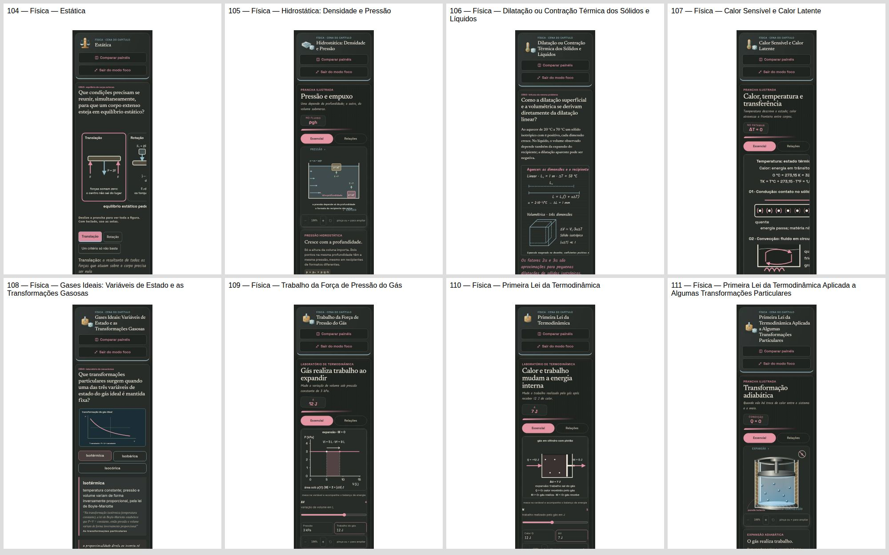

### Folha 14 — 360 px / dark

- summary-fisica-maquinas-termicas-e-ciclo-de-carnot
- summary-fisica-eletrostatica-processos-de-eletrizacao-e-aplicacoes
- summary-fisica-forca-eletrica-lei-de-coulomb
- summary-fisica-campo-eletrico
- summary-fisica-energia-potencial-e-potencial-eletrico
- summary-fisica-mapeamento-do-campo-eletrico-linhas-de-forca-e-superficies-equipotenciais
- summary-fisica-campo-eletrico-uniforme-abordagem-escalar-e-abordagem-vetorial
- summary-fisica-dinamica-das-cargas-eletricas

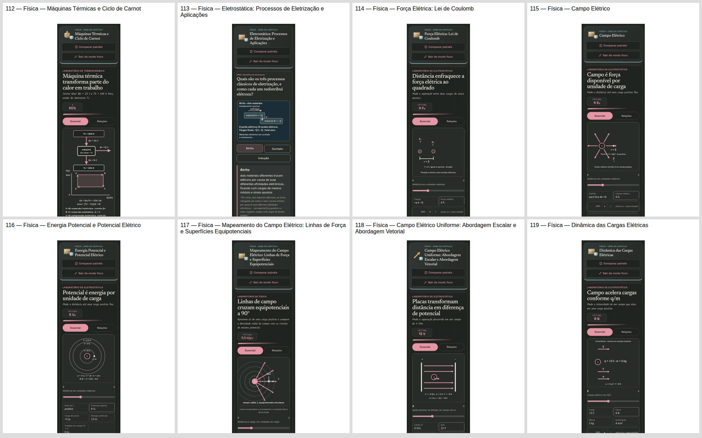

### Folha 15 — 360 px / dark

- summary-fisica-corrente-eletrica
- summary-fisica-potencia-eletrica
- summary-fisica-resistores
- summary-fisica-medidores-eletricos
- summary-fisica-geradores
- summary-fisica-receptores
- summary-fisica-circuitos-de-malha-unica
- summary-fisica-eletrodinamica-as-leis-de-kirchhoff

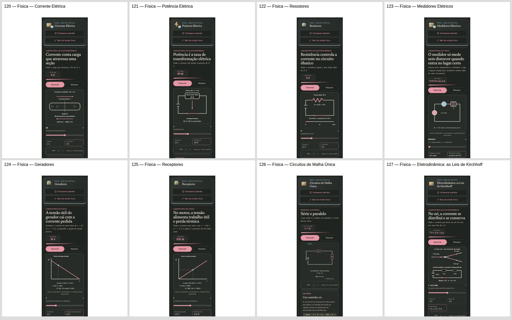

### Folha 16 — 360 px / dark

- summary-fisica-capacitores
- summary-fisica-imas-campo-de-inducao-magnetico-devido-a-imas-e-campo-magnetico-terrestre
- summary-fisica-campo-magnetico-devido-a-corrente-em-fio-reto-e-espira-descricao-vetorial-e-aplicacoes
- summary-fisica-forca-magnetica-e-analise-de-lancamentos-de-cargas-em-um-campo-magnetico-uniforme
- summary-fisica-analise-de-forca-magnetica-em-fios-percorridos-por-correntes-continuas
- summary-fisica-inducao-eletromagnetica-lei-de-lenz
- summary-fisica-inducao-eletromagnetica-analise-da-corrente-induzida-em-geradores
- summary-fisica-fundamentos-da-optica-geometrica

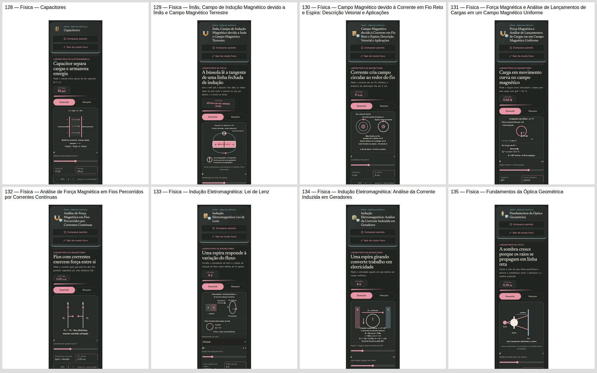

### Folha 17 — 360 px / dark

- summary-fisica-reflexao-em-superficies-planas
- summary-fisica-reflexao-em-superficies-esfericas
- summary-fisica-refracao-fundamentos-leis-e-aplicacoes
- summary-fisica-lentes-esfericas-estudo-grafico
- summary-fisica-estudo-analitico-das-lentes-esfericas
- summary-fisica-equacao-do-fabricante-de-lentes-e-associacao-de-lentes
- summary-fisica-optica-da-visao
- summary-fisica-microscopio-e-luneta-astronomica-ou-telescopio-refrator-nocoes-basicas

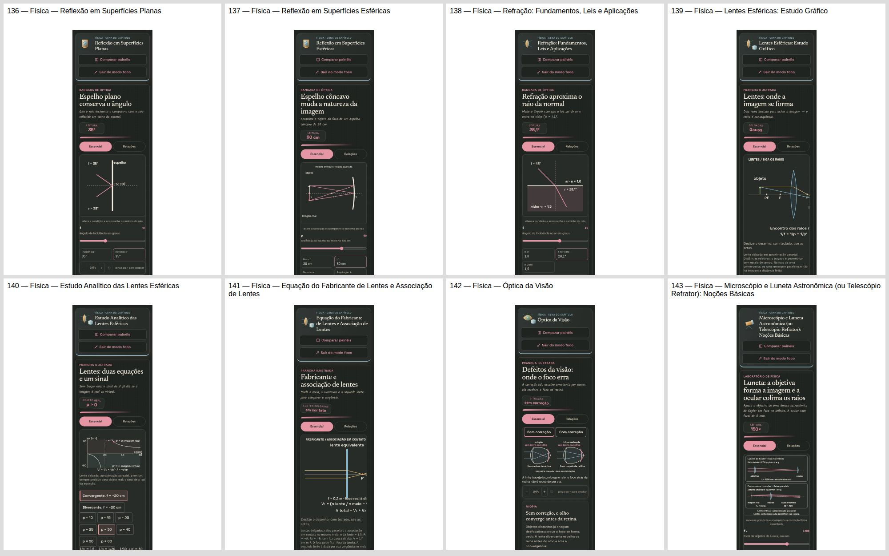

### Folha 18 — 360 px / dark

- summary-fisica-conceitos-basicos
- summary-fisica-equacao-fundamental-da-ondulatoria
- summary-fisica-ondulatoria-ondas-eletromagneticas
- summary-fisica-ondulatoria-som-e-suas-propriedades
- summary-fisica-intensidade-sonora
- summary-fisica-reflexao-eco-reverberacao-e-refracao-de-ondas
- summary-fisica-fenomenos-ondulatorios-analise-de-refracao-e-reflexao-em-cordas
- summary-fisica-fenomenos-ondulatorios-difracao-polarizacao-e-ressonancia

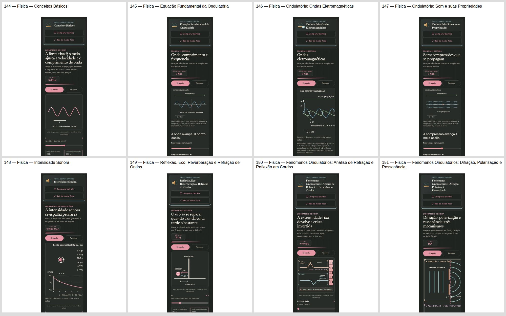

### Folha 19 — 360 px / dark

- summary-fisica-interferencia-de-ondas-analise-quantitativa-aplicacoes-e-batimento
- summary-fisica-um-caso-particular-de-interferencia-onda-estacionaria
- summary-fisica-ondas-estacionarias-em-cordas
- summary-fisica-ondas-estacionarias-em-tubos
- summary-fisica-efeito-doppler-descricao-e-estudo-quantitativo
- summary-fisica-nocoes-basicas-de-fisica-quantica
- summary-geografia-coordenadas-geograficas
- summary-geografia-movimentos-da-terra

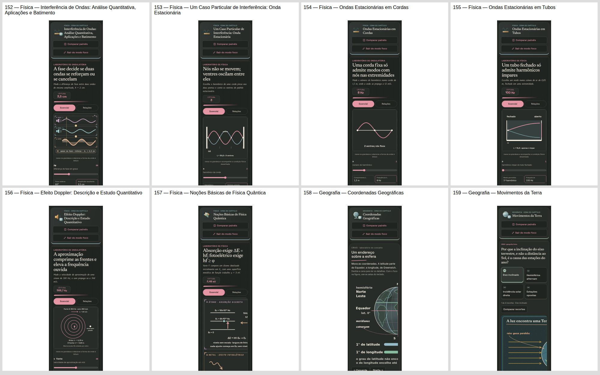

### Folha 20 — 360 px / dark

- summary-geografia-sistema-de-fusos-horarios
- summary-geografia-linguagem-cartografica
- summary-geografia-projecoes-cartograficas
- summary-geografia-cartografia-digital
- summary-geografia-representacoes-graficas-e-cartograficas
- summary-geografia-dinamica-climatica
- summary-geografia-clima-mundial
- summary-geografia-geomorfologia-mundial

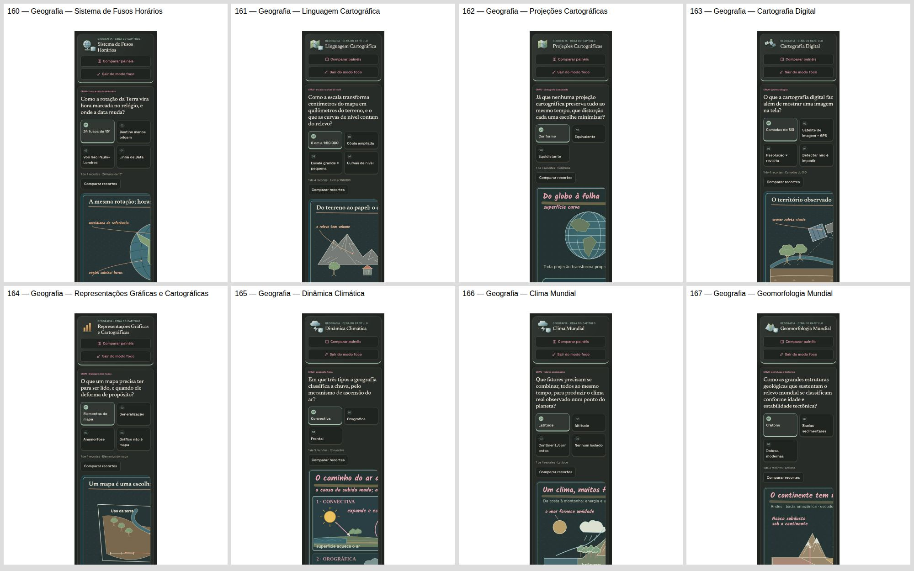

### Folha 21 — 360 px / dark

- summary-geografia-biogeografia-mundial
- summary-geografia-agua-na-superficie-terrestre
- summary-geografia-desafios-ambientais-do-seculo-xxi
- summary-geografia-geopolitica-ambiental
- summary-geografia-geopolitica-dos-recursos-hidricos
- summary-geografia-hidrogeografia-mundial
- summary-geografia-do-mundo-bipolar-ao-multipolar
- summary-geografia-globalizacao-e-processos-economicos-atuais

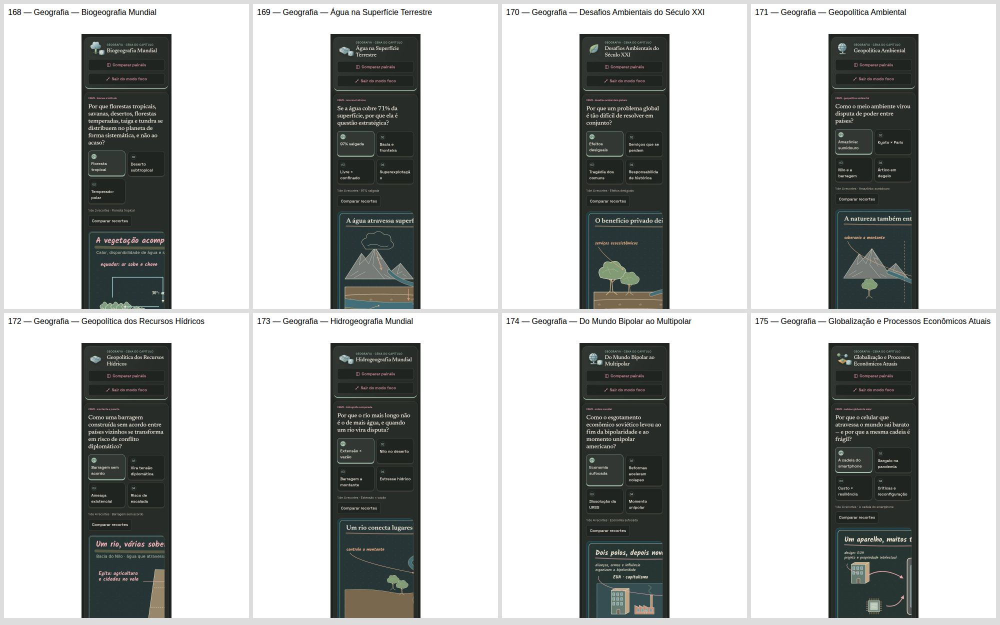

### Folha 22 — 360 px / dark

- summary-geografia-geografia-das-redes-mundiais
- summary-geografia-unilateralismo-e-multilateralismo
- summary-geografia-blocos-economicos
- summary-geografia-uniao-europeia
- summary-geografia-desigualdades-globais
- summary-geografia-mobilidade-populacional
- summary-geografia-geografia-do-turismo
- summary-geografia-producao-agricola-mundial

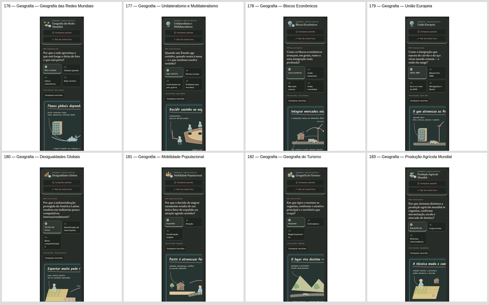

### Folha 23 — 360 px / dark

- summary-geografia-industria-i
- summary-geografia-industria-ii
- summary-geografia-gedeconomia-mundial
- summary-geografia-terrorismo-internacional
- summary-geografia-geografia-das-religioes
- summary-geografia-tensoes-geopoliticas-na-europa
- summary-geografia-geopolitica-e-geoeconomia-da-america-latina
- summary-geografia-africa-no-mundo-atual

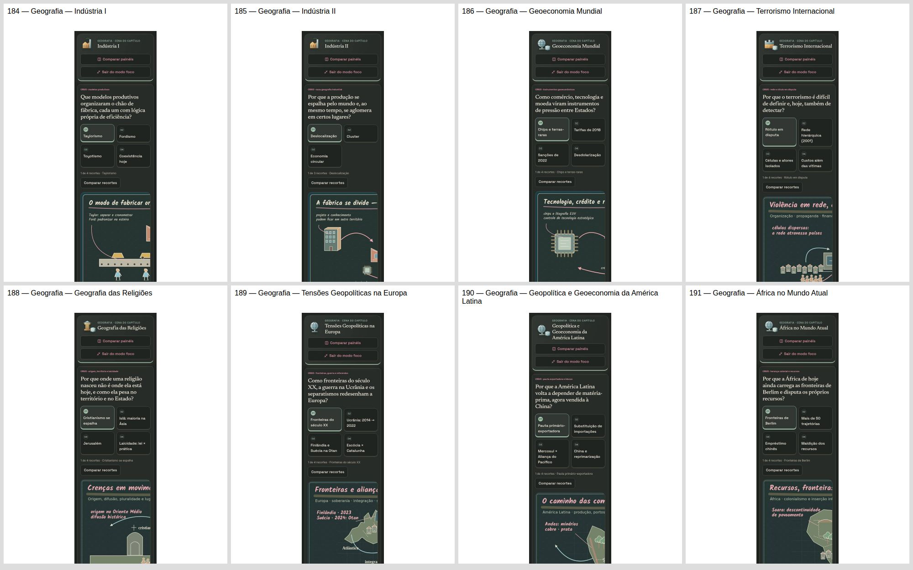

### Folha 24 — 360 px / dark

- summary-geografia-geopolitica-e-geoeconomia-da-asia
- summary-geografia-geografia-do-oriente-medio
- summary-geografia-questao-palestina
- summary-geografia-conflitos-no-mundo-arabe
- summary-geografia-paisagem-espaco-geografico-e-ciencia-geografica
- summary-geografia-geologia-e-geomorfologia
- summary-geografia-relevo-brasileiro
- summary-geografia-pedologia

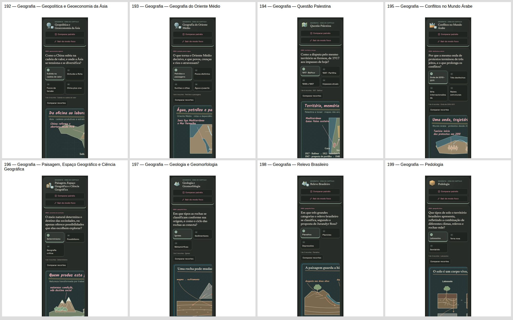

### Folha 25 — 360 px / dark

- summary-geografia-climatologia-do-brasil
- summary-geografia-biogeografia-do-brasil-i
- summary-geografia-biogeografia-do-brasil-ii
- summary-geografia-politicas-ambientais-brasileiras
- summary-geografia-hidrogeografia-do-brasil
- summary-geografia-dominios-morfoclimaticos
- summary-geografia-matriz-energetica
- summary-geografia-combustiveis-fosseis-e-biocombustiveis-no-brasil

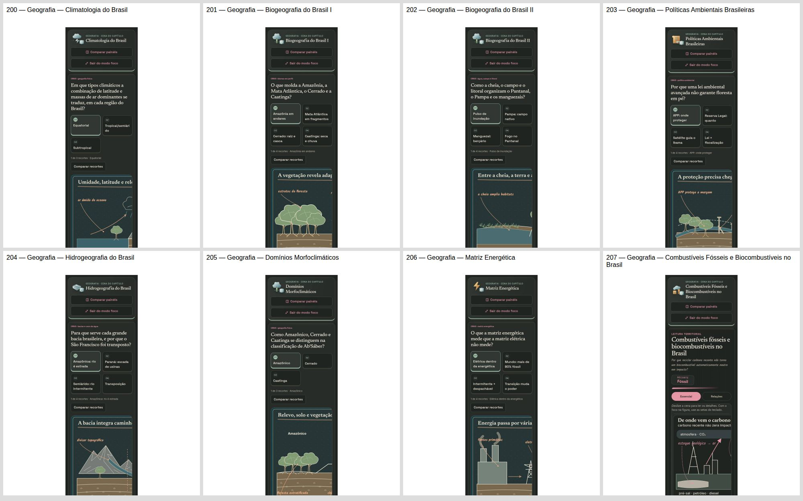

### Folha 26 — 360 px / dark

- summary-geografia-energia-eletrica-no-mundo
- summary-geografia-energia-eletrica-no-brasil
- summary-geografia-producao-mineral
- summary-geografia-o-espaco-agrario-brasileiro
- summary-geografia-o-espaco-industrial-brasileiro-i
- summary-geografia-o-espaco-industrial-brasileiro-ii
- summary-geografia-dinamica-demografica
- summary-geografia-estrutura-etnica-e-fluxos-migratorios

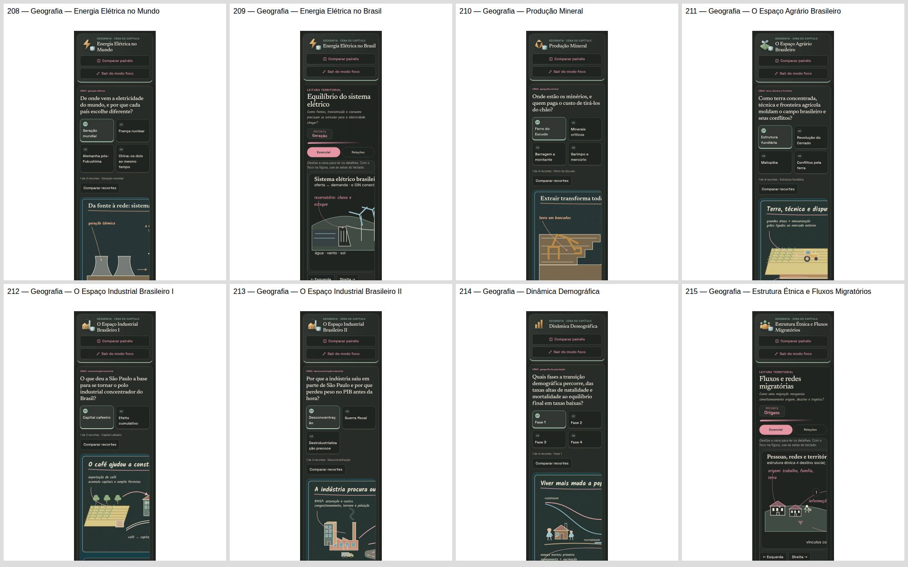

### Folha 27 — 360 px / dark

- summary-geografia-o-espaco-urbano-i
- summary-geografia-o-espaco-urbano-ii
- summary-geografia-as-redes-de-transportes
- summary-geografia-os-fluxos-do-comercio-externo
- summary-historia-introducao-a-historia-e-primeiras-civilizacoes
- summary-historia-antiguidade-classica-o-mundo-grego
- summary-historia-antiguidade-classica-o-mundo-romano
- summary-historia-alta-idade-media-e-feudalismo

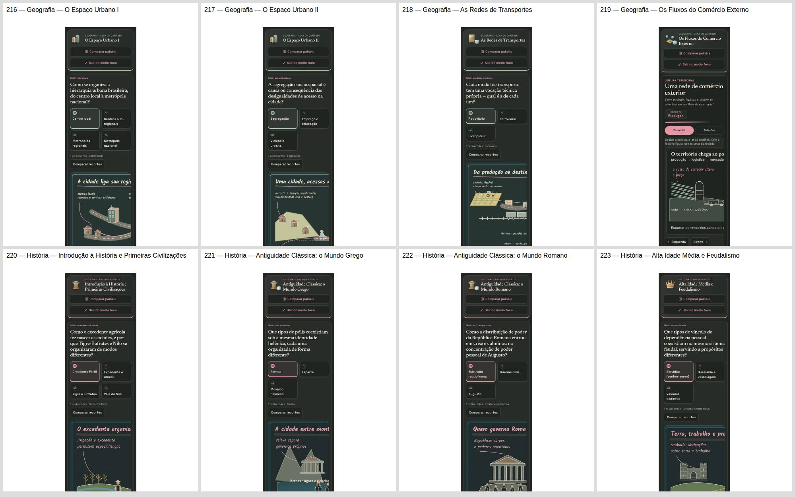

### Folha 28 — 360 px / dark

- summary-historia-baixa-idade-media
- summary-historia-a-primeira-globalizacao
- summary-historia-america-espanhola
- summary-historia-vida-urbana-e-renascimento-cultural
- summary-historia-reforma-religiosa
- summary-historia-absolutismo
- summary-historia-revolucao-industrial
- summary-historia-iluminismo

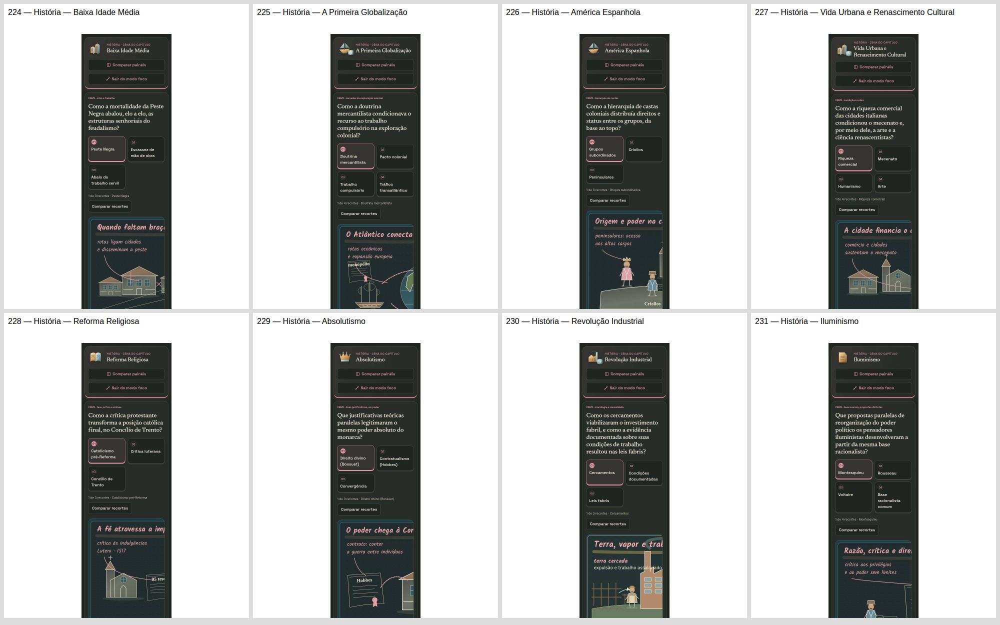

### Folha 29 — 360 px / dark

- summary-historia-revolucao-francesa
- summary-historia-america-no-seculo-xix
- summary-historia-europa-no-seculo-xix
- summary-historia-imperialismo-e-belle-epoque
- summary-historia-primeira-guerra-mundial-1914-1918
- summary-historia-grandes-revolucoes-do-seculo-xx
- summary-historia-o-periodo-entreguerras-1918-1939
- summary-historia-o-nazismo-na-alemanha

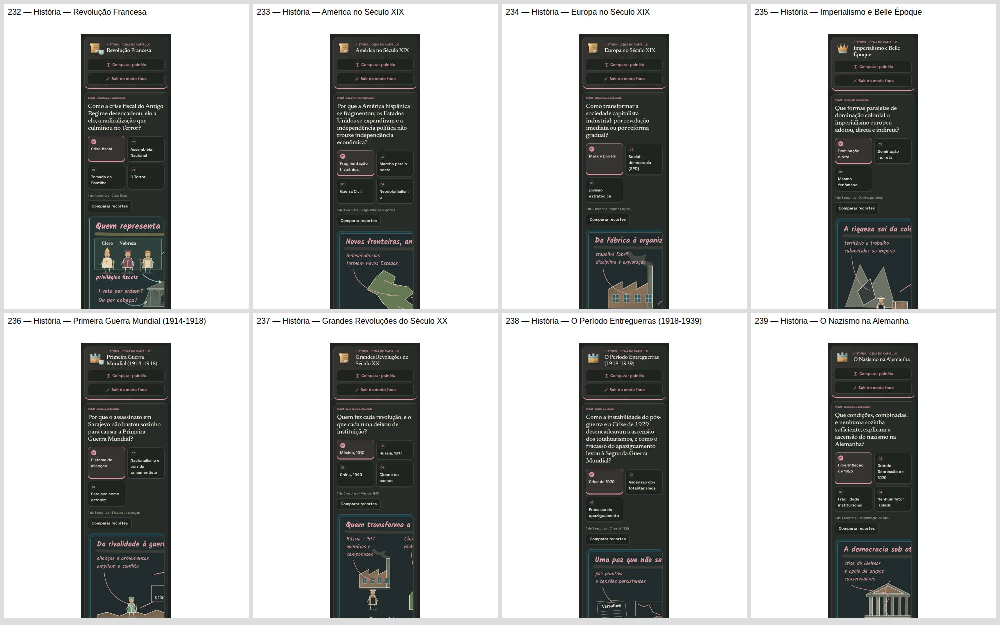

### Folha 30 — 360 px / dark

- summary-historia-segunda-guerra-mundial-1939-1945
- summary-historia-guerra-fria
- summary-historia-descolonizacao-afro-asiatica
- summary-historia-america-latina-no-seculo-xx
- summary-historia-o-fim-da-guerra-fria
- summary-historia-a-historia-e-o-brasil
- summary-historia-grandes-navegacoes-e-conquista-colonial
- summary-historia-a-montagem-da-colonizacao

### Folha 31 — 360 px / dark

- summary-historia-dinamica-interna-da-colonizacao
- summary-historia-disputas-europeias-no-brasil-colonial
- summary-historia-a-interiorizacao-da-colonizacao
- summary-historia-a-mineracao-no-brasil-colonial
- summary-historia-a-crise-do-antigo-sistema-colonial
- summary-historia-a-independencia-do-brasil
- summary-historia-brasil-imperio-formacao-do-estado-nacional-brasileiro
- summary-historia-brasil-imperio-o-periodo-regencial-1831-1840

### Folha 32 — 360 px / dark

- summary-historia-brasil-imperio-segundo-reinado-1840-1889
- summary-historia-brasil-imperio-o-declinio-do-segundo-reinado
- summary-historia-a-republica-da-espada
- summary-historia-ascensao-e-dominio-das-oligarquias
- summary-historia-a-primeira-republica-o-declinio-oligarquico-1889-1930
- summary-historia-a-era-vargas
- summary-historia-a-era-vargas-o-governo-constitucional-1934-1937
- summary-historia-a-era-vargas-o-estado-novo

### Folha 33 — 360 px / dark

- summary-historia-republica-liberal-1945-1964-democracia-em-tempos-de-guerra-fria
- summary-historia-republica-liberal-1945-1964-desenvolvimentismo-e-populismo
- summary-historia-regime-militar-1964-1985-i
- summary-historia-regime-militar-1964-1985-ii
- summary-historia-o-brasil-atual
- summary-lingua-inglesa-text-comprehension-taxonomy-and-terminology
- summary-lingua-inglesa-text-comprehension-songs-and-poems
- summary-lingua-inglesa-text-comprehension-calories-and-energy

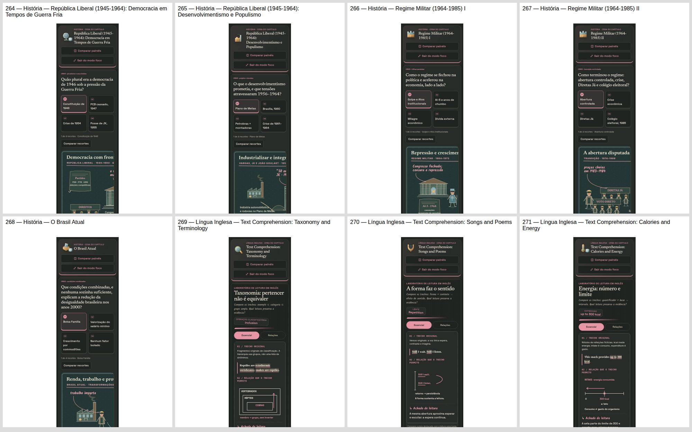

### Folha 34 — 360 px / dark

- summary-lingua-inglesa-text-comprehension-earthquakes
- summary-lingua-inglesa-text-comprehension-hurricanes
- summary-lingua-inglesa-text-comprehension-ecology-greenhouse-gases
- summary-lingua-inglesa-text-comprehension-pollution
- summary-lingua-inglesa-text-comprehension-the-human-brain
- summary-lingua-inglesa-text-comprehension-global-warming
- summary-lingua-inglesa-text-comprehension-novels-short-stories
- summary-lingua-inglesa-text-comprehension-bacteria

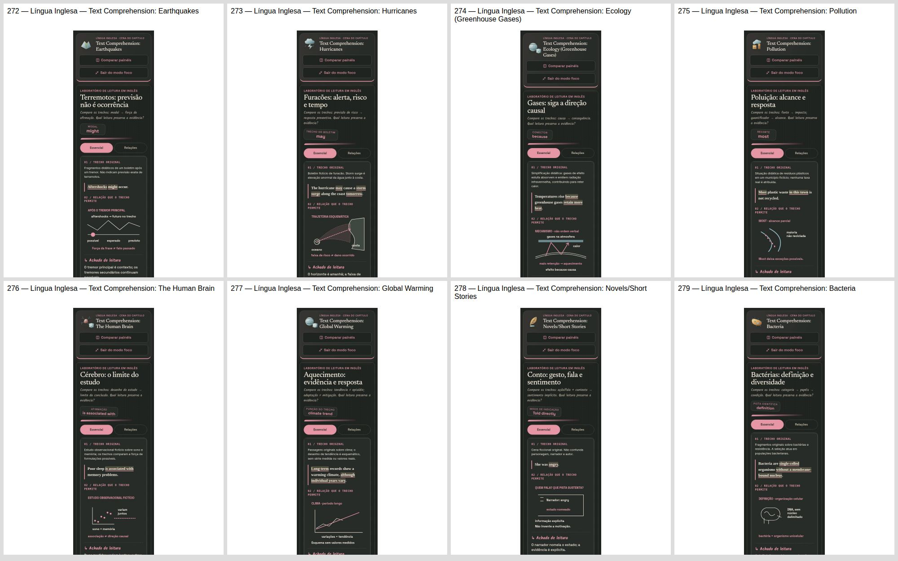

### Folha 35 — 360 px / dark

- summary-lingua-inglesa-text-comprehension-viruses
- summary-lingua-inglesa-text-comprehension-discrimination-against-women
- summary-lingua-inglesa-text-comprehension-women-empowerment
- summary-lingua-inglesa-text-comprehension-digital-technology
- summary-lingua-inglesa-text-comprehension-health-probiotics
- summary-lingua-inglesa-text-comprehension-stem-cells
- summary-redacao-a-dissertacao-no-vestibular-mitos-e-verdades
- summary-redacao-o-que-se-avalia-na-dissertacao-competencias-e-habilidades

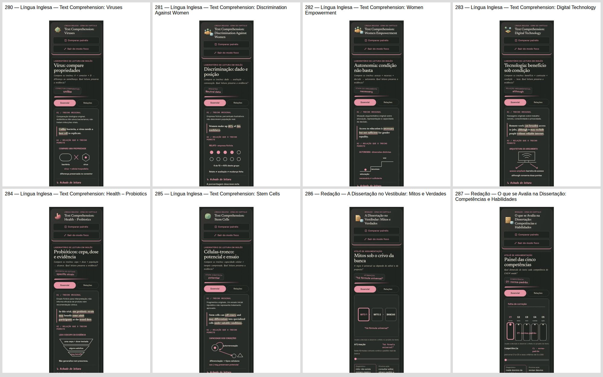

### Folha 36 — 360 px / dark

- summary-redacao-organizando-as-ideias-brainstorm-e-mind-maps
- summary-redacao-projeto-de-texto-em-favor-da-progressao-textual
- summary-redacao-repertorio-o-diferencial-de-redacoes-de-sucesso
- summary-redacao-qual-sera-o-tema-deste-ano-grandes-eixos-tematicos
- summary-redacao-diferentes-graus-de-adequacao-a-proposta
- summary-redacao-tangenciamento-e-fuga-a-fronteira-do-tema
- summary-redacao-generos-e-sua-relacao-com-a-estrutura-do-texto
- summary-redacao-estrutura-classica-do-texto-dissertativo

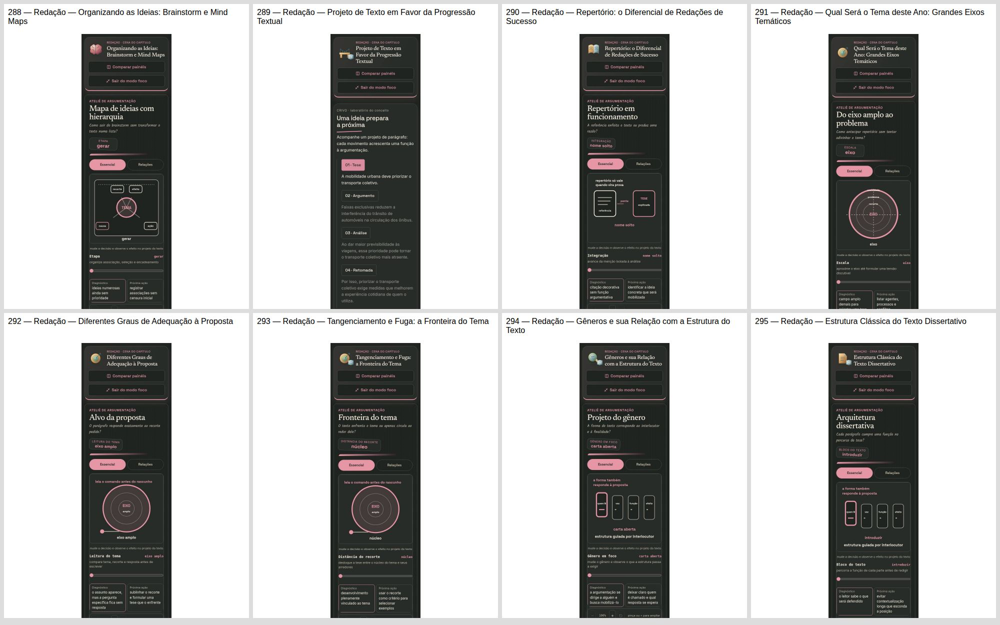

### Folha 37 — 360 px / dark

- summary-redacao-lendo-a-coletanea-a-apreensao-de-sentidos-i
- summary-redacao-lendo-a-coletanea-a-apreensao-de-sentidos-ii
- summary-redacao-lendo-a-coletanea-a-compreensao-e-o-texto-autoral-i
- summary-redacao-lendo-a-coletanea-a-compreensao-e-o-texto-autoral-ii
- summary-redacao-incrementando-o-repertorio-meio-ambiente
- summary-redacao-analisando-tema-de-redacao-meio-ambiente
- summary-redacao-incrementando-o-repertorio-educacao-e-trabalho
- summary-redacao-analisando-tema-de-redacao-educacao-e-trabalho

### Folha 38 — 360 px / dark

- summary-redacao-incrementando-o-repertorio-temas-abstratos
- summary-redacao-analisando-tema-abstrato-de-redacao
- summary-redacao-incrementando-o-repertorio-corpo-saude-e-sexualidade
- summary-redacao-analisando-tema-de-redacao-corpo-saude-e-sexualidade
- summary-redacao-incrementando-o-repertorio-violencia-leis-e-punicao
- summary-redacao-analisando-tema-de-redacao-violencia-leis-e-punicao
- summary-redacao-incrementando-o-repertorio-cidadania-e-poder
- summary-redacao-analisando-tema-de-redacao-cidadania-e-poder

### Folha 39 — 360 px / dark

- summary-redacao-incrementando-o-repertorio-arte-cultura-e-relacoes-sociais
- summary-redacao-analisando-o-tema-de-redacao-arte-cultura-e-relacoes-sociais
- summary-redacao-incrementando-o-repertorio-midia-e-sociedade
- summary-redacao-analisando-tema-de-redacao-midia-e-sociedade
- summary-redacao-paragrafo-de-introducao-delimitando-a-opiniao
- summary-redacao-paragrafo-de-introducao-como-contextualizar
- summary-redacao-argumentacao-auditorio-particular-e-universal
- summary-redacao-argumentacao-quase-logica-e-efeito-de-verdade

### Folha 40 — 360 px / dark

- summary-redacao-argumentacao-e-coerencia-interna
- summary-redacao-argumentacao-e-coerencia-externa
- summary-redacao-recursos-argumentativos-dados-numericos-e-exemplos
- summary-redacao-recursos-argumentativos-vozes-prestigiadas
- summary-redacao-ressalvando-o-ponto-de-vista-contrario
- summary-redacao-refutando-o-ponto-contrario
- summary-redacao-recursos-argumentativos-interdiscursividade-e-intertextualidade
- summary-redacao-recursos-argumentativos-temas-de-redacao-ja-analisados

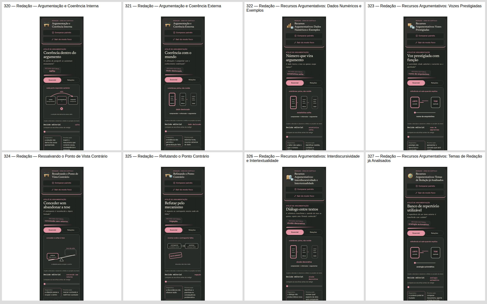

### Folha 41 — 360 px / dark

- summary-redacao-recursos-argumentativos-fatos-da-atualidade
- summary-redacao-recursos-argumentativos-multiplos-dominios-do-saber
- summary-redacao-conclusao-por-sintese-ou-retomada-da-tese
- summary-redacao-conclusao-sumarizacao-focalizacao-e-expressividade
- summary-redacao-proposta-de-intervencao-atores-sociais-e-cidadania
- summary-redacao-proposta-de-intervencao-viabilizacao-e-inovacao
- summary-redacao-proposta-de-intervencao-coerencia-argumentativa
- summary-redacao-proposta-de-intervencao-respeito-aos-direitos-humanos

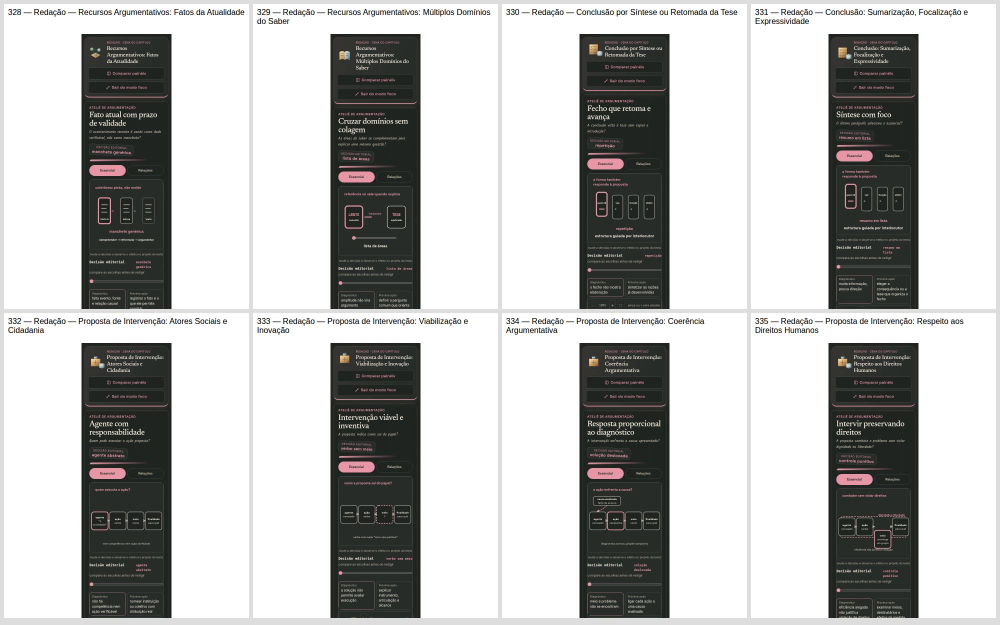

### Folha 42 — 360 px / dark

- summary-redacao-recursos-de-coesao-referencial-no-texto-dissertativo
- summary-redacao-recursos-de-coesao-sequencial-no-texto-dissertativo
- summary-redacao-coesao-no-texto-dissertativo-analise-de-problemas
- summary-redacao-recursos-linguisticos-norma-clareza-e-expressividade
- summary-redacao-os-direitos-humanos-de-1-geracao-direitos-individuais
- summary-redacao-os-direitos-humanos-de-2-e-3-geracao-direitos-sociais-coletivos-e-difusos
- summary-redacao-redacoes-nota-1000-trunfos-a-inspirar
- summary-redacao-redacoes-na-midia-como-aprimorar

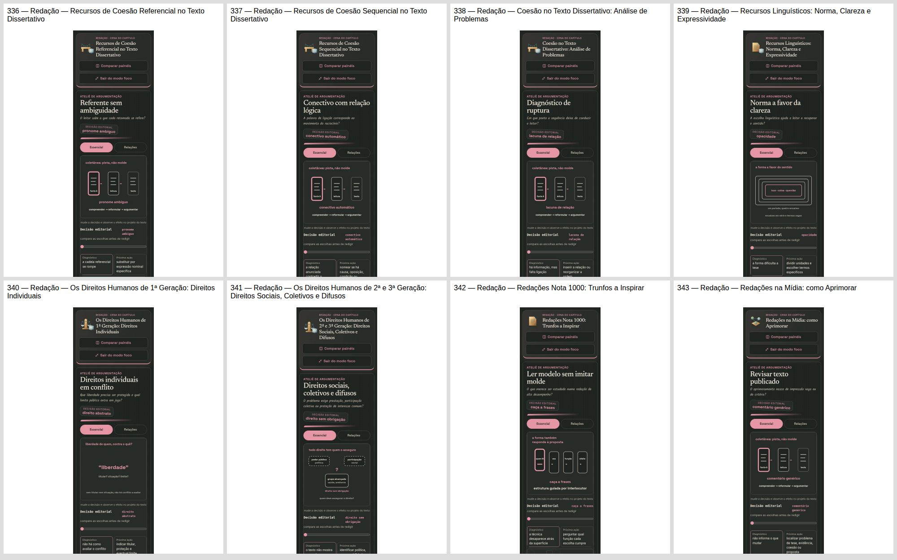

### Folha 43 — 360 px / dark

- summary-gramatica-lingua-um-sistema-complexo
- summary-gramatica-variacao-linguistica
- summary-gramatica-substantivo-os-nomes-e-a-visao-do-enunciador
- summary-gramatica-tipos-de-texto-explorando-elementos-concretos-e-conceitos-abstratos
- summary-gramatica-artigo-numeral-e-adjetivo-no-sintagma-nominal
- summary-gramatica-pronomes
- summary-gramatica-verbo
- summary-gramatica-adverbio-e-locucoes-adverbiais-circunstanciadores

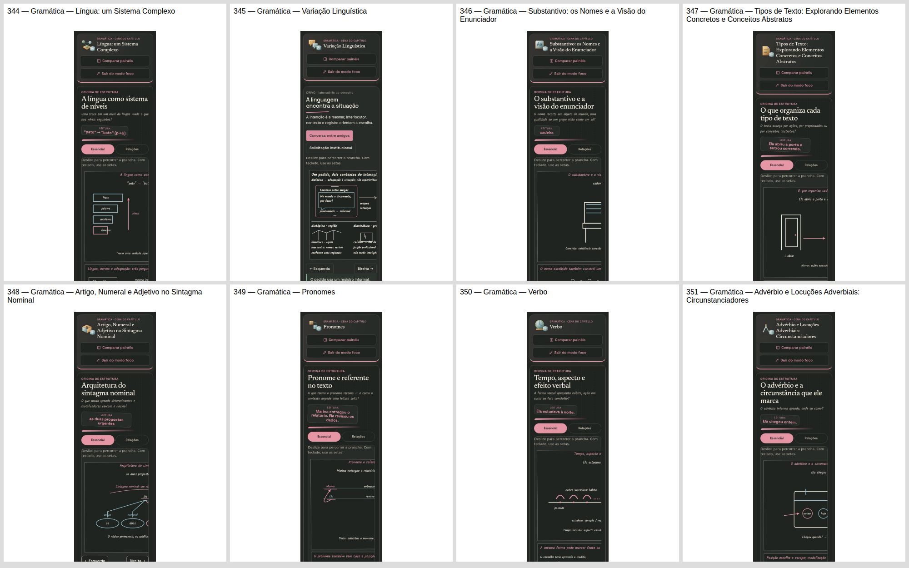

### Folha 44 — 360 px / dark

- summary-gramatica-verbo-e-sintaxe-da-oracao
- summary-gramatica-concordancia
- summary-gramatica-significados-implicitos
- summary-gramatica-tipos-de-discurso
- summary-gramatica-pontuacao-i-principios-para-o-uso-da-virgula
- summary-gramatica-pontuacao-ii-virgula-entre-oracoes-e-outros-sinais-de-pontuacao
- summary-gramatica-o-lexico-em-contexto-variadas-possibilidades-semanticas
- summary-gramatica-ambiguidade-duplicidade-no-lexico-e-na-sintaxe

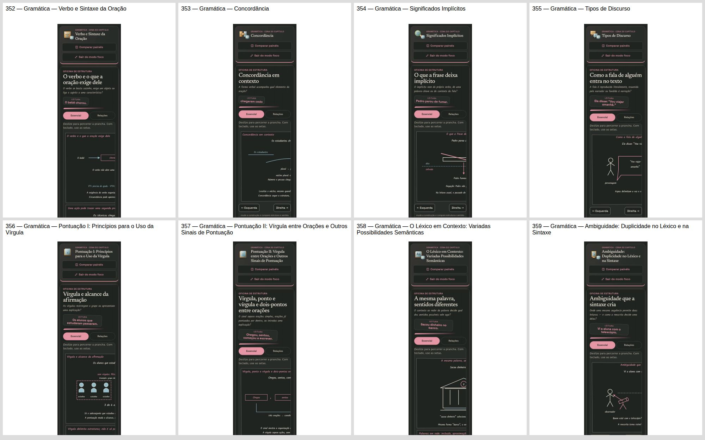

### Folha 45 — 360 px / dark

- summary-gramatica-mecanismo-de-regencia
- summary-gramatica-crase
- summary-gramatica-processos-de-formacao-de-palavras
- summary-gramatica-funcoes-sintaticas-nominais-e-vocativo
- summary-gramatica-tipos-de-sujeito
- summary-gramatica-vozes-verbais
- summary-gramatica-oracoes-substantivas
- summary-gramatica-oracoes-adjetivas

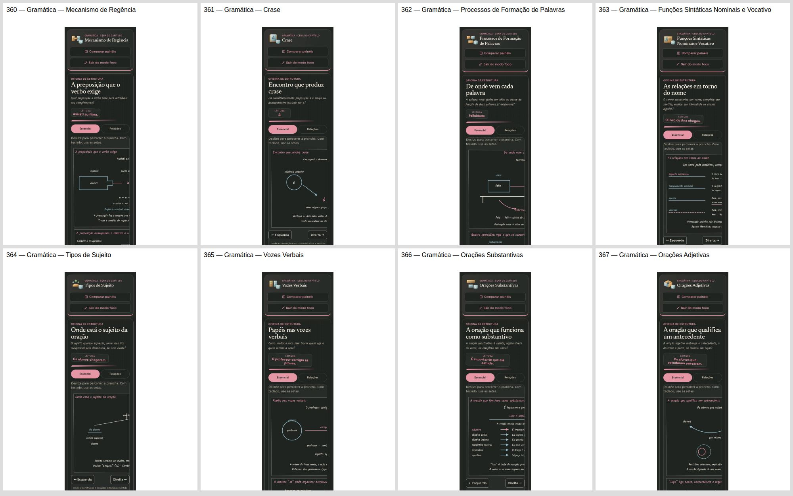

### Folha 46 — 360 px / dark

- summary-gramatica-oracoes-adverbiais
- summary-gramatica-oracoes-coordenadas
- summary-literatura-a-arte-e-suas-linguagens
- summary-literatura-texto-literario-x-texto-nao-literario
- summary-literatura-trovadorismo-e-humanismo
- summary-literatura-renascimento-e-camoes
- summary-literatura-brasil-primeiros-registros
- summary-literatura-a-estetica-barroca

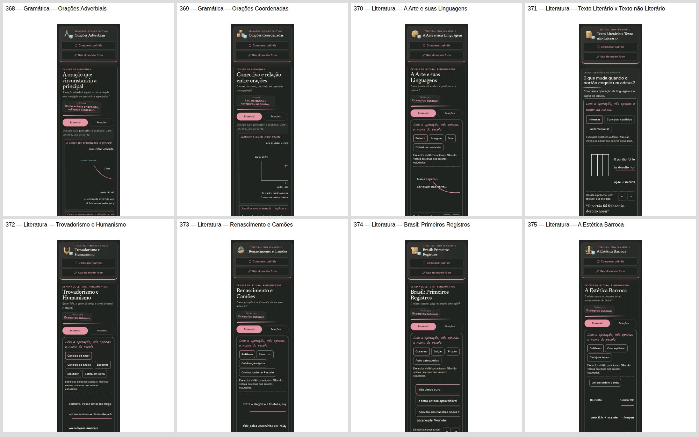

### Folha 47 — 360 px / dark

- summary-literatura-a-estetica-neoclassica
- summary-literatura-a-estetica-romantica-poesia
- summary-literatura-elementos-da-narrativa
- summary-literatura-a-estetica-romantica-prosa
- summary-literatura-a-estetica-realista
- summary-literatura-machado-de-assis
- summary-literatura-naturalismo
- summary-literatura-realismo-portugues-eca-de-queiros

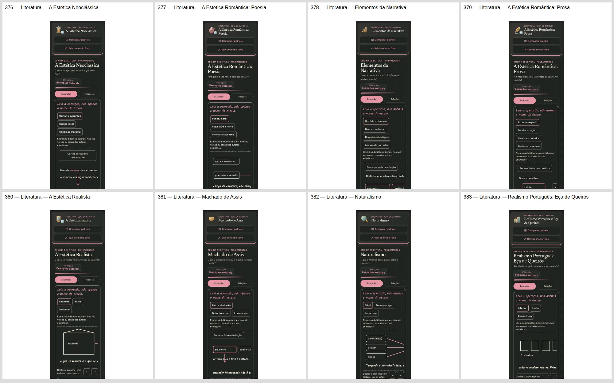

### Folha 48 — 360 px / dark

- summary-literatura-parnasianismo
- summary-literatura-simbolismo
- summary-literatura-pre-modernismo
- summary-literatura-vanguardas-artisticas
- summary-literatura-fernando-pessoa
- summary-literatura-semana-de-arte-moderna
- summary-literatura-modernismo-no-brasil-primeira-geracao
- summary-literatura-segunda-geracao-modernista-prosa

### Folha 49 — 360 px / dark

- summary-literatura-graciliano-ramos
- summary-literatura-segunda-geracao-modernista-poesia
- summary-literatura-carlos-drummond-de-andrade
- summary-literatura-joao-cabral-de-melo-neto
- summary-literatura-poesia-concreta
- summary-literatura-clarice-lispector
- summary-literatura-guimaraes-rosa
- summary-literatura-poesia-brasileira-1960-1980

### Folha 50 — 360 px / dark

- summary-literatura-prosa-brasileira-1960-1980
- summary-literatura-literatura-lusofona-contemporanea
- summary-literatura-poesia-brasileira-contemporanea
- summary-literatura-prosa-brasileira-contemporanea
- summary-literatura-artes-plasticas-brasileiras
- summary-literatura-teatro-brasileiro
- summary-literatura-cancioneiro-popular-brasileiro
- summary-entendimento-de-texto-fatores-de-textualidade

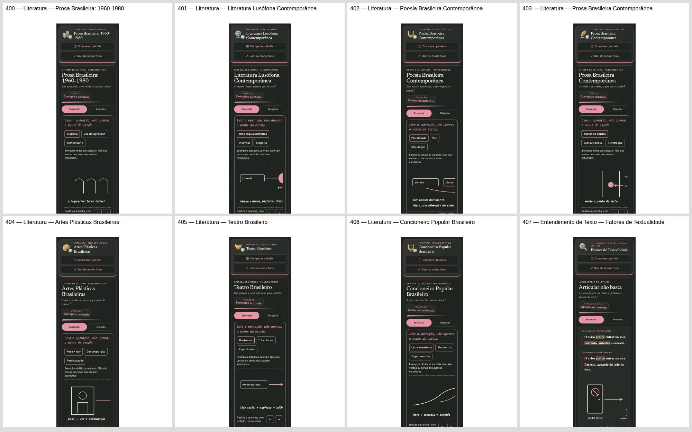

### Folha 51 — 360 px / dark

- summary-entendimento-de-texto-os-dois-niveis-da-leitura
- summary-entendimento-de-texto-intertextualidade-e-interdiscursividade
- summary-entendimento-de-texto-generos-textuais
- summary-entendimento-de-texto-generos-narrativos-e-niveis-de-compreensao
- summary-entendimento-de-texto-generos-nao-verbais-fundamentos-de-leitura
- summary-entendimento-de-texto-funcoes-da-linguagem
- summary-entendimento-de-texto-funcao-poetica-e-linguagem-literaria
- summary-entendimento-de-texto-figuras-de-linguagem

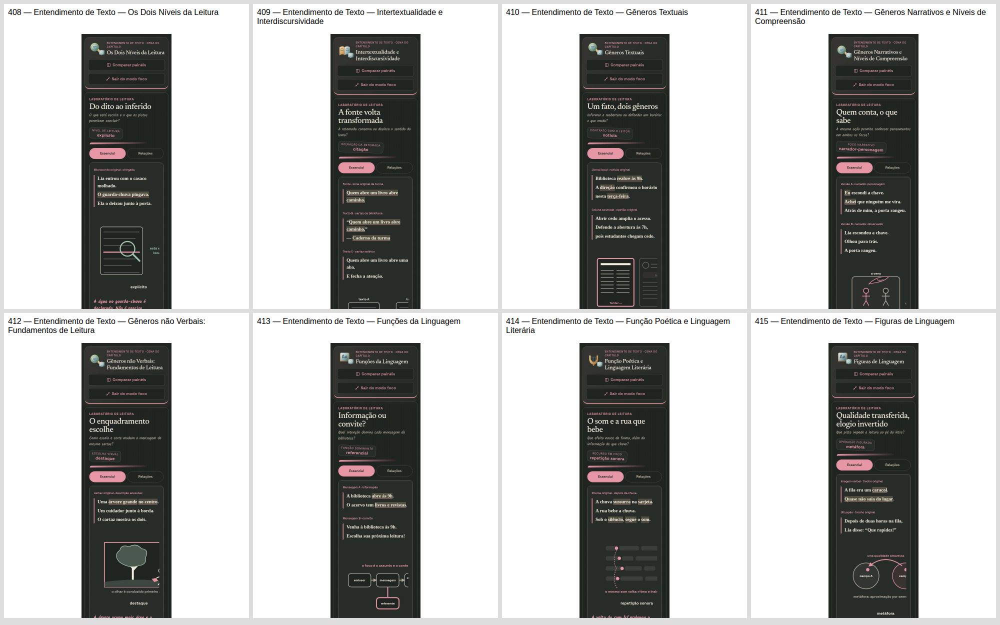

### Folha 52 — 360 px / dark

- summary-entendimento-de-texto-modelos-de-leitura-e-distorcoes-interpretativas
- summary-entendimento-de-texto-leitura-de-textos-comicos
- summary-entendimento-de-texto-tecnologias-digitais-da-informacao-e-comunicacao-tdic-impactos-sociais
- summary-matematica-potencias-e-radicais
- summary-matematica-razao-e-proporcao
- summary-matematica-porcentagem
- summary-matematica-o-sistema-de-numeracao-decimal
- summary-matematica-introducao-a-teoria-dos-numeros-inteiros

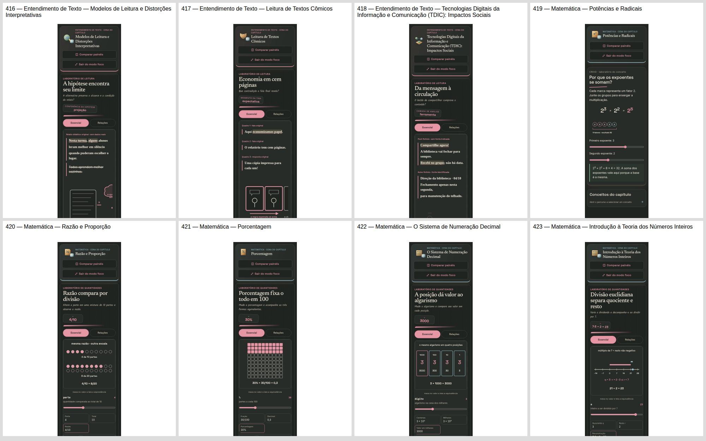

### Folha 53 — 360 px / dark

- summary-matematica-introducao-as-sequencias
- summary-matematica-progressao-aritmetica
- summary-matematica-progressao-geometrica
- summary-matematica-sequencias
- summary-matematica-sistemas-de-equacoes
- summary-matematica-tabelas-e-matrizes
- summary-matematica-multiplicacao-de-matrizes
- summary-matematica-determinantes

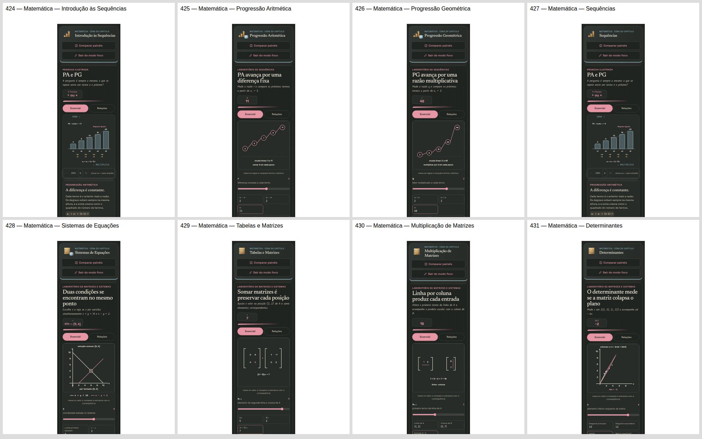

### Folha 54 — 360 px / dark

- summary-matematica-discussao-de-sistemas-lineares
- summary-matematica-medias
- summary-matematica-introducao-as-tecnicas-de-contagem
- summary-matematica-o-problema-da-fila
- summary-matematica-o-problema-do-grupo
- summary-matematica-tecnicas-de-contagem
- summary-matematica-operacoes-com-probabilidades
- summary-matematica-eventos-disjuntos-e-eventos-independentes

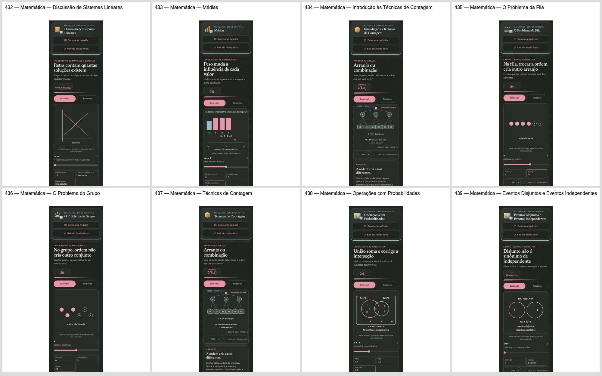

### Folha 55 — 360 px / dark

- summary-matematica-estatistica-descritiva
- summary-matematica-introducao-a-geometria-plana
- summary-matematica-angulos-em-triangulos
- summary-matematica-angulos-em-poligonos
- summary-matematica-angulos-e-circunferencias
- summary-matematica-simetrias-e-congruencias
- summary-matematica-identificacao-de-simetrias-i
- summary-matematica-identificacao-de-simetrias-ii

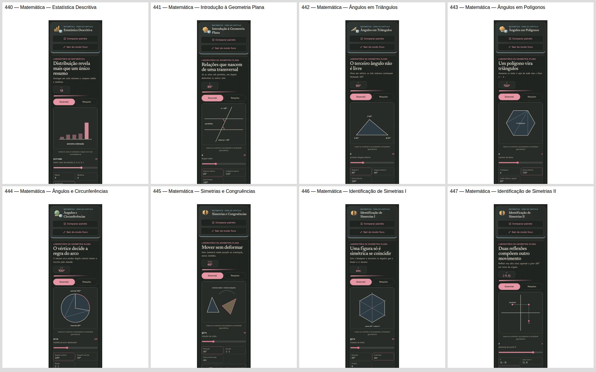

### Folha 56 — 360 px / dark

- summary-matematica-a-geometria-da-proporcionalidade
- summary-matematica-semelhanca-de-triangulos
- summary-matematica-o-ponto-medio-e-o-baricentro-de-um-triangulo
- summary-matematica-triangulo-retangulo
- summary-matematica-a-geometria-metrica-plana
- summary-matematica-areas-de-poligonos
- summary-matematica-area-do-circulo-e-de-suas-partes
- summary-matematica-razoes-entre-areas-de-figuras-planas

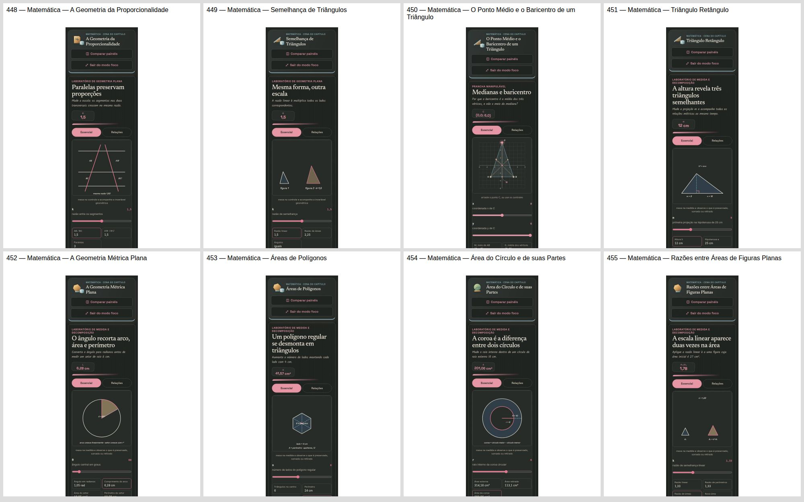

### Folha 57 — 360 px / dark

- summary-matematica-areas-de-figuras-planas
- summary-matematica-trigonometria-no-triangulo-retangulo
- summary-matematica-relacoes-trigonometricas-em-poligonos
- summary-matematica-a-trigonometria-dos-numeros-reais
- summary-matematica-outras-razoes-trigonometricas
- summary-matematica-a-relacao-fundamental-da-trigonometria
- summary-matematica-transformacoes-trigonometricas
- summary-matematica-funcoes-trigonometricas

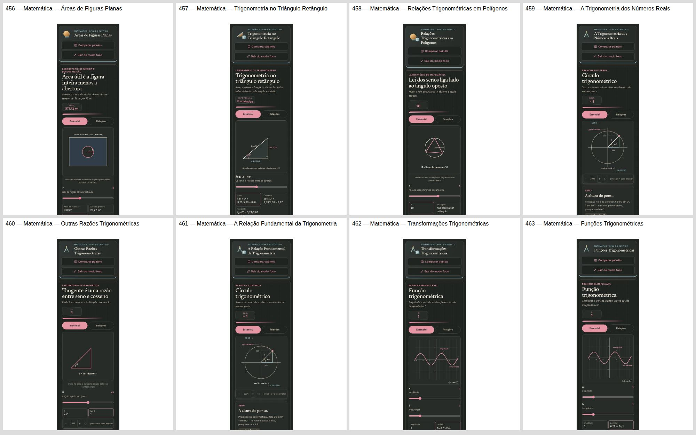

### Folha 58 — 360 px / dark

- summary-matematica-o-universo-tridimensional
- summary-matematica-cubos-e-paralelepipedos
- summary-matematica-prismas
- summary-matematica-piramides
- summary-matematica-solidos-de-revolucao
- summary-matematica-razoes-entre-volumes-de-solidos
- summary-matematica-introducao-a-geometria-analitica
- summary-matematica-lugar-geometrico-e-equacao-da-circunferencia

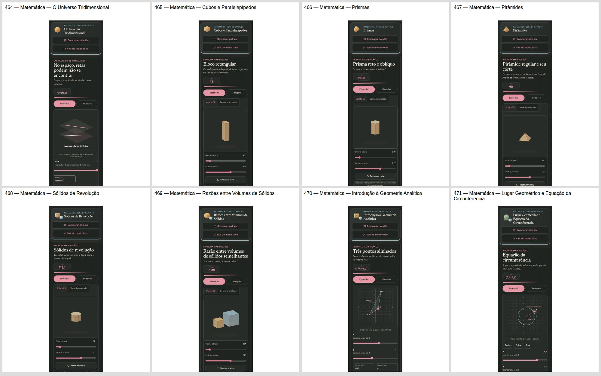

### Folha 59 — 360 px / dark

- summary-matematica-estudo-analitico-da-reta
- summary-matematica-posicoes-relativas-entre-duas-retas
- summary-matematica-distancia-entre-um-ponto-e-uma-reta
- summary-matematica-posicoes-relativas-entre-uma-reta-e-uma-circunferencia
- summary-matematica-introducao-ao-estudo-analitico-das-conicas
- summary-matematica-representacao-geometrica-de-inequacoes
- summary-matematica-a-geometria-dos-numeros-complexos
- summary-matematica-tecnicas-algebricas

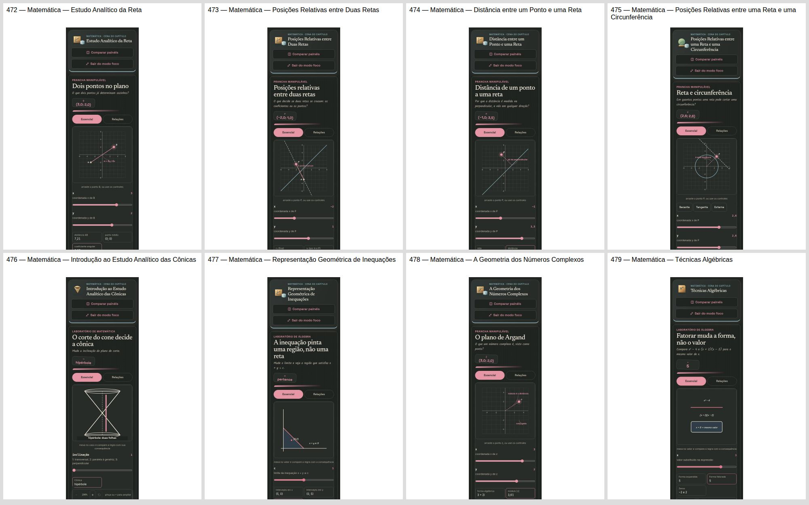

### Folha 60 — 360 px / dark

- summary-matematica-igualdades
- summary-matematica-desigualdades
- summary-matematica-modelagem-algebrica-de-problemas-i
- summary-matematica-equacoes-do-2-grau
- summary-matematica-modelagem-algebrica-de-problemas-ii
- summary-matematica-introducao-as-funcoes
- summary-matematica-transformacoes-em-graficos-de-funcoes
- summary-matematica-composicao-de-funcoes

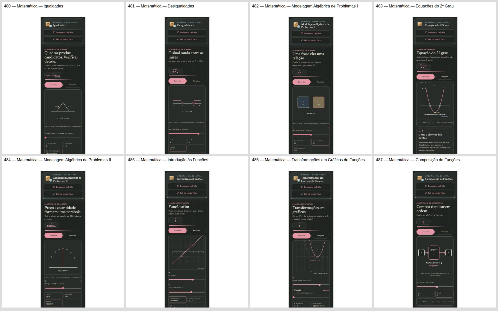

### Folha 61 — 360 px / dark

- summary-matematica-inversao-de-funcoes
- summary-matematica-funcoes-bijetoras
- summary-matematica-funcao-constante-e-funcao-afim
- summary-matematica-funcao-quadratica
- summary-matematica-estudo-do-sinal-de-funcoes
- summary-matematica-introducao-ao-modelo-exponencial
- summary-matematica-introducao-aos-logaritmos
- summary-matematica-equacoes-e-funcoes-logaritmicas

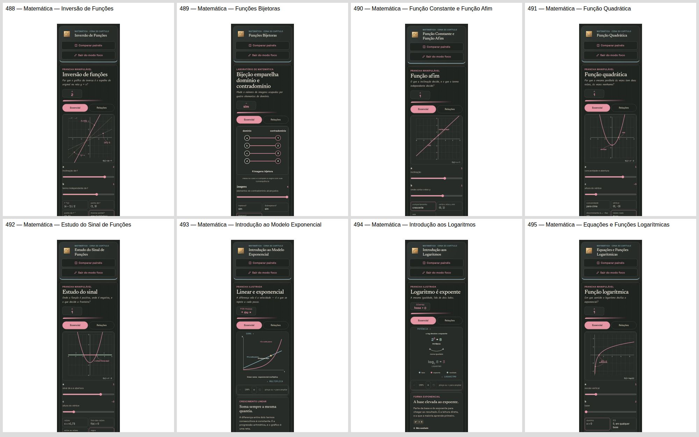

### Folha 62 — 360 px / dark

- summary-matematica-modelagem-exponencial-de-problemas
- summary-matematica-modulo-de-um-numero-real
- summary-matematica-numeros-complexos
- summary-matematica-polinomios
- summary-matematica-equacoes-polinomiais
- summary-quimica-evolucao-dos-modelos-atomicos
- summary-quimica-organizacao-da-tabela-periodica-dos-elementos
- summary-quimica-radioatividade-o-estudo-das-radiacoes

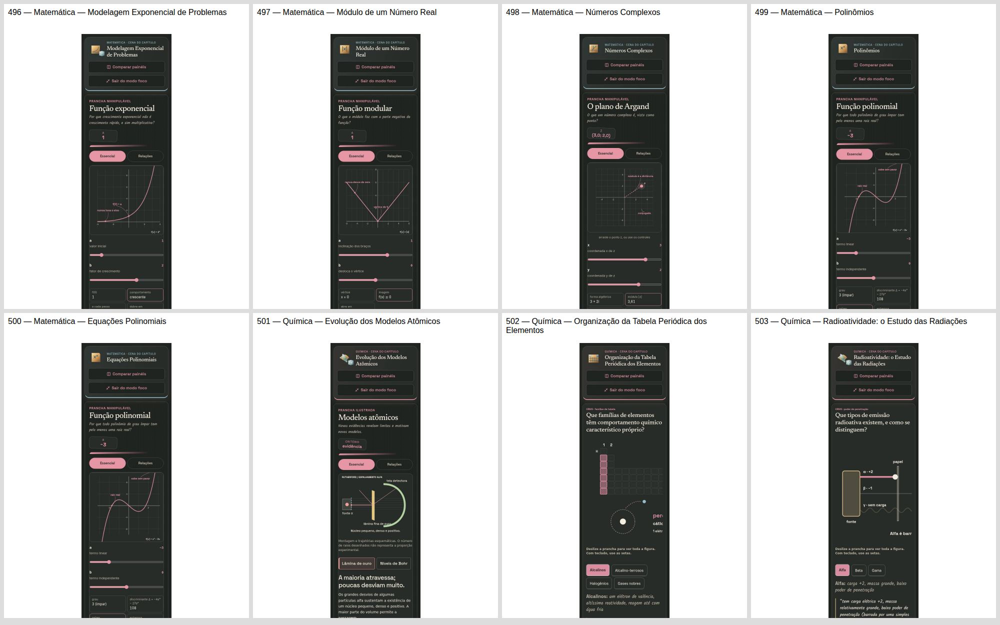

### Folha 63 — 360 px / dark

- summary-quimica-ligacoes-quimicas-e-alotropia
- summary-quimica-geometria-molecular
- summary-quimica-polaridade-das-ligacoes-e-das-moleculas
- summary-quimica-interacoes-intermoleculares
- summary-quimica-composicao-da-materia-estados-fisicos
- summary-quimica-o-estado-gasoso
- summary-quimica-estudo-dos-gases-ii
- summary-quimica-separacao-de-misturas

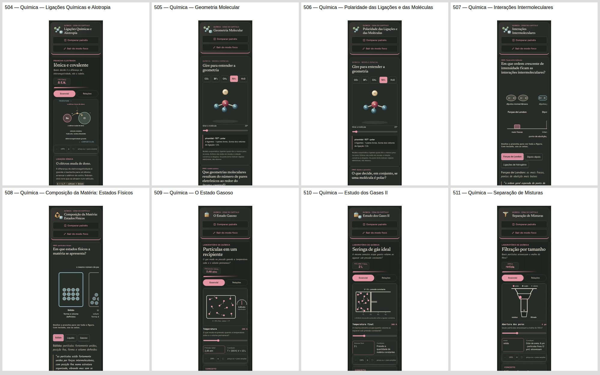

### Folha 64 — 360 px / dark

- summary-quimica-transformacoes-fisicas-e-quimicas-e-balanceamento-de-equacoes
- summary-quimica-massa-atomica-mol-e-massa-molar
- summary-quimica-determinacao-de-formulas-quimicas
- summary-quimica-estequiometria-leis-ponderais
- summary-quimica-calculos-estequiometricos
- summary-quimica-quimica-inorganica
- summary-quimica-equacoes-ionicas-e-outras-teorias-para-acidos-e-bases
- summary-quimica-processos-de-oxirreducao

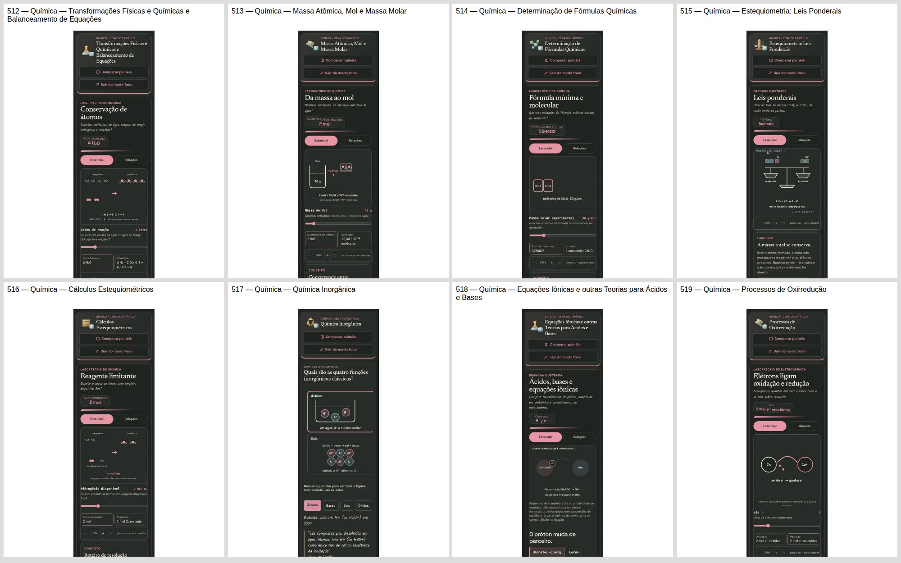

### Folha 65 — 360 px / dark

- summary-quimica-quimica-ambiental
- summary-quimica-introducao-a-quimica-organica
- summary-quimica-nomenclatura-de-compostos-organicos
- summary-quimica-nomenclatura-de-compostos-organicos-oxigenados-e-nitrogenados
- summary-quimica-reconhecimento-de-funcoes-organicas-e-algumas-de-suas-propriedades
- summary-quimica-isomeria
- summary-quimica-combustiveis-fosseis
- summary-quimica-interpretando-reacoes-organicas

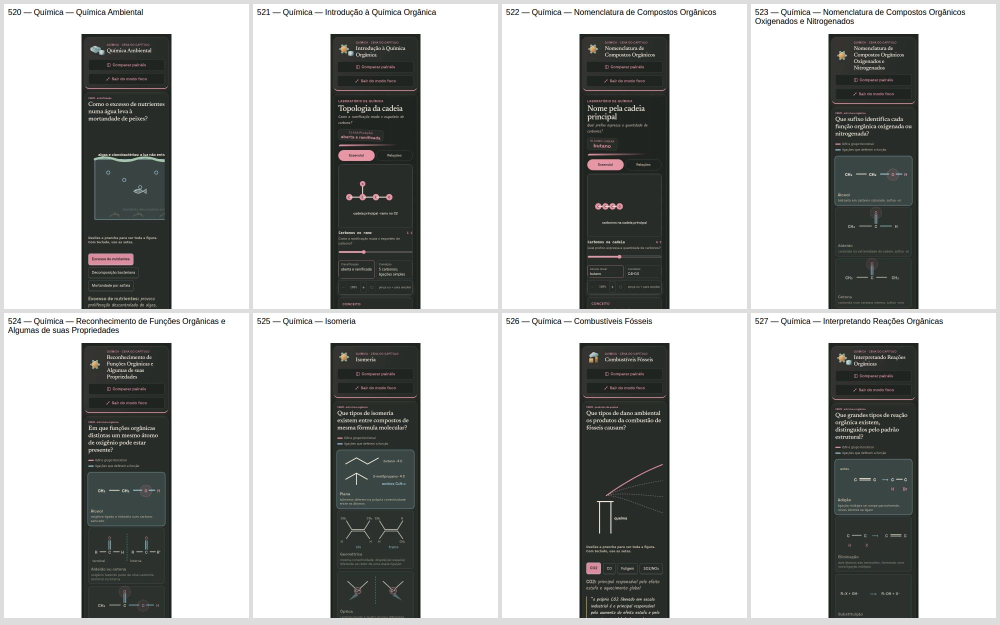

### Folha 66 — 360 px / dark

- summary-quimica-reacoes-de-substituicao
- summary-quimica-reacoes-de-adicao
- summary-quimica-reacoes-de-oxidacao-em-hidrocarbonetos
- summary-quimica-alcoois
- summary-quimica-acidos-graxos-e-esterificacao
- summary-quimica-transesterificacao-alcoolise
- summary-quimica-acidez-e-basicidade-pka
- summary-quimica-polimeros

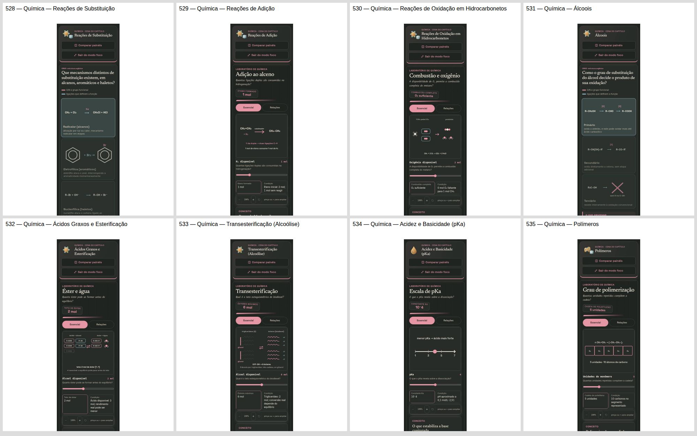

### Folha 67 — 360 px / dark

- summary-quimica-dispersoes
- summary-quimica-efeitos-coligativos
- summary-quimica-termoquimica-i
- summary-quimica-termoquimica-ii
- summary-quimica-cinetica-quimica
- summary-quimica-introducao-ao-estudo-das-pilhas-e-baterias
- summary-quimica-eletroquimica-de-processos-espontaneos
- summary-quimica-eletroquimica-de-processos-nao-espontaneos

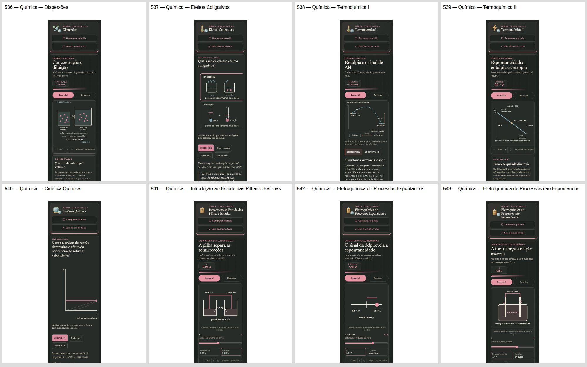

### Folha 68 — 360 px / dark

- summary-quimica-aspectos-quantitativos-da-eletroquimica-e-metalurgia
- summary-quimica-deslocamento-de-equilibrio
- summary-quimica-equilibrios-ionicos
- summary-quimica-equilibrios-ionicos-ii
- qui-equilibrio-acidificacao
- mat-probabilidade-contagem
- geo-bonus-demografico
- summary-filosofia-o-nascimento-da-filosofia-do-mito-ao-logos

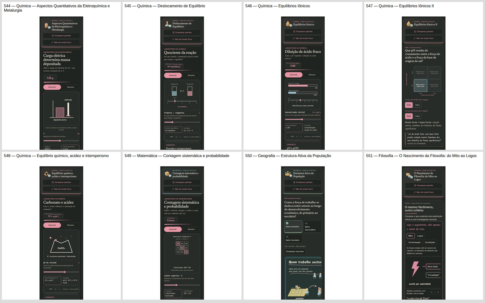

### Folha 69 — 360 px / dark

- summary-filosofia-os-filosofos-da-physis-tales-anaximandro-e-anaximenes
- summary-filosofia-heraclito-e-parmenides-o-ser-e-o-devir
- summary-filosofia-os-sofistas-e-a-crise-da-verdade
- summary-filosofia-o-metodo-socratico-e-a-maieutica
- summary-filosofia-a-teoria-das-ideias-de-platao
- summary-filosofia-o-mito-da-caverna
- summary-filosofia-a-alegoria-da-linha-dividida-e-o-conhecimento
- summary-filosofia-logica-e-metafisica-aristotelicas

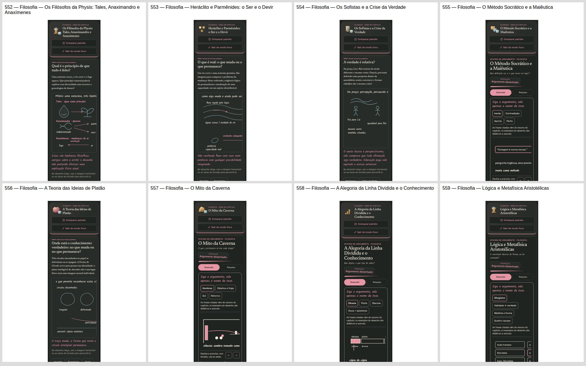

### Folha 70 — 360 px / dark

- summary-filosofia-a-etica-a-nicomaco-e-a-doutrina-do-meio-termo
- summary-filosofia-politica-aristotelica-o-homem-como-animal-politico
- summary-filosofia-patristica-e-santo-agostinho
- summary-filosofia-escolastica-e-santo-tomas-de-aquino
- summary-filosofia-a-relacao-entre-fe-e-razao
- summary-filosofia-descartes-e-o-metodo-a-duvida-hiperbolica
- summary-filosofia-racionalismo-continental-espinosa-e-leibniz
- summary-filosofia-empirismo-britanico-locke-berkeley-e-hume

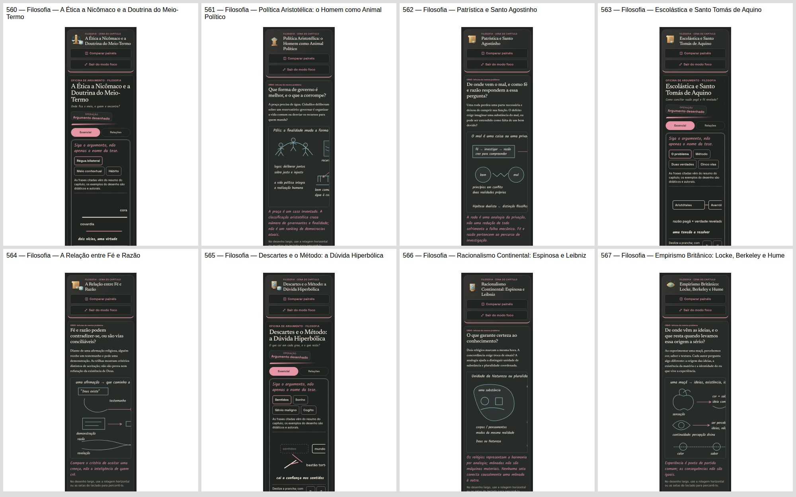

### Folha 71 — 360 px / dark

- summary-filosofia-a-critica-de-hume-a-causalidade
- summary-filosofia-hobbes-e-o-estado-de-natureza
- summary-filosofia-locke-e-os-direitos-naturais
- summary-filosofia-rousseau-e-a-vontade-geral
- summary-filosofia-o-ideal-iluminista-de-razao-e-progresso
- summary-filosofia-a-critica-da-razao-pura
- summary-filosofia-a-etica-kantiana-e-o-imperativo-categorico
- summary-filosofia-hegel-e-a-dialetica

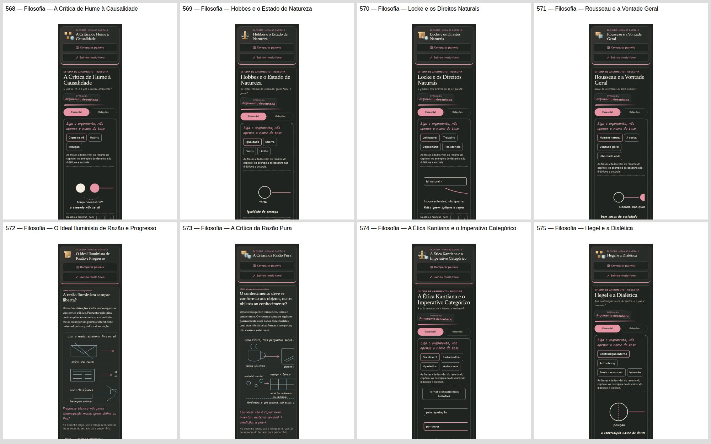

### Folha 72 — 360 px / dark

- summary-filosofia-o-materialismo-historico
- summary-filosofia-alienacao-e-mais-valia
- summary-filosofia-a-luta-de-classes-na-filosofia-marxista
- summary-filosofia-nietzsche-e-a-critica-aos-valores-morais
- summary-filosofia-o-existencialismo-de-sartre
- summary-filosofia-a-escola-de-frankfurt-e-a-industria-cultural
- summary-filosofia-foucault-e-as-relacoes-de-poder
- summary-filosofia-justica-e-direitos-humanos

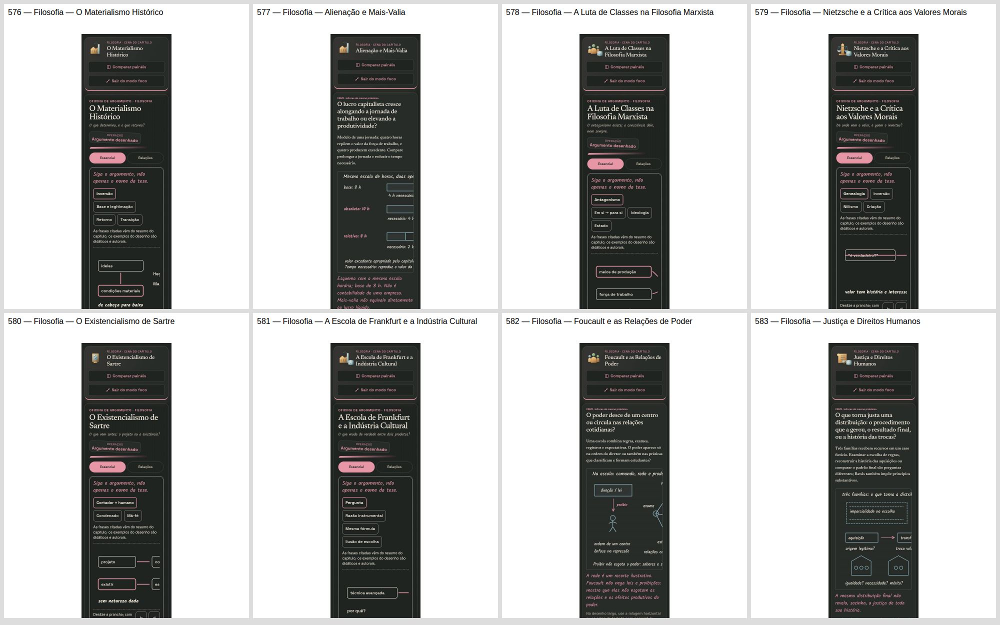

### Folha 73 — 360 px / dark

- summary-filosofia-etica-aplicada-e-bioetica
- summary-filosofia-filosofia-politica-contemporanea
- summary-sociologia-o-contexto-historico-do-surgimento-da-sociologia
- summary-sociologia-o-que-e-o-fato-social
- summary-sociologia-sociologia-e-senso-comum
- summary-sociologia-solidariedade-mecanica-e-solidariedade-organica
- summary-sociologia-anomia-e-coesao-social
- summary-sociologia-educacao-e-socializacao-em-durkheim

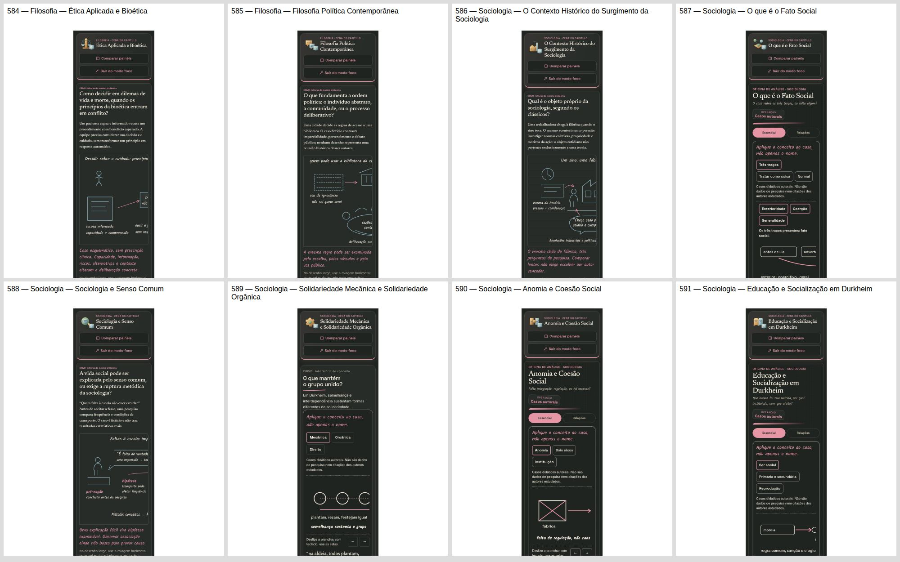

### Folha 74 — 360 px / dark

- summary-sociologia-modo-de-producao-e-estrutura-social
- summary-sociologia-ideologia-e-alienacao
- summary-sociologia-a-luta-de-classes-na-analise-sociologica
- summary-sociologia-tipos-de-acao-social
- summary-sociologia-dominacao-e-poder-em-weber
- summary-sociologia-etica-protestante-e-o-espirito-do-capitalismo
- summary-sociologia-cultura-e-etnocentrismo
- summary-sociologia-identidade-e-diferenca

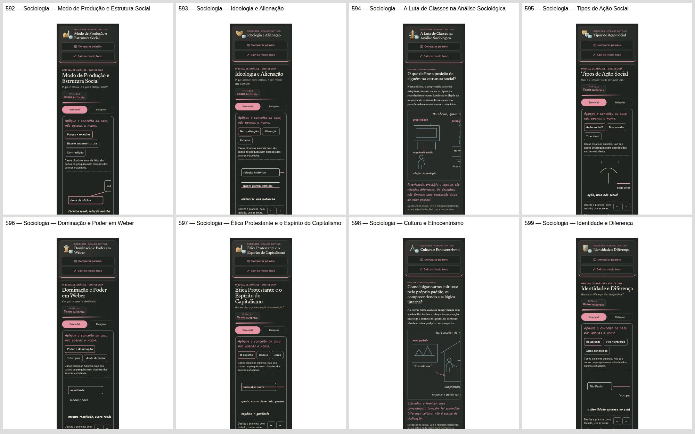

### Folha 75 — 360 px / dark

- summary-sociologia-multiculturalismo-e-relativismo-cultural
- summary-sociologia-classes-sociais-e-mobilidade-social
- summary-sociologia-desigualdade-racial-no-brasil
- summary-sociologia-desigualdade-de-genero
- summary-sociologia-divisao-social-do-trabalho
- summary-sociologia-transformacoes-no-mundo-do-trabalho
- summary-sociologia-precarizacao-e-uberizacao-do-trabalho
- summary-sociologia-movimentos-sociais-classicos-e-contemporaneos

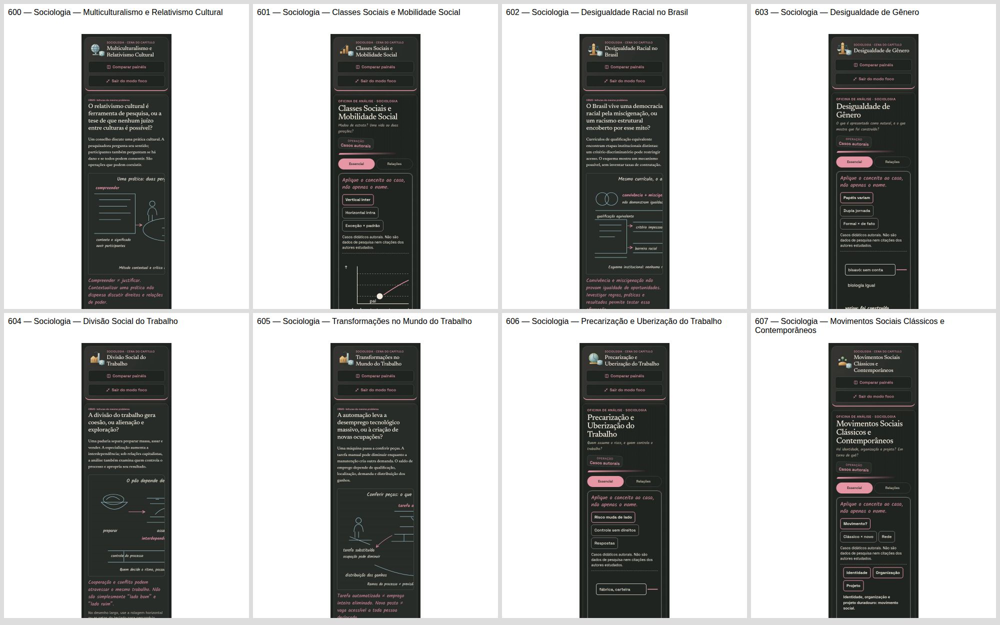

### Folha 76 — 360 px / dark

- summary-sociologia-cidadania-e-direitos
- summary-sociologia-democracia-e-participacao-politica
- summary-sociologia-globalizacao-economica-e-cultural
- summary-sociologia-o-estado-nacao-na-era-global
- summary-sociologia-a-sociedade-da-informacao

### Folha 77 — 1440 px / light

- fis-termologia-calor
- atu-cop30-belem
- bio-ecologia-introducao
- bio-ecologia-dinamica-populacoes
- bio-ecologia-invasoras-controle-biologico
- bio-ecologia-sucessao
- bio-ecologia-ciclo-carbono
- bio-ecologia-ciclo-nitrogenio

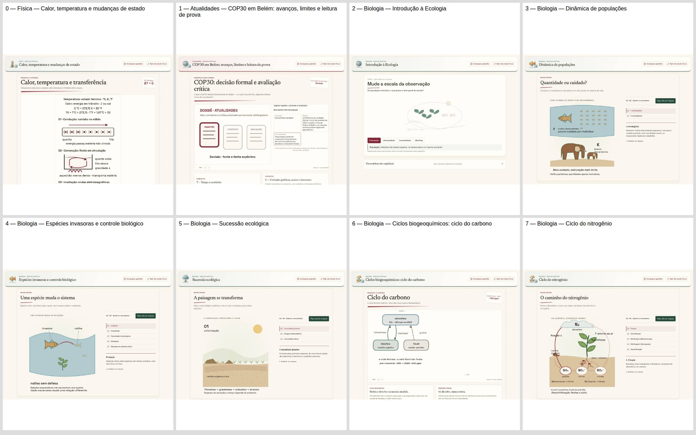

### Folha 78 — 1440 px / light

- bio-ecologia-ciclo-hidrologico-poluicao-agua
- bio-ecologia-eutrofizacao
- bio-ecologia-poluicao-ar
- bio-ecologia-biomagnificacao
- bio-ecologia-aquecimento-global-pops-biorremediacao
- summary-biologia-origem-da-vida-e-as-primeiras-celulas
- summary-biologia-composicao-quimica-celular-compostos-inorganicos
- summary-biologia-composicao-quimica-celular-carboidratos-e-lipidios

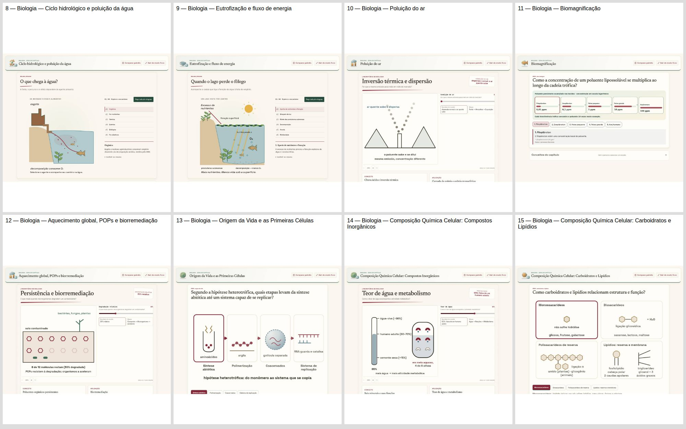

### Folha 79 — 1440 px / light

- summary-biologia-composicao-quimica-celular-proteinas-e-sua-funcao-estrutural
- summary-biologia-membranas-celulares
- summary-biologia-citoplasma-estrutura-e-componentes-i
- summary-biologia-citoplasma-estrutura-e-componentes-ii
- summary-biologia-nucleo-celular
- summary-biologia-proteinas-enzimas
- summary-biologia-bioenergetica-fermentacao-e-respiracao
- summary-biologia-bioenergetica-fotossintese-e-quimiossintese

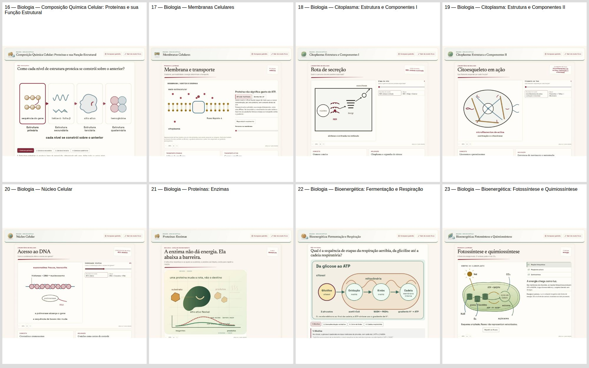

### Folha 80 — 1440 px / light

- summary-biologia-acidos-nucleicos
- summary-biologia-divisao-celular
- summary-biologia-mutacoes-cromossomicas-e-gametogenese
- summary-biologia-biotecnologia
- summary-biologia-introducao-a-genetica
- summary-biologia-alelos-multiplos-e-heranca-dos-grupos-sanguineos
- summary-biologia-heranca-sexual
- summary-biologia-segunda-lei-de-mendel

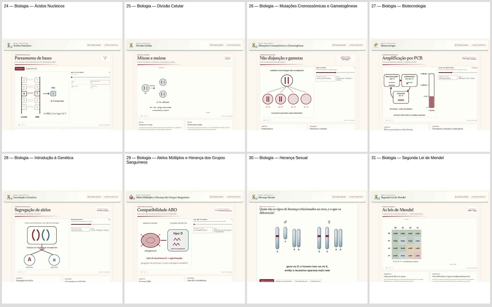

### Folha 81 — 1440 px / light

- summary-biologia-segunda-lei-de-mendel-e-interacao-genica
- summary-biologia-ligacao-genica
- summary-biologia-mutacoes-genicas
- summary-biologia-evolucao-biologica-construcao-historica
- summary-biologia-mecanismos-da-evolucao-biologica
- summary-biologia-biomas-brasileiros
- summary-biologia-classificacao-biologica-nomenclatura-cientifica-e-nocoes-de-sistematica-filogenetica
- summary-biologia-protozoarios-e-protozooses

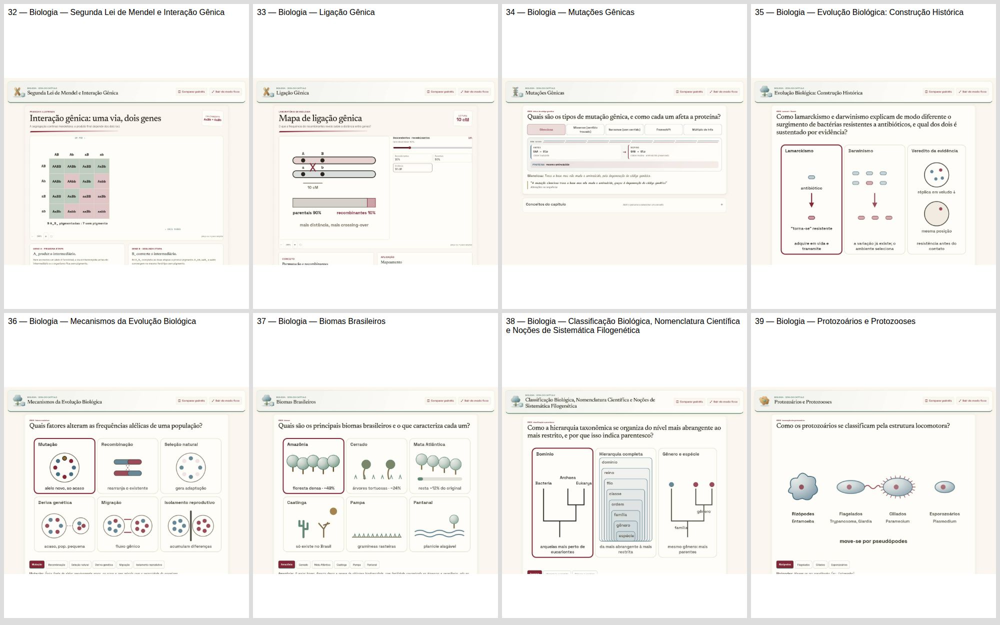

### Folha 82 — 1440 px / light

- summary-biologia-poriferos-e-cnidarios
- summary-biologia-arquitetura-corporal-dos-animais-e-o-filo-dos-platelmintos-e-dos-nematodeos
- summary-biologia-moluscos
- summary-biologia-anelideos
- summary-biologia-artropodes-insetos-crustaceos-e-miriapodes
- summary-biologia-artropodes-aracnideos
- summary-biologia-equinodermos
- summary-biologia-introducao-aos-cordados-e-os-peixes

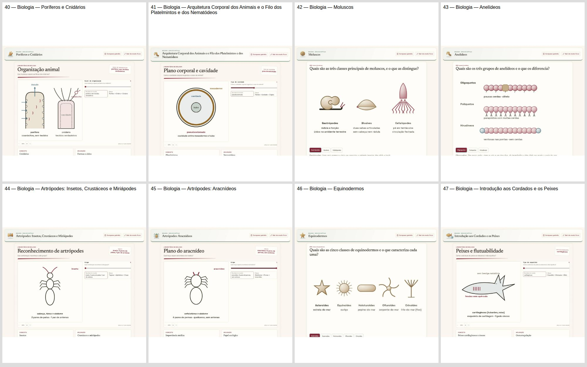

### Folha 83 — 1440 px / light

- summary-biologia-cordados-tetrapodes
- summary-biologia-fungos
- summary-biologia-algas
- summary-biologia-ciclos-de-vida
- summary-biologia-plantas-terrestres-i-briofitas-e-pteridofitas
- summary-biologia-plantas-terrestres-ii-gimnospermas-e-angiospermas
- summary-biologia-procariotos
- summary-biologia-virus

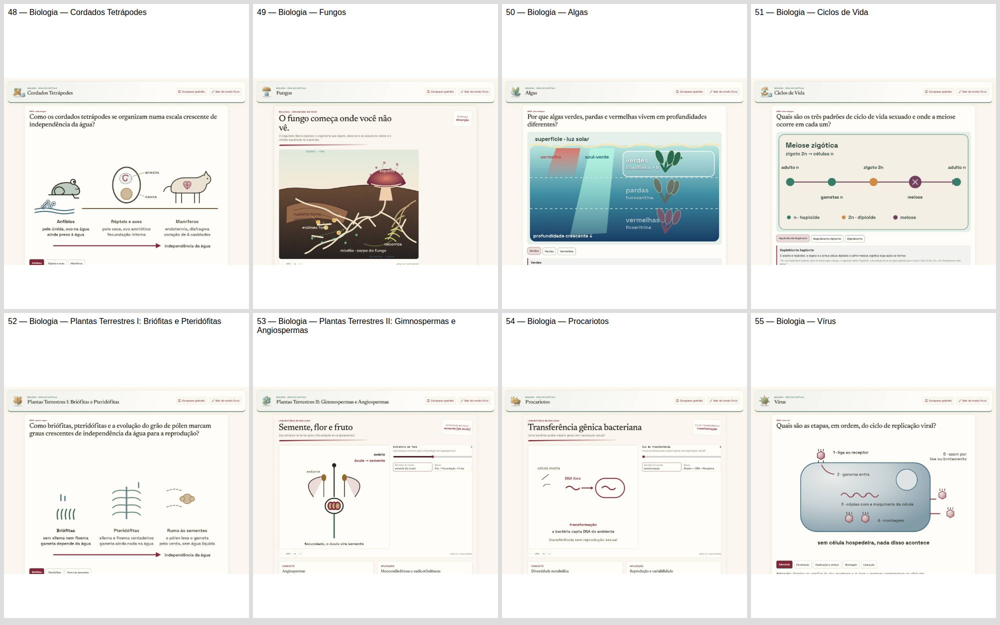

### Folha 84 — 1440 px / light

- summary-biologia-embriologia-animal
- summary-biologia-fisiologia-da-sustentacao-e-da-locomocao
- summary-biologia-fisiologia-da-digestao
- summary-biologia-sangue-e-imunologia
- summary-biologia-coracao-e-vasos-sanguineos
- summary-biologia-fisiologia-da-respiracao
- summary-biologia-fisiologia-da-excrecao
- summary-biologia-fisiologia-da-coordenacao-nervosa-i

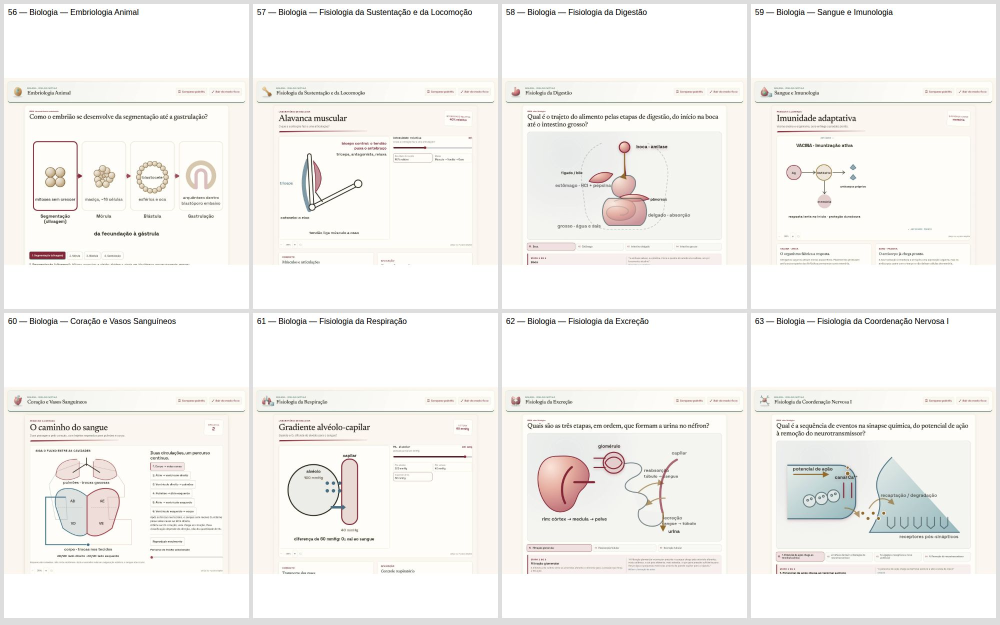

### Folha 85 — 1440 px / light

- summary-biologia-coordenacao-nervosa-ii
- summary-biologia-sistemas-sensoriais-visao-e-audicao
- summary-biologia-coordenacao-endocrina-i
- summary-biologia-coordenacao-endocrina-ii
- summary-biologia-reproducao-humana-e-metodos-contraceptivos
- summary-biologia-histologia-e-morfologia-vegetal
- summary-biologia-morfofisiologia-vegetal-caules-e-folhas
- summary-biologia-traqueofitas-transpiracao-e-reposicao-rapida-de-agua

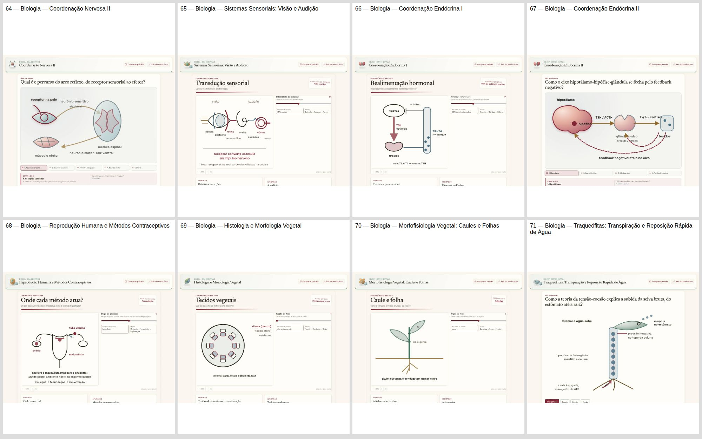

### Folha 86 — 1440 px / light

- summary-biologia-fisiologia-vegetal-transporte-no-floema
- summary-biologia-fisiologia-vegetal-hormonios-vegetais
- summary-fisica-cinematica-escalar-conceitos-fundamentais
- summary-fisica-movimento-uniforme
- summary-fisica-movimento-uniformemente-variado
- summary-fisica-o-movimento-circular
- summary-fisica-grandezas-fisicas-e-operacoes-com-vetores
- summary-fisica-velocidade-vetorial

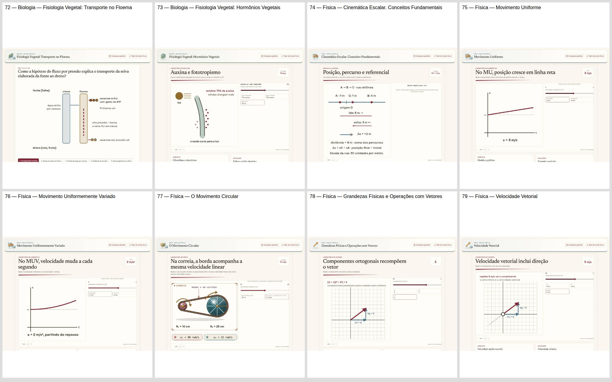

### Folha 87 — 1440 px / light

- summary-fisica-composicao-de-movimentos
- summary-fisica-aceleracao-vetorial
- summary-fisica-forca-e-seus-tipos
- summary-fisica-resultante-de-um-sistema-de-forcas
- summary-fisica-as-leis-de-newton
- summary-fisica-a-forca-de-contato
- summary-fisica-sistema-de-corpos-interagindo-e-os-elementos-transmissores-de-forca
- summary-fisica-plano-inclinado

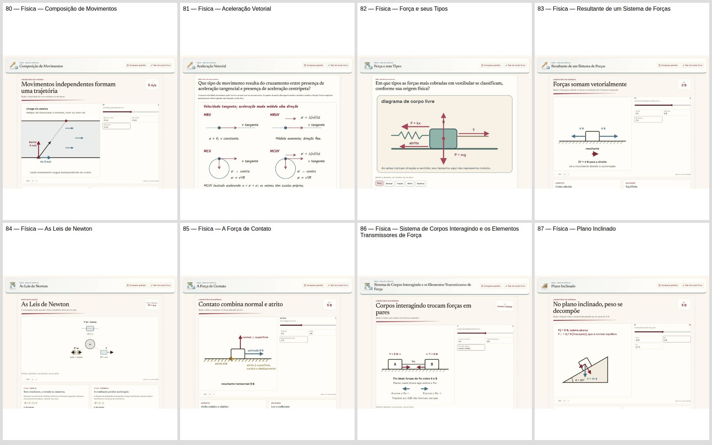

### Folha 88 — 1440 px / light

- summary-fisica-leis-da-gravitacao
- summary-fisica-dinamica-do-movimento-circular
- summary-fisica-analisando-movimentos-contidos-em-um-plano-vertical
- summary-fisica-orbitas
- summary-fisica-balistica
- summary-fisica-movimento-harmonico-simples-mhs
- summary-fisica-impulso-e-quantidade-de-movimento
- summary-fisica-sistemas-isolados-e-a-conservacao-da-quantidade-de-movimento

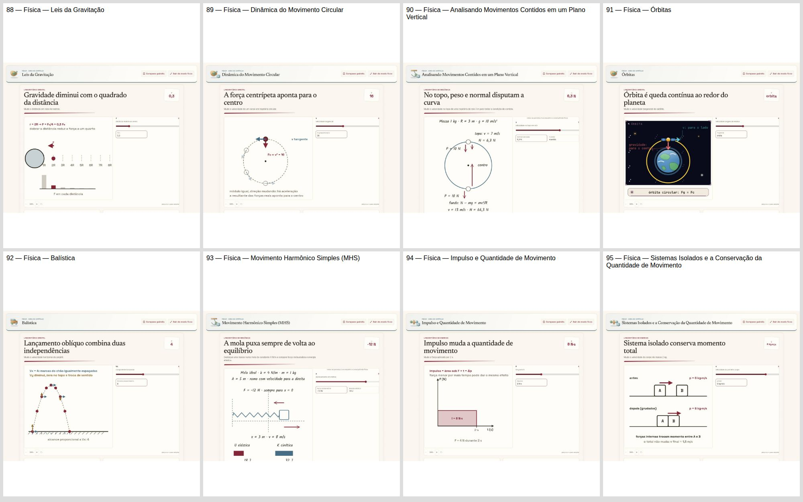

### Folha 89 — 1440 px / light

- summary-fisica-colisoes
- summary-fisica-trabalho-e-energia-trabalho-de-uma-forca
- summary-fisica-trabalho-e-energia-teorema-da-energia-cinetica
- summary-fisica-trabalho-e-energia-o-teorema-da-energia-potencial
- summary-fisica-sistemas-conservativos-e-sistemas-nao-conservativos
- summary-fisica-potencia-maquina-e-rendimento
- summary-fisica-a-fisica-por-tras-da-obtencao-de-energia-eletrica-das-quedas-d-agua-aos-reatores-nucleares
- summary-fisica-equivalencia-massa-energia

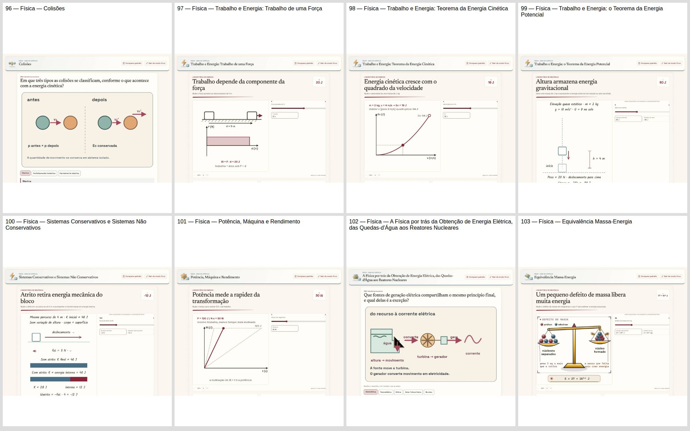

### Folha 90 — 1440 px / light

- summary-fisica-estatica
- summary-fisica-hidrostatica-densidade-e-pressao
- summary-fisica-dilatacao-ou-contracao-termica-dos-solidos-e-liquidos
- summary-fisica-calor-sensivel-e-calor-latente
- summary-fisica-gases-ideais-variaveis-de-estado-e-as-transformacoes-gasosas
- summary-fisica-trabalho-da-forca-de-pressao-do-gas
- summary-fisica-primeira-lei-da-termodinamica
- summary-fisica-primeira-lei-da-termodinamica-aplicada-a-algumas-transformacoes-particulares

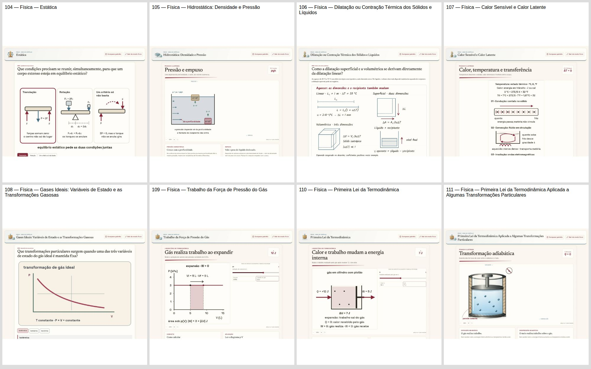

### Folha 91 — 1440 px / light

- summary-fisica-maquinas-termicas-e-ciclo-de-carnot
- summary-fisica-eletrostatica-processos-de-eletrizacao-e-aplicacoes
- summary-fisica-forca-eletrica-lei-de-coulomb
- summary-fisica-campo-eletrico
- summary-fisica-energia-potencial-e-potencial-eletrico
- summary-fisica-mapeamento-do-campo-eletrico-linhas-de-forca-e-superficies-equipotenciais
- summary-fisica-campo-eletrico-uniforme-abordagem-escalar-e-abordagem-vetorial
- summary-fisica-dinamica-das-cargas-eletricas

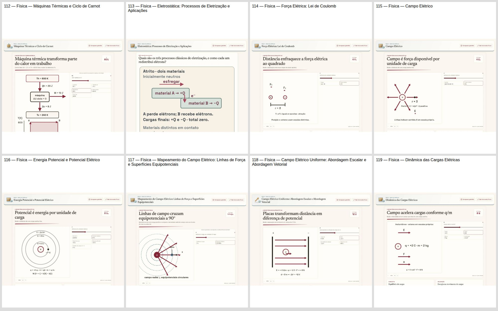

### Folha 92 — 1440 px / light

- summary-fisica-corrente-eletrica
- summary-fisica-potencia-eletrica
- summary-fisica-resistores
- summary-fisica-medidores-eletricos
- summary-fisica-geradores
- summary-fisica-receptores
- summary-fisica-circuitos-de-malha-unica
- summary-fisica-eletrodinamica-as-leis-de-kirchhoff

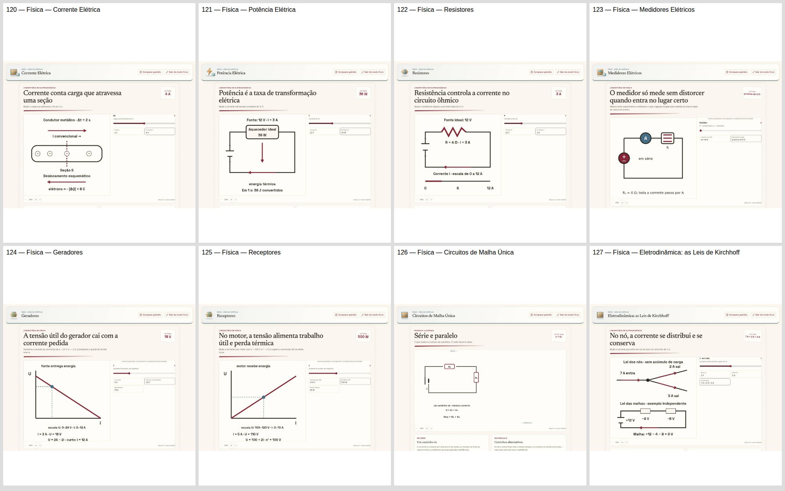

### Folha 93 — 1440 px / light

- summary-fisica-capacitores
- summary-fisica-imas-campo-de-inducao-magnetico-devido-a-imas-e-campo-magnetico-terrestre
- summary-fisica-campo-magnetico-devido-a-corrente-em-fio-reto-e-espira-descricao-vetorial-e-aplicacoes
- summary-fisica-forca-magnetica-e-analise-de-lancamentos-de-cargas-em-um-campo-magnetico-uniforme
- summary-fisica-analise-de-forca-magnetica-em-fios-percorridos-por-correntes-continuas
- summary-fisica-inducao-eletromagnetica-lei-de-lenz
- summary-fisica-inducao-eletromagnetica-analise-da-corrente-induzida-em-geradores
- summary-fisica-fundamentos-da-optica-geometrica

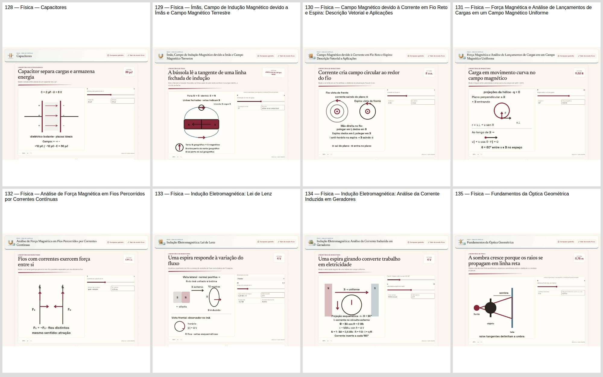

### Folha 94 — 1440 px / light

- summary-fisica-reflexao-em-superficies-planas
- summary-fisica-reflexao-em-superficies-esfericas
- summary-fisica-refracao-fundamentos-leis-e-aplicacoes
- summary-fisica-lentes-esfericas-estudo-grafico
- summary-fisica-estudo-analitico-das-lentes-esfericas
- summary-fisica-equacao-do-fabricante-de-lentes-e-associacao-de-lentes
- summary-fisica-optica-da-visao
- summary-fisica-microscopio-e-luneta-astronomica-ou-telescopio-refrator-nocoes-basicas

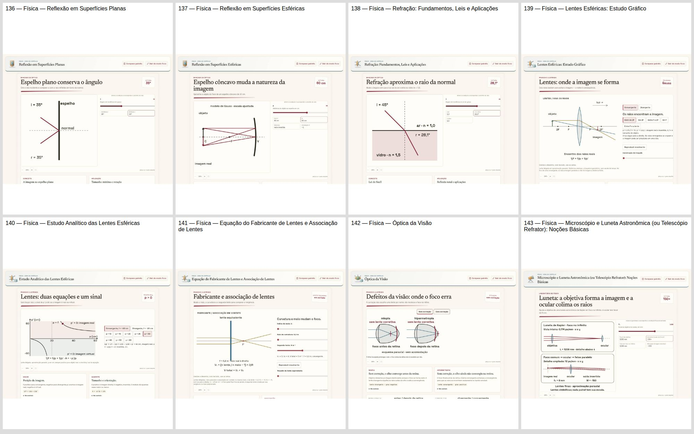

### Folha 95 — 1440 px / light

- summary-fisica-conceitos-basicos
- summary-fisica-equacao-fundamental-da-ondulatoria
- summary-fisica-ondulatoria-ondas-eletromagneticas
- summary-fisica-ondulatoria-som-e-suas-propriedades
- summary-fisica-intensidade-sonora
- summary-fisica-reflexao-eco-reverberacao-e-refracao-de-ondas
- summary-fisica-fenomenos-ondulatorios-analise-de-refracao-e-reflexao-em-cordas
- summary-fisica-fenomenos-ondulatorios-difracao-polarizacao-e-ressonancia

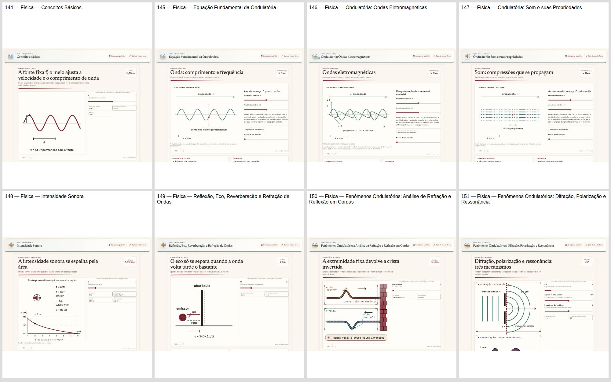

### Folha 96 — 1440 px / light

- summary-fisica-interferencia-de-ondas-analise-quantitativa-aplicacoes-e-batimento
- summary-fisica-um-caso-particular-de-interferencia-onda-estacionaria
- summary-fisica-ondas-estacionarias-em-cordas
- summary-fisica-ondas-estacionarias-em-tubos
- summary-fisica-efeito-doppler-descricao-e-estudo-quantitativo
- summary-fisica-nocoes-basicas-de-fisica-quantica
- summary-geografia-coordenadas-geograficas
- summary-geografia-movimentos-da-terra

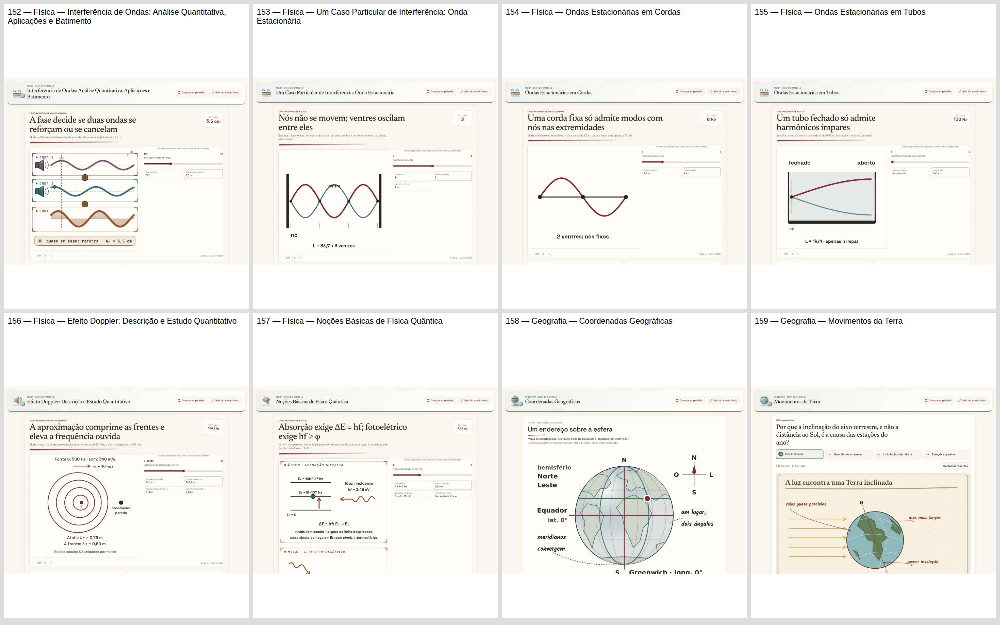

### Folha 97 — 1440 px / light

- summary-geografia-sistema-de-fusos-horarios
- summary-geografia-linguagem-cartografica
- summary-geografia-projecoes-cartograficas
- summary-geografia-cartografia-digital
- summary-geografia-representacoes-graficas-e-cartograficas
- summary-geografia-dinamica-climatica
- summary-geografia-clima-mundial
- summary-geografia-geomorfologia-mundial

### Folha 98 — 1440 px / light

- summary-geografia-biogeografia-mundial
- summary-geografia-agua-na-superficie-terrestre
- summary-geografia-desafios-ambientais-do-seculo-xxi
- summary-geografia-geopolitica-ambiental
- summary-geografia-geopolitica-dos-recursos-hidricos
- summary-geografia-hidrogeografia-mundial
- summary-geografia-do-mundo-bipolar-ao-multipolar
- summary-geografia-globalizacao-e-processos-economicos-atuais

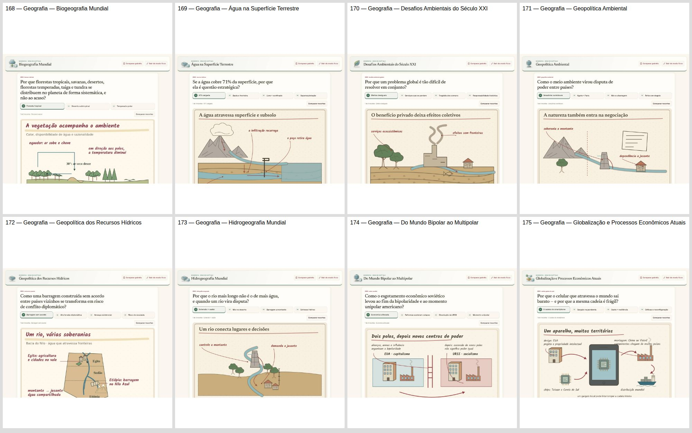

### Folha 99 — 1440 px / light

- summary-geografia-geografia-das-redes-mundiais
- summary-geografia-unilateralismo-e-multilateralismo
- summary-geografia-blocos-economicos
- summary-geografia-uniao-europeia
- summary-geografia-desigualdades-globais
- summary-geografia-mobilidade-populacional
- summary-geografia-geografia-do-turismo
- summary-geografia-producao-agricola-mundial

### Folha 100 — 1440 px / light

- summary-geografia-industria-i
- summary-geografia-industria-ii
- summary-geografia-gedeconomia-mundial
- summary-geografia-terrorismo-internacional
- summary-geografia-geografia-das-religioes
- summary-geografia-tensoes-geopoliticas-na-europa
- summary-geografia-geopolitica-e-geoeconomia-da-america-latina
- summary-geografia-africa-no-mundo-atual

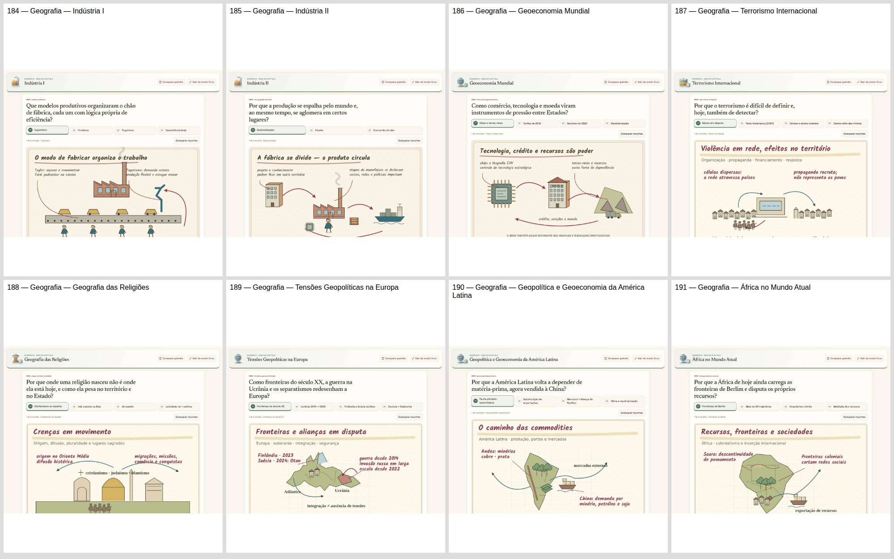

### Folha 101 — 1440 px / light

- summary-geografia-geopolitica-e-geoeconomia-da-asia
- summary-geografia-geografia-do-oriente-medio
- summary-geografia-questao-palestina
- summary-geografia-conflitos-no-mundo-arabe
- summary-geografia-paisagem-espaco-geografico-e-ciencia-geografica
- summary-geografia-geologia-e-geomorfologia
- summary-geografia-relevo-brasileiro
- summary-geografia-pedologia

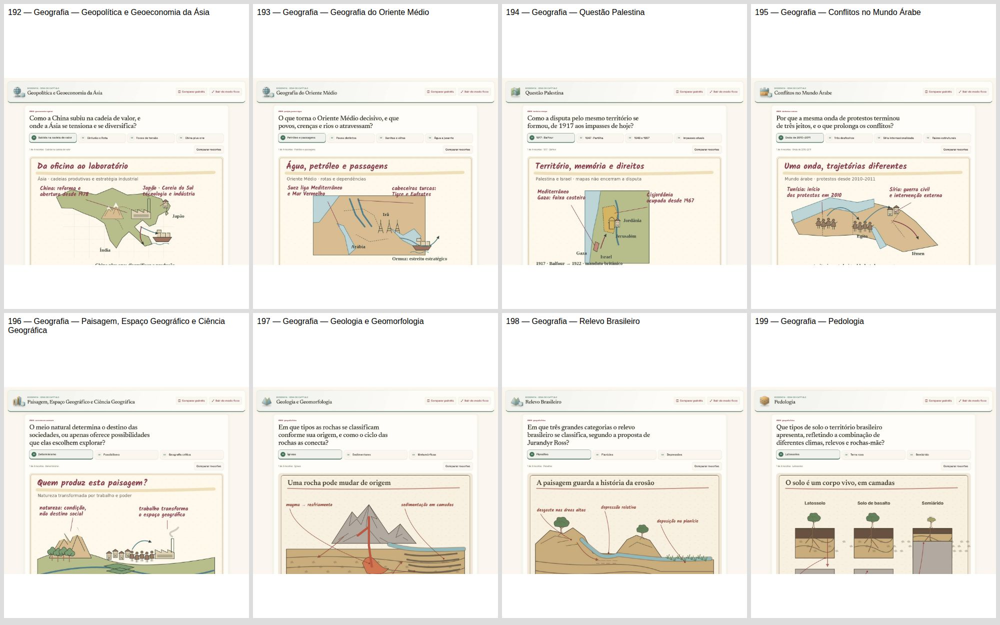

### Folha 102 — 1440 px / light

- summary-geografia-climatologia-do-brasil
- summary-geografia-biogeografia-do-brasil-i
- summary-geografia-biogeografia-do-brasil-ii
- summary-geografia-politicas-ambientais-brasileiras
- summary-geografia-hidrogeografia-do-brasil
- summary-geografia-dominios-morfoclimaticos
- summary-geografia-matriz-energetica
- summary-geografia-combustiveis-fosseis-e-biocombustiveis-no-brasil

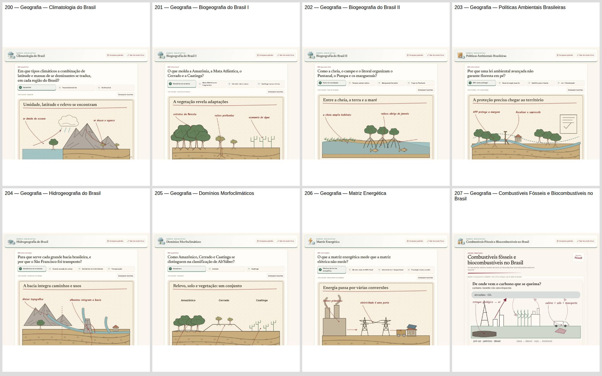

### Folha 103 — 1440 px / light

- summary-geografia-energia-eletrica-no-mundo
- summary-geografia-energia-eletrica-no-brasil
- summary-geografia-producao-mineral
- summary-geografia-o-espaco-agrario-brasileiro
- summary-geografia-o-espaco-industrial-brasileiro-i
- summary-geografia-o-espaco-industrial-brasileiro-ii
- summary-geografia-dinamica-demografica
- summary-geografia-estrutura-etnica-e-fluxos-migratorios

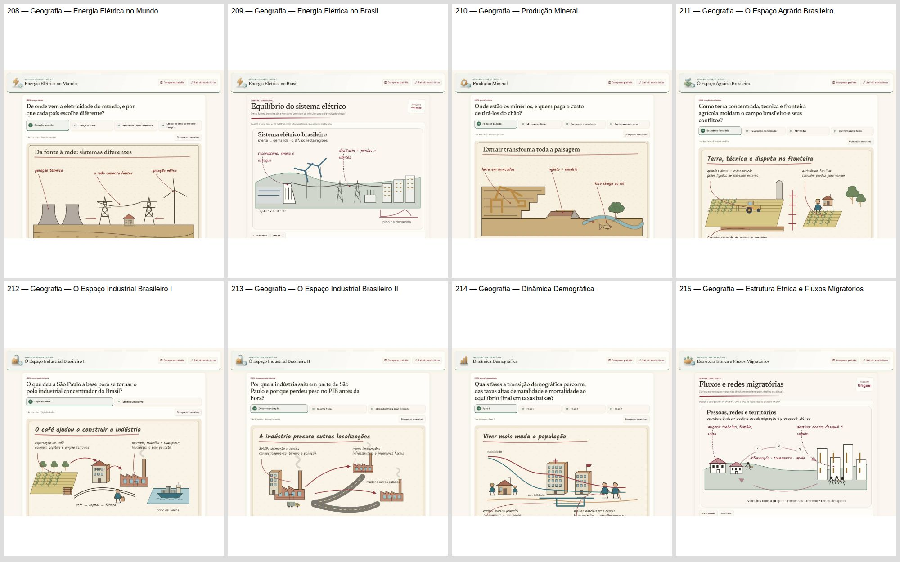

### Folha 104 — 1440 px / light

- summary-geografia-o-espaco-urbano-i
- summary-geografia-o-espaco-urbano-ii
- summary-geografia-as-redes-de-transportes
- summary-geografia-os-fluxos-do-comercio-externo
- summary-historia-introducao-a-historia-e-primeiras-civilizacoes
- summary-historia-antiguidade-classica-o-mundo-grego
- summary-historia-antiguidade-classica-o-mundo-romano
- summary-historia-alta-idade-media-e-feudalismo

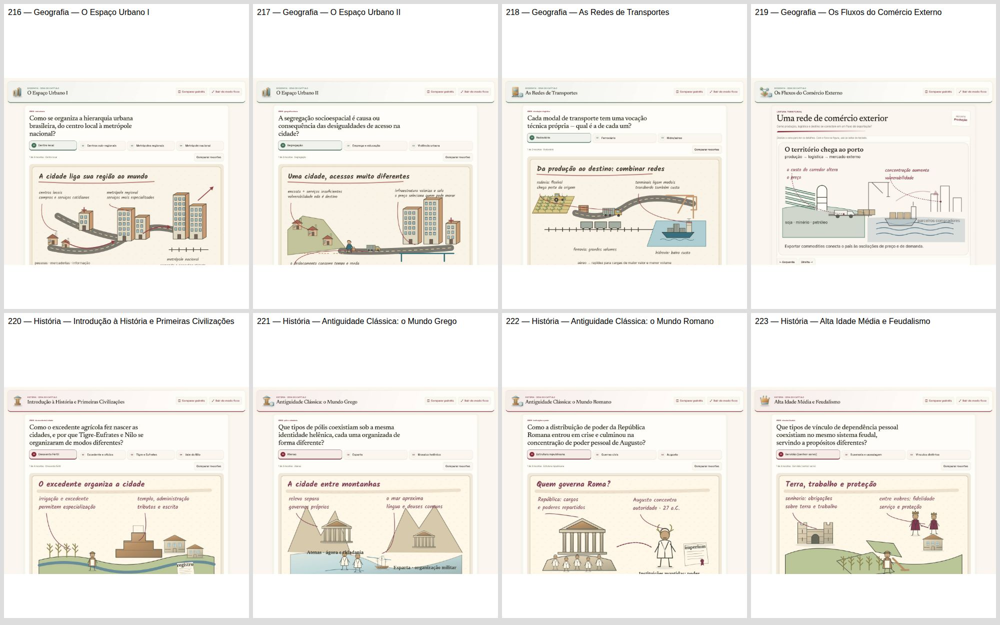

### Folha 105 — 1440 px / light

- summary-historia-baixa-idade-media
- summary-historia-a-primeira-globalizacao
- summary-historia-america-espanhola
- summary-historia-vida-urbana-e-renascimento-cultural
- summary-historia-reforma-religiosa
- summary-historia-absolutismo
- summary-historia-revolucao-industrial
- summary-historia-iluminismo

### Folha 106 — 1440 px / light

- summary-historia-revolucao-francesa
- summary-historia-america-no-seculo-xix
- summary-historia-europa-no-seculo-xix
- summary-historia-imperialismo-e-belle-epoque
- summary-historia-primeira-guerra-mundial-1914-1918
- summary-historia-grandes-revolucoes-do-seculo-xx
- summary-historia-o-periodo-entreguerras-1918-1939
- summary-historia-o-nazismo-na-alemanha

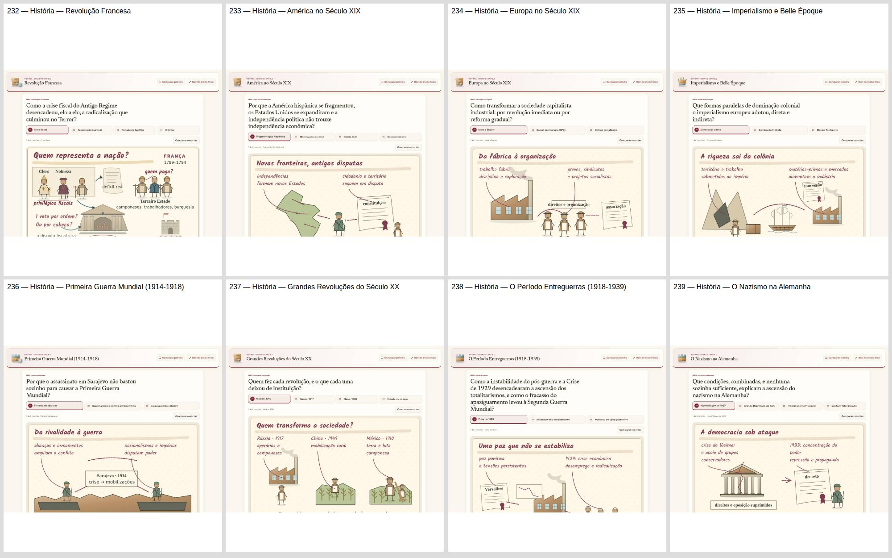

### Folha 107 — 1440 px / light

- summary-historia-segunda-guerra-mundial-1939-1945
- summary-historia-guerra-fria
- summary-historia-descolonizacao-afro-asiatica
- summary-historia-america-latina-no-seculo-xx
- summary-historia-o-fim-da-guerra-fria
- summary-historia-a-historia-e-o-brasil
- summary-historia-grandes-navegacoes-e-conquista-colonial
- summary-historia-a-montagem-da-colonizacao

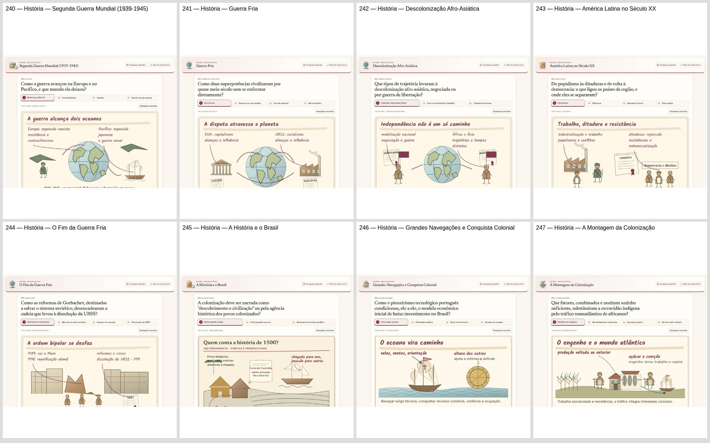

### Folha 108 — 1440 px / light

- summary-historia-dinamica-interna-da-colonizacao
- summary-historia-disputas-europeias-no-brasil-colonial
- summary-historia-a-interiorizacao-da-colonizacao
- summary-historia-a-mineracao-no-brasil-colonial
- summary-historia-a-crise-do-antigo-sistema-colonial
- summary-historia-a-independencia-do-brasil
- summary-historia-brasil-imperio-formacao-do-estado-nacional-brasileiro
- summary-historia-brasil-imperio-o-periodo-regencial-1831-1840

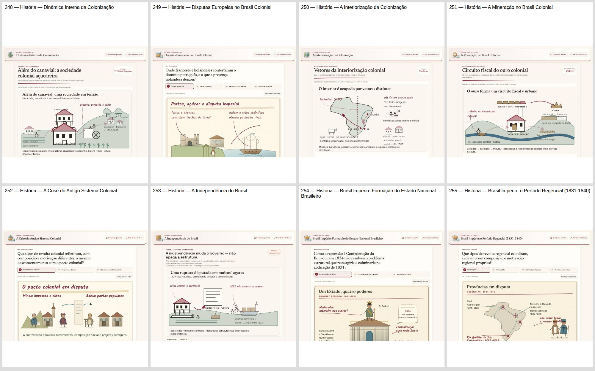

### Folha 109 — 1440 px / light

- summary-historia-brasil-imperio-segundo-reinado-1840-1889
- summary-historia-brasil-imperio-o-declinio-do-segundo-reinado
- summary-historia-a-republica-da-espada
- summary-historia-ascensao-e-dominio-das-oligarquias
- summary-historia-a-primeira-republica-o-declinio-oligarquico-1889-1930
- summary-historia-a-era-vargas
- summary-historia-a-era-vargas-o-governo-constitucional-1934-1937
- summary-historia-a-era-vargas-o-estado-novo

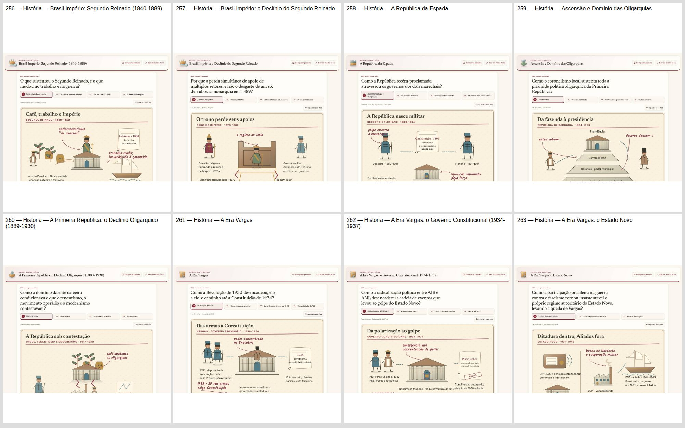

### Folha 110 — 1440 px / light

- summary-historia-republica-liberal-1945-1964-democracia-em-tempos-de-guerra-fria
- summary-historia-republica-liberal-1945-1964-desenvolvimentismo-e-populismo
- summary-historia-regime-militar-1964-1985-i
- summary-historia-regime-militar-1964-1985-ii
- summary-historia-o-brasil-atual
- summary-lingua-inglesa-text-comprehension-taxonomy-and-terminology
- summary-lingua-inglesa-text-comprehension-songs-and-poems
- summary-lingua-inglesa-text-comprehension-calories-and-energy

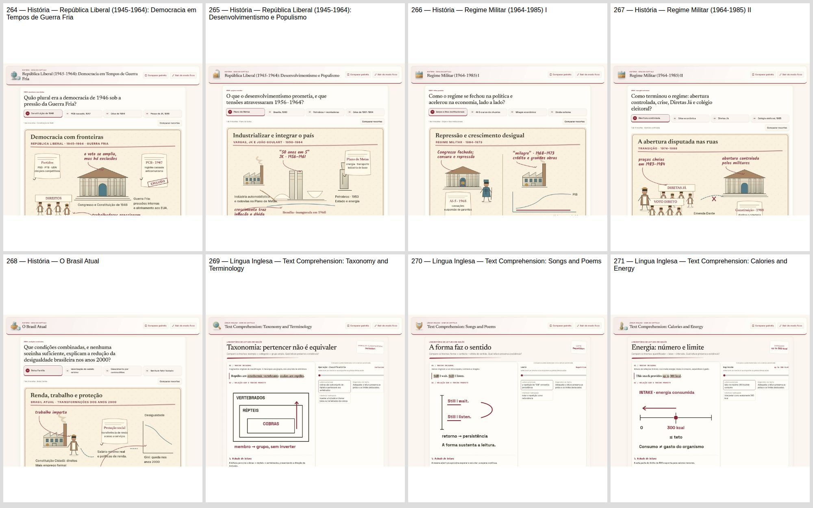

### Folha 111 — 1440 px / light

- summary-lingua-inglesa-text-comprehension-earthquakes
- summary-lingua-inglesa-text-comprehension-hurricanes
- summary-lingua-inglesa-text-comprehension-ecology-greenhouse-gases
- summary-lingua-inglesa-text-comprehension-pollution
- summary-lingua-inglesa-text-comprehension-the-human-brain
- summary-lingua-inglesa-text-comprehension-global-warming
- summary-lingua-inglesa-text-comprehension-novels-short-stories
- summary-lingua-inglesa-text-comprehension-bacteria

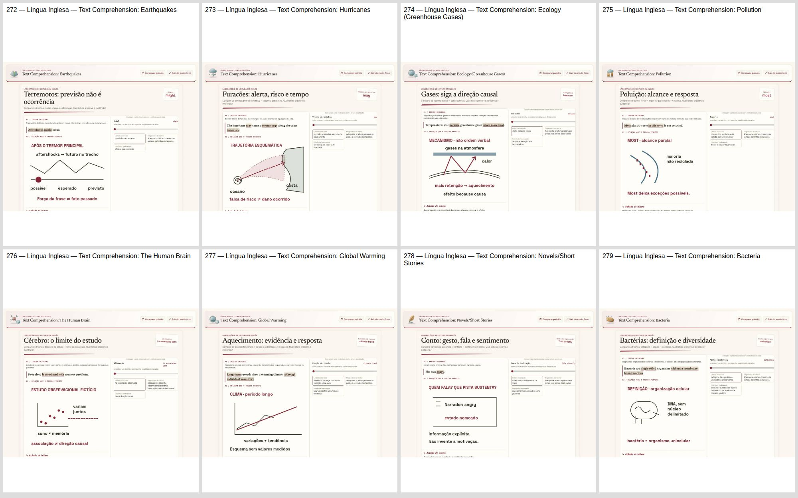

### Folha 112 — 1440 px / light

- summary-lingua-inglesa-text-comprehension-viruses
- summary-lingua-inglesa-text-comprehension-discrimination-against-women
- summary-lingua-inglesa-text-comprehension-women-empowerment
- summary-lingua-inglesa-text-comprehension-digital-technology
- summary-lingua-inglesa-text-comprehension-health-probiotics
- summary-lingua-inglesa-text-comprehension-stem-cells
- summary-redacao-a-dissertacao-no-vestibular-mitos-e-verdades
- summary-redacao-o-que-se-avalia-na-dissertacao-competencias-e-habilidades

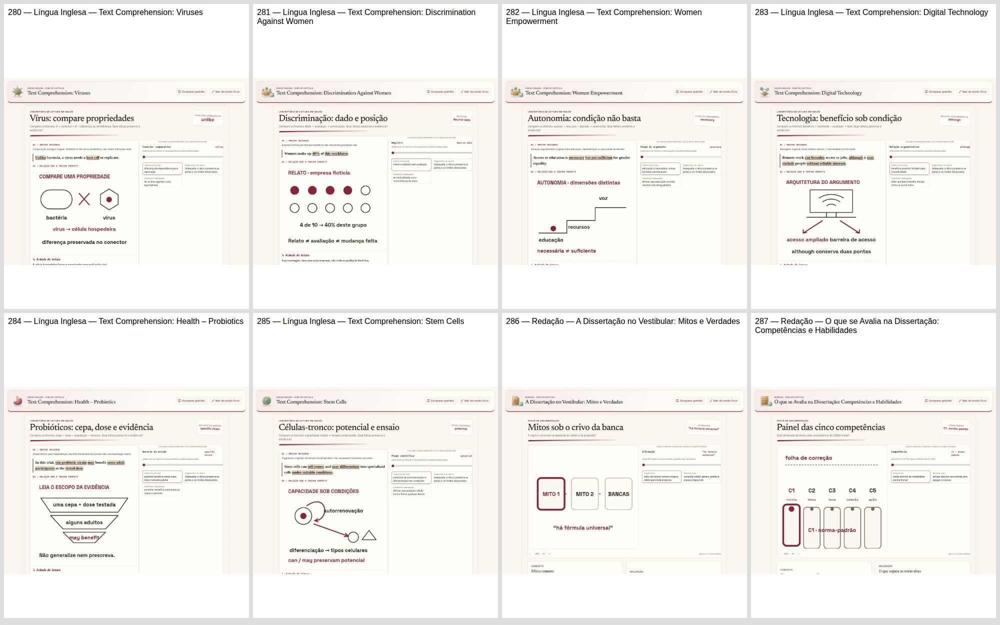

### Folha 113 — 1440 px / light

- summary-redacao-organizando-as-ideias-brainstorm-e-mind-maps
- summary-redacao-projeto-de-texto-em-favor-da-progressao-textual
- summary-redacao-repertorio-o-diferencial-de-redacoes-de-sucesso
- summary-redacao-qual-sera-o-tema-deste-ano-grandes-eixos-tematicos
- summary-redacao-diferentes-graus-de-adequacao-a-proposta
- summary-redacao-tangenciamento-e-fuga-a-fronteira-do-tema
- summary-redacao-generos-e-sua-relacao-com-a-estrutura-do-texto
- summary-redacao-estrutura-classica-do-texto-dissertativo

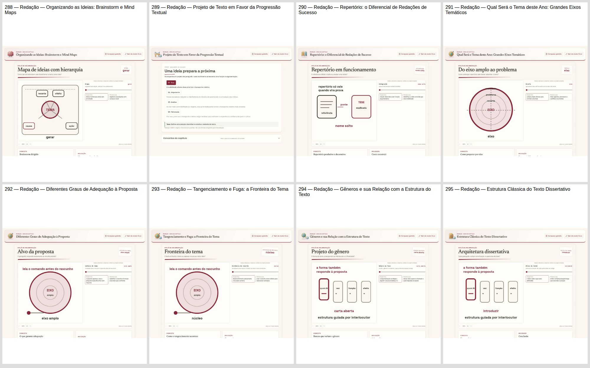

### Folha 114 — 1440 px / light

- summary-redacao-lendo-a-coletanea-a-apreensao-de-sentidos-i
- summary-redacao-lendo-a-coletanea-a-apreensao-de-sentidos-ii
- summary-redacao-lendo-a-coletanea-a-compreensao-e-o-texto-autoral-i
- summary-redacao-lendo-a-coletanea-a-compreensao-e-o-texto-autoral-ii
- summary-redacao-incrementando-o-repertorio-meio-ambiente
- summary-redacao-analisando-tema-de-redacao-meio-ambiente
- summary-redacao-incrementando-o-repertorio-educacao-e-trabalho
- summary-redacao-analisando-tema-de-redacao-educacao-e-trabalho

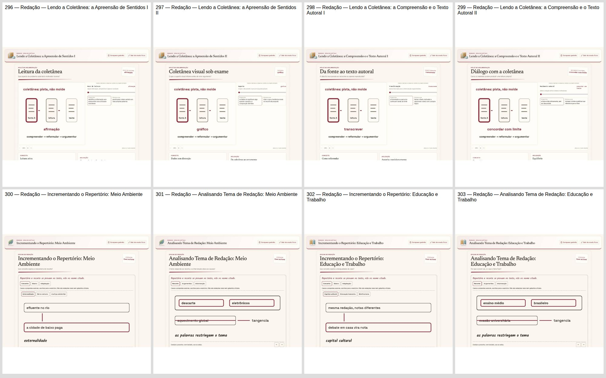

### Folha 115 — 1440 px / light

- summary-redacao-incrementando-o-repertorio-temas-abstratos
- summary-redacao-analisando-tema-abstrato-de-redacao
- summary-redacao-incrementando-o-repertorio-corpo-saude-e-sexualidade
- summary-redacao-analisando-tema-de-redacao-corpo-saude-e-sexualidade
- summary-redacao-incrementando-o-repertorio-violencia-leis-e-punicao
- summary-redacao-analisando-tema-de-redacao-violencia-leis-e-punicao
- summary-redacao-incrementando-o-repertorio-cidadania-e-poder
- summary-redacao-analisando-tema-de-redacao-cidadania-e-poder

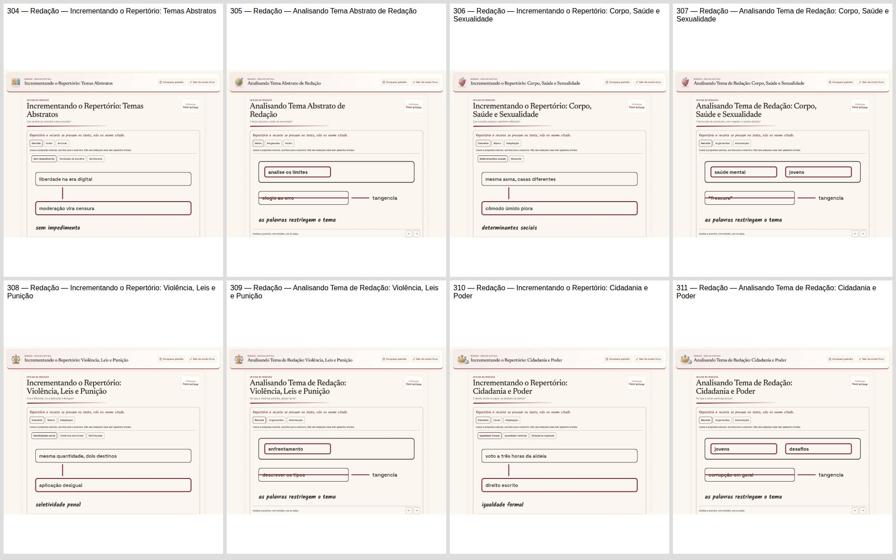

### Folha 116 — 1440 px / light

- summary-redacao-incrementando-o-repertorio-arte-cultura-e-relacoes-sociais
- summary-redacao-analisando-o-tema-de-redacao-arte-cultura-e-relacoes-sociais
- summary-redacao-incrementando-o-repertorio-midia-e-sociedade
- summary-redacao-analisando-tema-de-redacao-midia-e-sociedade
- summary-redacao-paragrafo-de-introducao-delimitando-a-opiniao
- summary-redacao-paragrafo-de-introducao-como-contextualizar
- summary-redacao-argumentacao-auditorio-particular-e-universal
- summary-redacao-argumentacao-quase-logica-e-efeito-de-verdade

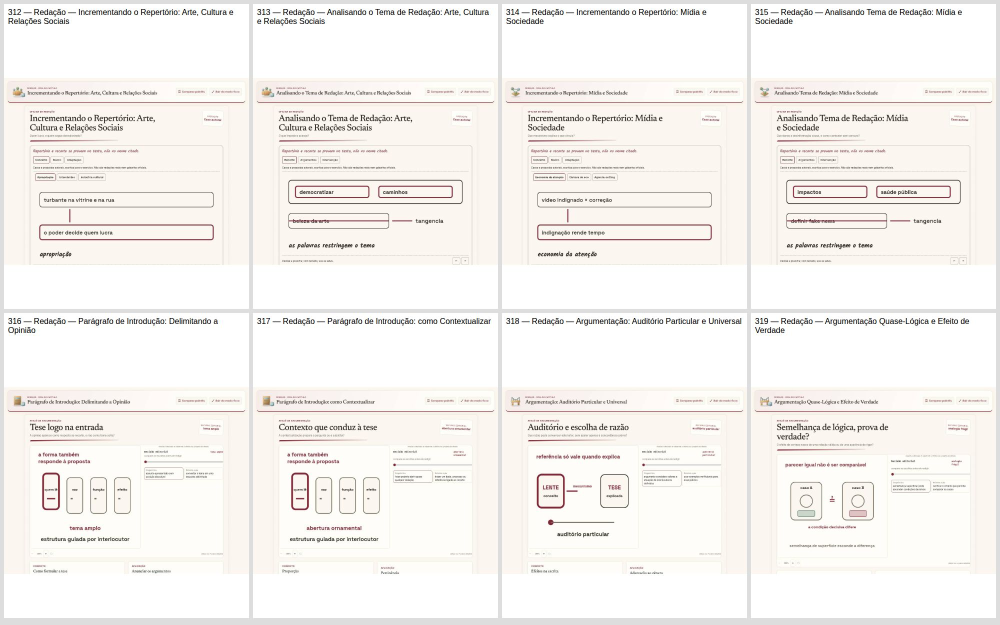

### Folha 117 — 1440 px / light

- summary-redacao-argumentacao-e-coerencia-interna
- summary-redacao-argumentacao-e-coerencia-externa
- summary-redacao-recursos-argumentativos-dados-numericos-e-exemplos
- summary-redacao-recursos-argumentativos-vozes-prestigiadas
- summary-redacao-ressalvando-o-ponto-de-vista-contrario
- summary-redacao-refutando-o-ponto-contrario
- summary-redacao-recursos-argumentativos-interdiscursividade-e-intertextualidade
- summary-redacao-recursos-argumentativos-temas-de-redacao-ja-analisados

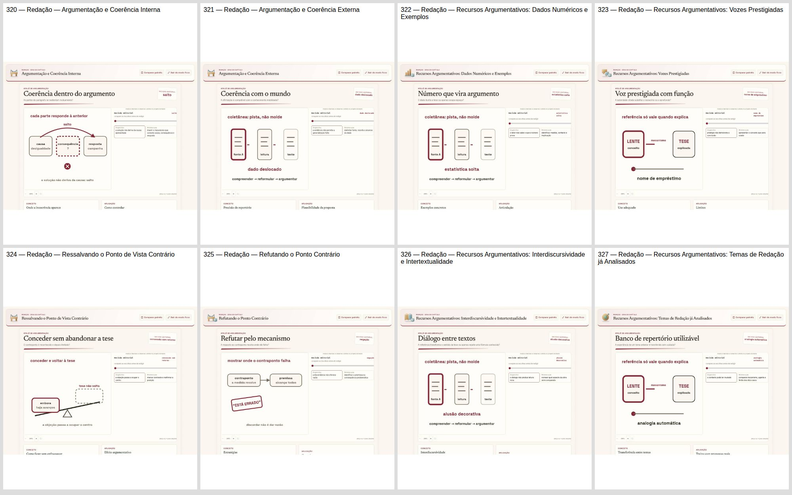

### Folha 118 — 1440 px / light

- summary-redacao-recursos-argumentativos-fatos-da-atualidade
- summary-redacao-recursos-argumentativos-multiplos-dominios-do-saber
- summary-redacao-conclusao-por-sintese-ou-retomada-da-tese
- summary-redacao-conclusao-sumarizacao-focalizacao-e-expressividade
- summary-redacao-proposta-de-intervencao-atores-sociais-e-cidadania
- summary-redacao-proposta-de-intervencao-viabilizacao-e-inovacao
- summary-redacao-proposta-de-intervencao-coerencia-argumentativa
- summary-redacao-proposta-de-intervencao-respeito-aos-direitos-humanos

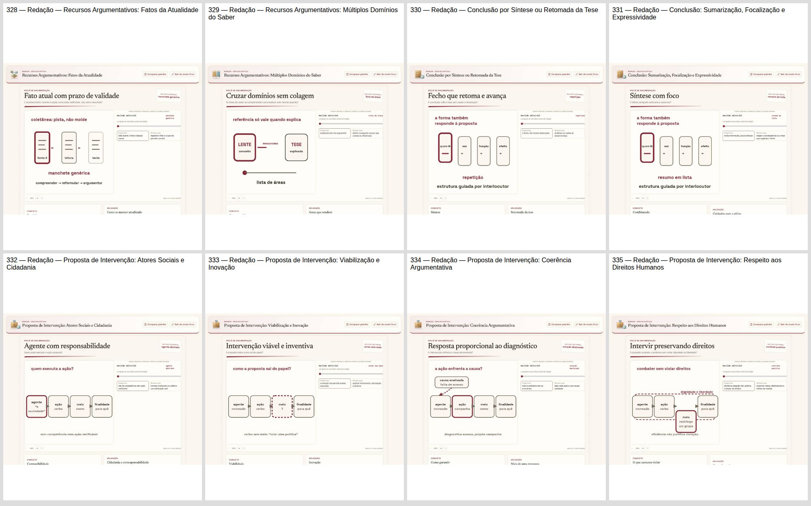

### Folha 119 — 1440 px / light

- summary-redacao-recursos-de-coesao-referencial-no-texto-dissertativo
- summary-redacao-recursos-de-coesao-sequencial-no-texto-dissertativo
- summary-redacao-coesao-no-texto-dissertativo-analise-de-problemas
- summary-redacao-recursos-linguisticos-norma-clareza-e-expressividade
- summary-redacao-os-direitos-humanos-de-1-geracao-direitos-individuais
- summary-redacao-os-direitos-humanos-de-2-e-3-geracao-direitos-sociais-coletivos-e-difusos
- summary-redacao-redacoes-nota-1000-trunfos-a-inspirar
- summary-redacao-redacoes-na-midia-como-aprimorar

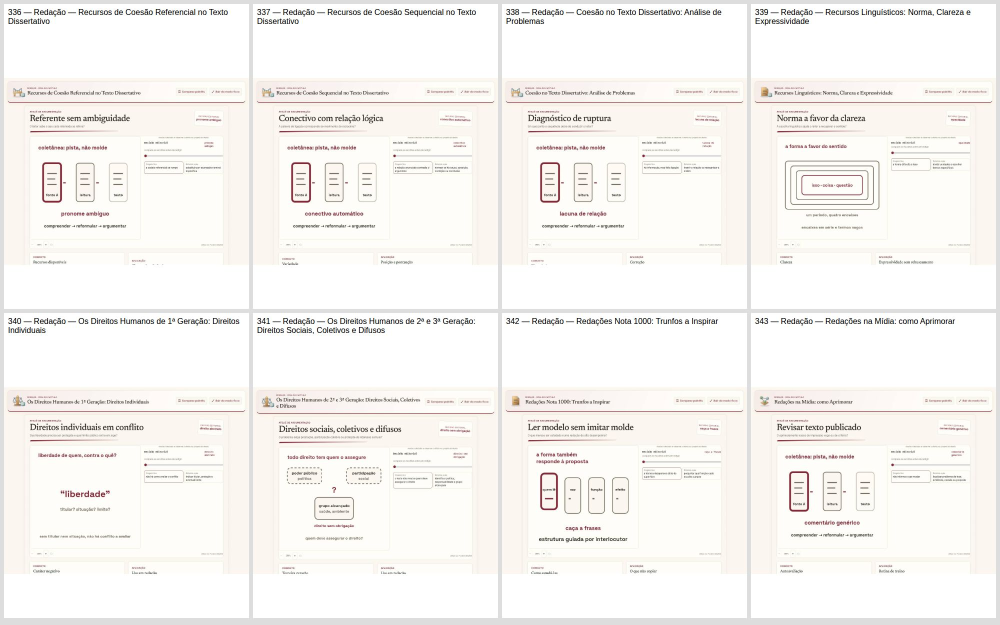

### Folha 120 — 1440 px / light

- summary-gramatica-lingua-um-sistema-complexo
- summary-gramatica-variacao-linguistica
- summary-gramatica-substantivo-os-nomes-e-a-visao-do-enunciador
- summary-gramatica-tipos-de-texto-explorando-elementos-concretos-e-conceitos-abstratos
- summary-gramatica-artigo-numeral-e-adjetivo-no-sintagma-nominal
- summary-gramatica-pronomes
- summary-gramatica-verbo
- summary-gramatica-adverbio-e-locucoes-adverbiais-circunstanciadores

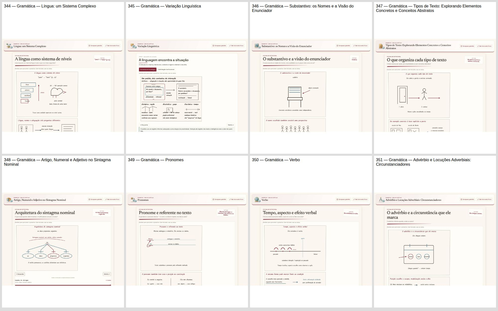

### Folha 121 — 1440 px / light

- summary-gramatica-verbo-e-sintaxe-da-oracao
- summary-gramatica-concordancia
- summary-gramatica-significados-implicitos
- summary-gramatica-tipos-de-discurso
- summary-gramatica-pontuacao-i-principios-para-o-uso-da-virgula
- summary-gramatica-pontuacao-ii-virgula-entre-oracoes-e-outros-sinais-de-pontuacao
- summary-gramatica-o-lexico-em-contexto-variadas-possibilidades-semanticas
- summary-gramatica-ambiguidade-duplicidade-no-lexico-e-na-sintaxe

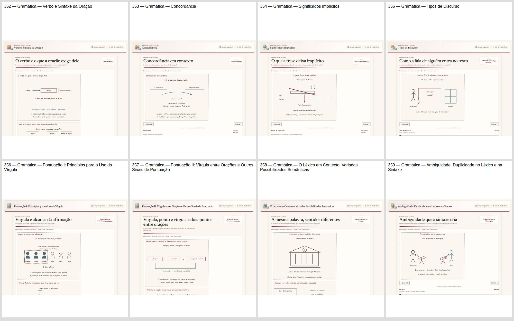

### Folha 122 — 1440 px / light

- summary-gramatica-mecanismo-de-regencia
- summary-gramatica-crase
- summary-gramatica-processos-de-formacao-de-palavras
- summary-gramatica-funcoes-sintaticas-nominais-e-vocativo
- summary-gramatica-tipos-de-sujeito
- summary-gramatica-vozes-verbais
- summary-gramatica-oracoes-substantivas
- summary-gramatica-oracoes-adjetivas

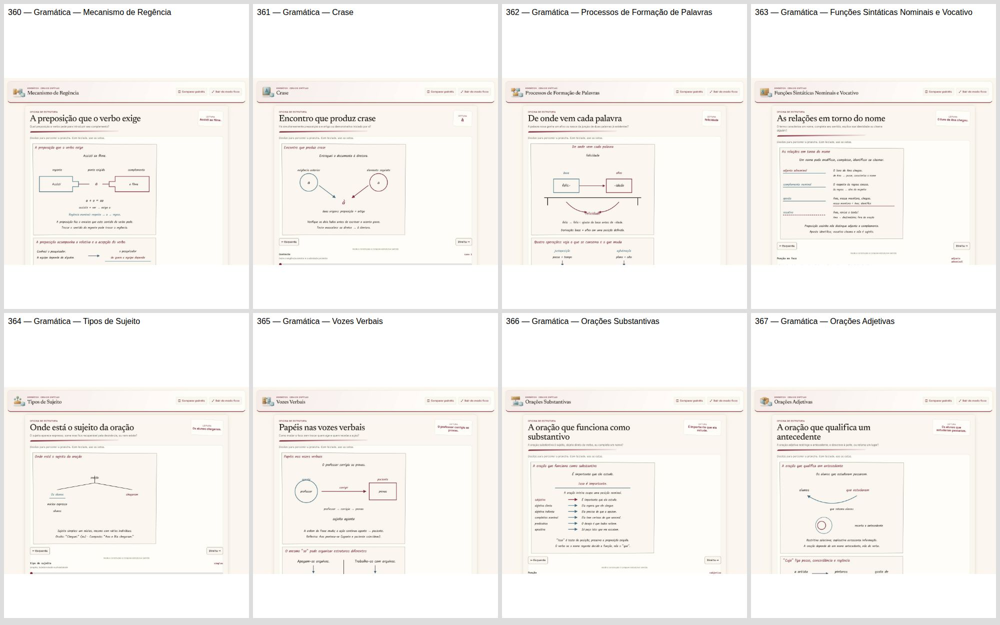

### Folha 123 — 1440 px / light

- summary-gramatica-oracoes-adverbiais
- summary-gramatica-oracoes-coordenadas
- summary-literatura-a-arte-e-suas-linguagens
- summary-literatura-texto-literario-x-texto-nao-literario
- summary-literatura-trovadorismo-e-humanismo
- summary-literatura-renascimento-e-camoes
- summary-literatura-brasil-primeiros-registros
- summary-literatura-a-estetica-barroca

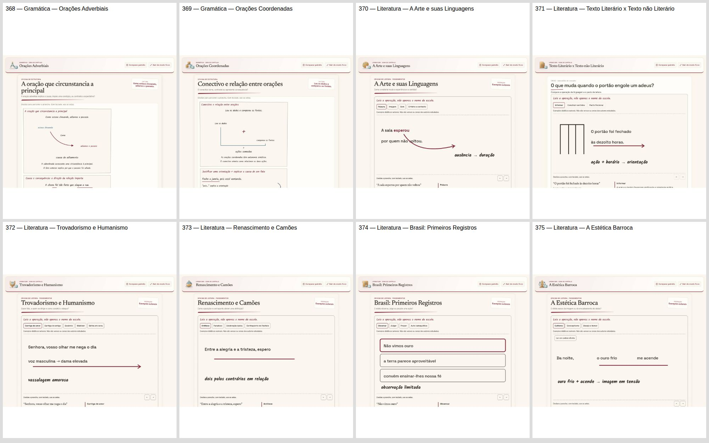

### Folha 124 — 1440 px / light

- summary-literatura-a-estetica-neoclassica
- summary-literatura-a-estetica-romantica-poesia
- summary-literatura-elementos-da-narrativa
- summary-literatura-a-estetica-romantica-prosa
- summary-literatura-a-estetica-realista
- summary-literatura-machado-de-assis
- summary-literatura-naturalismo
- summary-literatura-realismo-portugues-eca-de-queiros

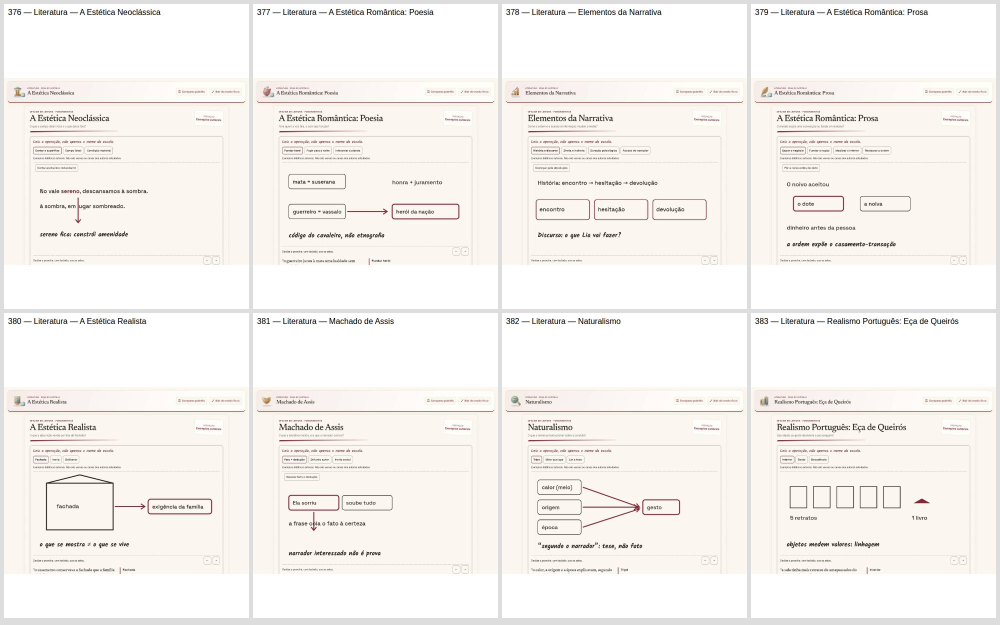

### Folha 125 — 1440 px / light

- summary-literatura-parnasianismo
- summary-literatura-simbolismo
- summary-literatura-pre-modernismo
- summary-literatura-vanguardas-artisticas
- summary-literatura-fernando-pessoa
- summary-literatura-semana-de-arte-moderna
- summary-literatura-modernismo-no-brasil-primeira-geracao
- summary-literatura-segunda-geracao-modernista-prosa

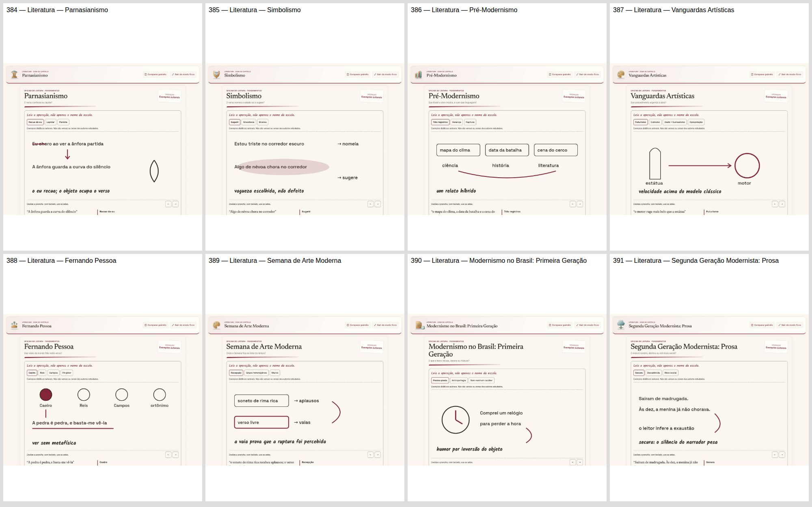

### Folha 126 — 1440 px / light

- summary-literatura-graciliano-ramos
- summary-literatura-segunda-geracao-modernista-poesia
- summary-literatura-carlos-drummond-de-andrade
- summary-literatura-joao-cabral-de-melo-neto
- summary-literatura-poesia-concreta
- summary-literatura-clarice-lispector
- summary-literatura-guimaraes-rosa
- summary-literatura-poesia-brasileira-1960-1980

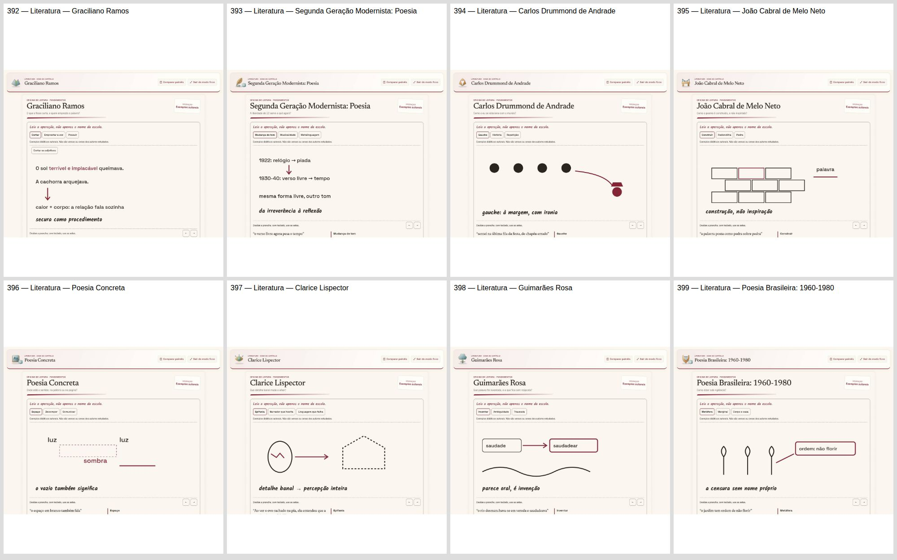

### Folha 127 — 1440 px / light

- summary-literatura-prosa-brasileira-1960-1980
- summary-literatura-literatura-lusofona-contemporanea
- summary-literatura-poesia-brasileira-contemporanea
- summary-literatura-prosa-brasileira-contemporanea
- summary-literatura-artes-plasticas-brasileiras
- summary-literatura-teatro-brasileiro
- summary-literatura-cancioneiro-popular-brasileiro
- summary-entendimento-de-texto-fatores-de-textualidade

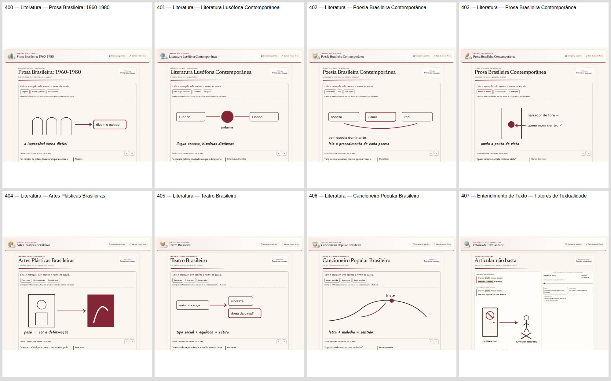

### Folha 128 — 1440 px / light

- summary-entendimento-de-texto-os-dois-niveis-da-leitura
- summary-entendimento-de-texto-intertextualidade-e-interdiscursividade
- summary-entendimento-de-texto-generos-textuais
- summary-entendimento-de-texto-generos-narrativos-e-niveis-de-compreensao
- summary-entendimento-de-texto-generos-nao-verbais-fundamentos-de-leitura
- summary-entendimento-de-texto-funcoes-da-linguagem
- summary-entendimento-de-texto-funcao-poetica-e-linguagem-literaria
- summary-entendimento-de-texto-figuras-de-linguagem

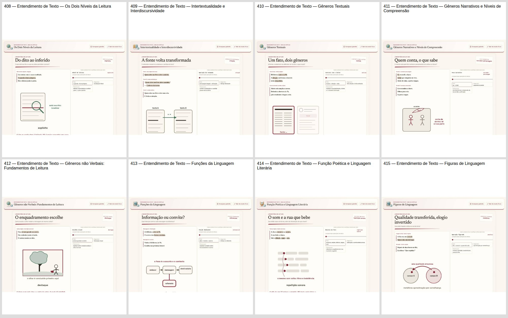

### Folha 129 — 1440 px / light

- summary-entendimento-de-texto-modelos-de-leitura-e-distorcoes-interpretativas
- summary-entendimento-de-texto-leitura-de-textos-comicos
- summary-entendimento-de-texto-tecnologias-digitais-da-informacao-e-comunicacao-tdic-impactos-sociais
- summary-matematica-potencias-e-radicais
- summary-matematica-razao-e-proporcao
- summary-matematica-porcentagem
- summary-matematica-o-sistema-de-numeracao-decimal
- summary-matematica-introducao-a-teoria-dos-numeros-inteiros

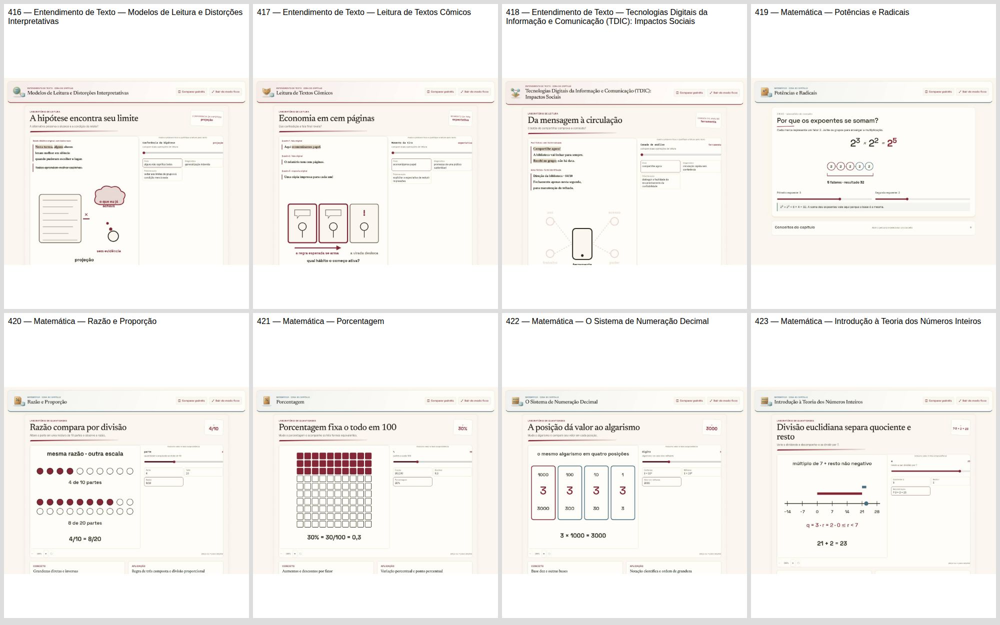

### Folha 130 — 1440 px / light

- summary-matematica-introducao-as-sequencias
- summary-matematica-progressao-aritmetica
- summary-matematica-progressao-geometrica
- summary-matematica-sequencias
- summary-matematica-sistemas-de-equacoes
- summary-matematica-tabelas-e-matrizes
- summary-matematica-multiplicacao-de-matrizes
- summary-matematica-determinantes

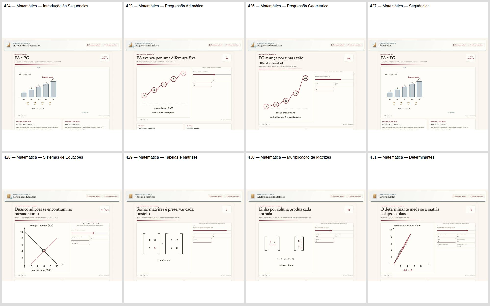

### Folha 131 — 1440 px / light

- summary-matematica-discussao-de-sistemas-lineares
- summary-matematica-medias
- summary-matematica-introducao-as-tecnicas-de-contagem
- summary-matematica-o-problema-da-fila
- summary-matematica-o-problema-do-grupo
- summary-matematica-tecnicas-de-contagem
- summary-matematica-operacoes-com-probabilidades
- summary-matematica-eventos-disjuntos-e-eventos-independentes

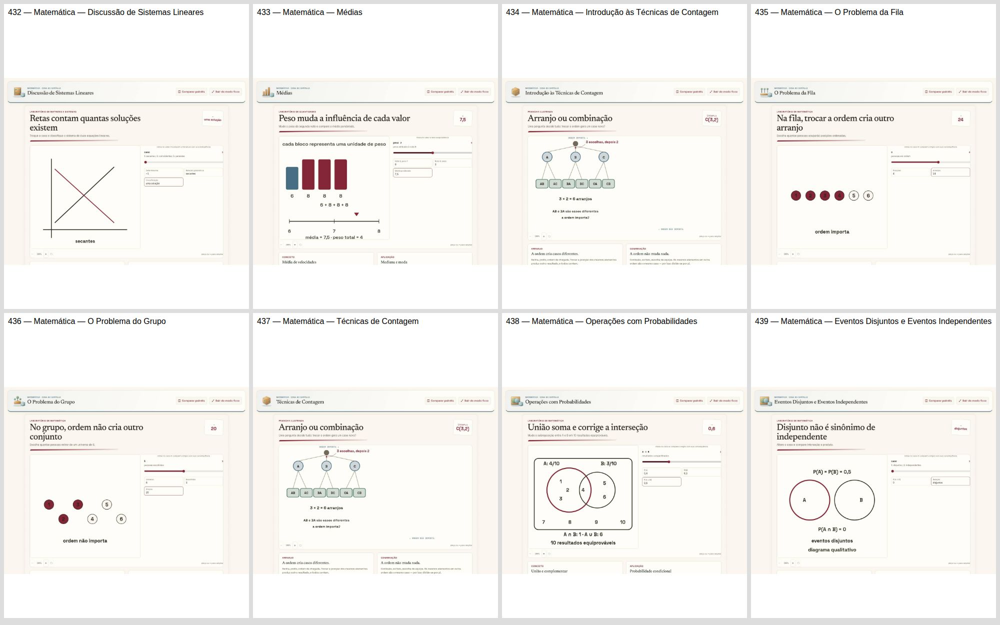

### Folha 132 — 1440 px / light

- summary-matematica-estatistica-descritiva
- summary-matematica-introducao-a-geometria-plana
- summary-matematica-angulos-em-triangulos
- summary-matematica-angulos-em-poligonos
- summary-matematica-angulos-e-circunferencias
- summary-matematica-simetrias-e-congruencias
- summary-matematica-identificacao-de-simetrias-i
- summary-matematica-identificacao-de-simetrias-ii

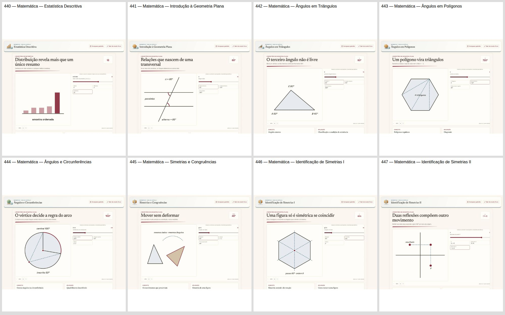

### Folha 133 — 1440 px / light

- summary-matematica-a-geometria-da-proporcionalidade
- summary-matematica-semelhanca-de-triangulos
- summary-matematica-o-ponto-medio-e-o-baricentro-de-um-triangulo
- summary-matematica-triangulo-retangulo
- summary-matematica-a-geometria-metrica-plana
- summary-matematica-areas-de-poligonos
- summary-matematica-area-do-circulo-e-de-suas-partes
- summary-matematica-razoes-entre-areas-de-figuras-planas

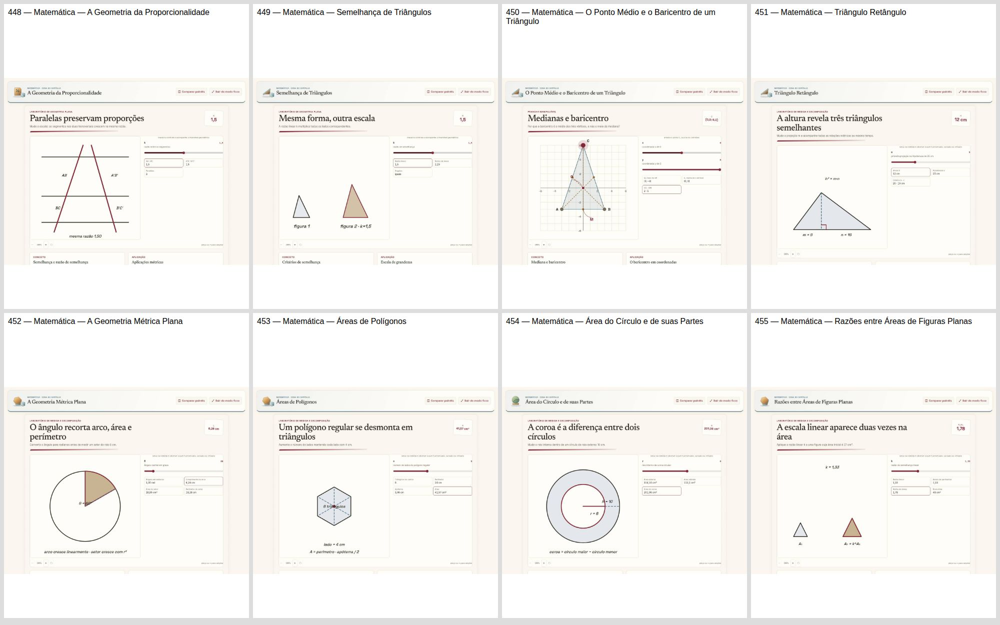

### Folha 134 — 1440 px / light

- summary-matematica-areas-de-figuras-planas
- summary-matematica-trigonometria-no-triangulo-retangulo
- summary-matematica-relacoes-trigonometricas-em-poligonos
- summary-matematica-a-trigonometria-dos-numeros-reais
- summary-matematica-outras-razoes-trigonometricas
- summary-matematica-a-relacao-fundamental-da-trigonometria
- summary-matematica-transformacoes-trigonometricas
- summary-matematica-funcoes-trigonometricas

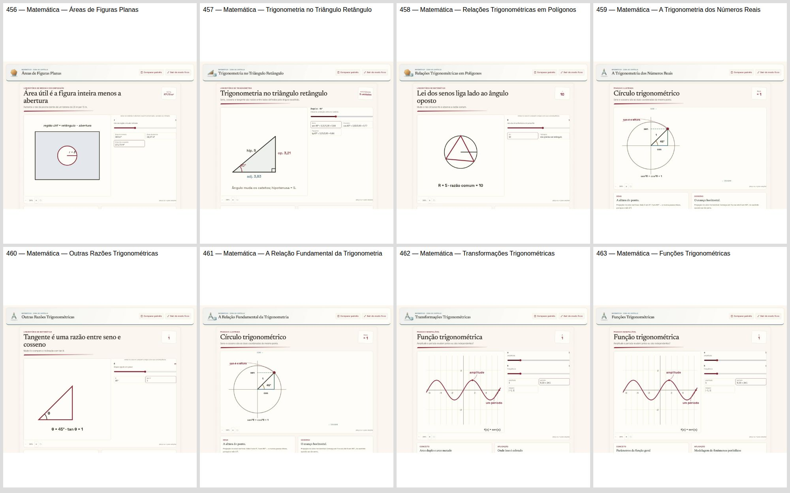

### Folha 135 — 1440 px / light

- summary-matematica-o-universo-tridimensional
- summary-matematica-cubos-e-paralelepipedos
- summary-matematica-prismas
- summary-matematica-piramides
- summary-matematica-solidos-de-revolucao
- summary-matematica-razoes-entre-volumes-de-solidos
- summary-matematica-introducao-a-geometria-analitica
- summary-matematica-lugar-geometrico-e-equacao-da-circunferencia

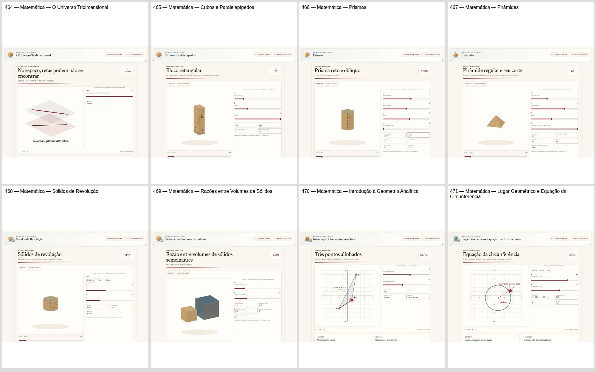

### Folha 136 — 1440 px / light

- summary-matematica-estudo-analitico-da-reta
- summary-matematica-posicoes-relativas-entre-duas-retas
- summary-matematica-distancia-entre-um-ponto-e-uma-reta
- summary-matematica-posicoes-relativas-entre-uma-reta-e-uma-circunferencia
- summary-matematica-introducao-ao-estudo-analitico-das-conicas
- summary-matematica-representacao-geometrica-de-inequacoes
- summary-matematica-a-geometria-dos-numeros-complexos
- summary-matematica-tecnicas-algebricas

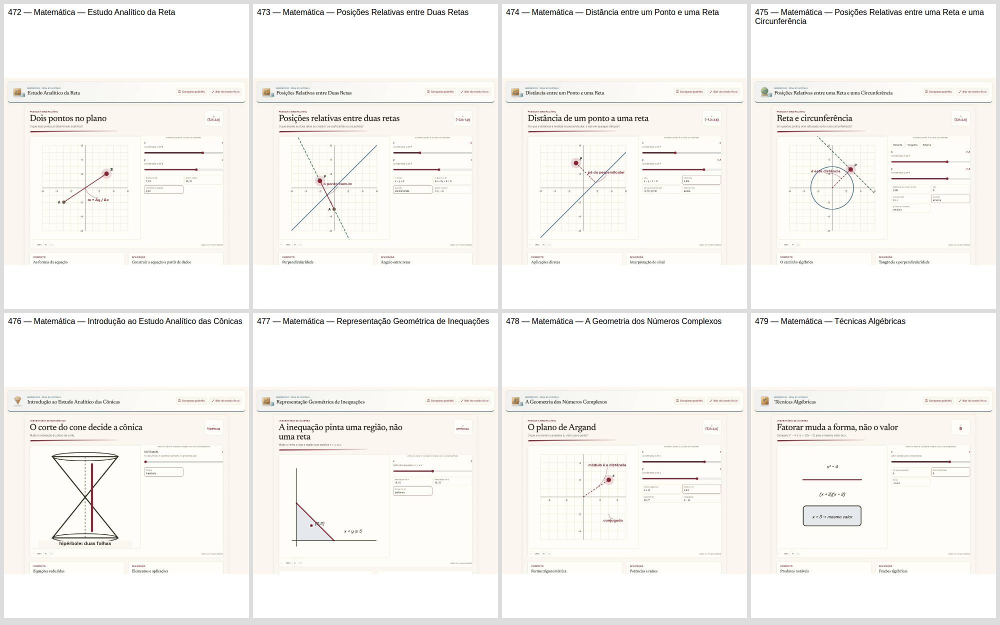

### Folha 137 — 1440 px / light

- summary-matematica-igualdades
- summary-matematica-desigualdades
- summary-matematica-modelagem-algebrica-de-problemas-i
- summary-matematica-equacoes-do-2-grau
- summary-matematica-modelagem-algebrica-de-problemas-ii
- summary-matematica-introducao-as-funcoes
- summary-matematica-transformacoes-em-graficos-de-funcoes
- summary-matematica-composicao-de-funcoes

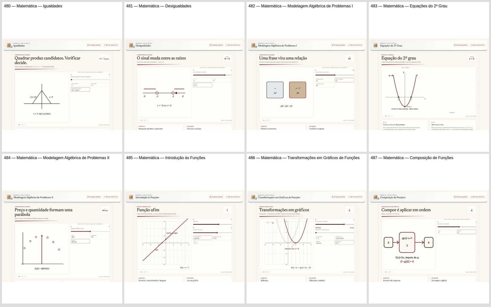

### Folha 138 — 1440 px / light

- summary-matematica-inversao-de-funcoes
- summary-matematica-funcoes-bijetoras
- summary-matematica-funcao-constante-e-funcao-afim
- summary-matematica-funcao-quadratica
- summary-matematica-estudo-do-sinal-de-funcoes
- summary-matematica-introducao-ao-modelo-exponencial
- summary-matematica-introducao-aos-logaritmos
- summary-matematica-equacoes-e-funcoes-logaritmicas

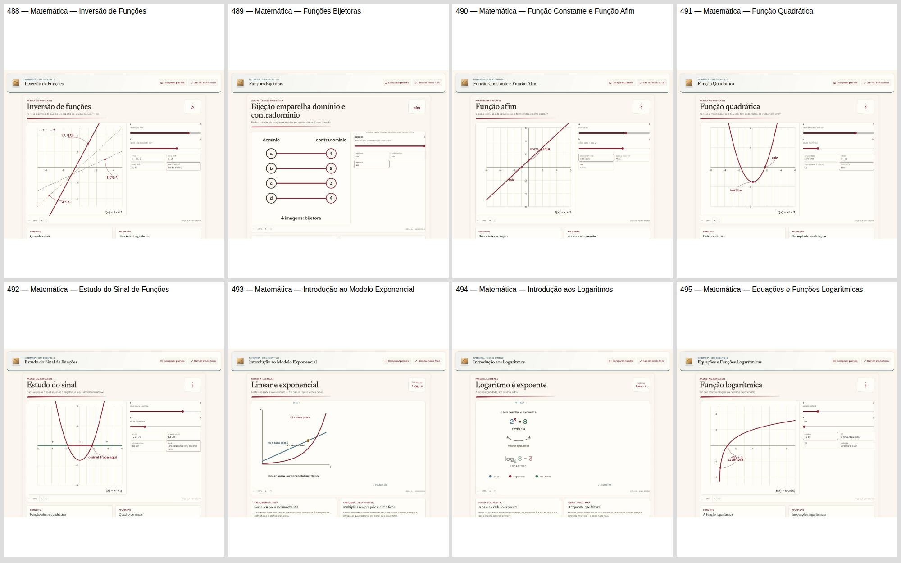

### Folha 139 — 1440 px / light

- summary-matematica-modelagem-exponencial-de-problemas
- summary-matematica-modulo-de-um-numero-real
- summary-matematica-numeros-complexos
- summary-matematica-polinomios
- summary-matematica-equacoes-polinomiais
- summary-quimica-evolucao-dos-modelos-atomicos
- summary-quimica-organizacao-da-tabela-periodica-dos-elementos
- summary-quimica-radioatividade-o-estudo-das-radiacoes

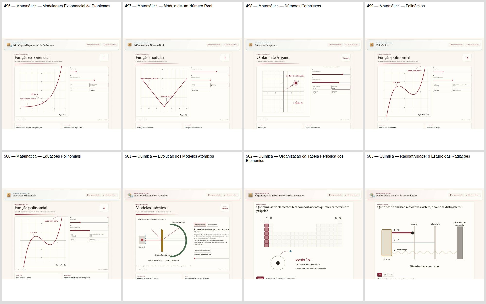

### Folha 140 — 1440 px / light

- summary-quimica-ligacoes-quimicas-e-alotropia
- summary-quimica-geometria-molecular
- summary-quimica-polaridade-das-ligacoes-e-das-moleculas
- summary-quimica-interacoes-intermoleculares
- summary-quimica-composicao-da-materia-estados-fisicos
- summary-quimica-o-estado-gasoso
- summary-quimica-estudo-dos-gases-ii
- summary-quimica-separacao-de-misturas

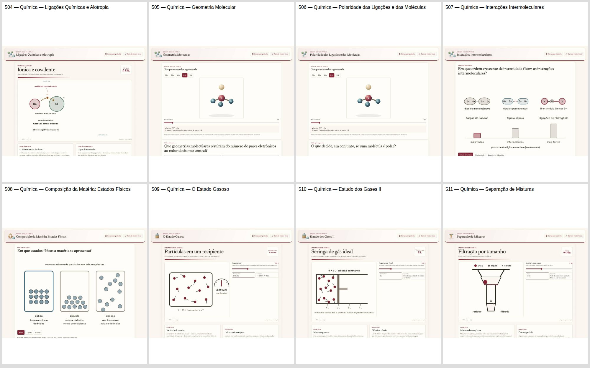

### Folha 141 — 1440 px / light

- summary-quimica-transformacoes-fisicas-e-quimicas-e-balanceamento-de-equacoes
- summary-quimica-massa-atomica-mol-e-massa-molar
- summary-quimica-determinacao-de-formulas-quimicas
- summary-quimica-estequiometria-leis-ponderais
- summary-quimica-calculos-estequiometricos
- summary-quimica-quimica-inorganica
- summary-quimica-equacoes-ionicas-e-outras-teorias-para-acidos-e-bases
- summary-quimica-processos-de-oxirreducao

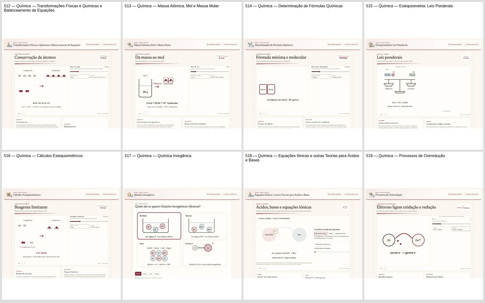

### Folha 142 — 1440 px / light

- summary-quimica-quimica-ambiental
- summary-quimica-introducao-a-quimica-organica
- summary-quimica-nomenclatura-de-compostos-organicos
- summary-quimica-nomenclatura-de-compostos-organicos-oxigenados-e-nitrogenados
- summary-quimica-reconhecimento-de-funcoes-organicas-e-algumas-de-suas-propriedades
- summary-quimica-isomeria
- summary-quimica-combustiveis-fosseis
- summary-quimica-interpretando-reacoes-organicas

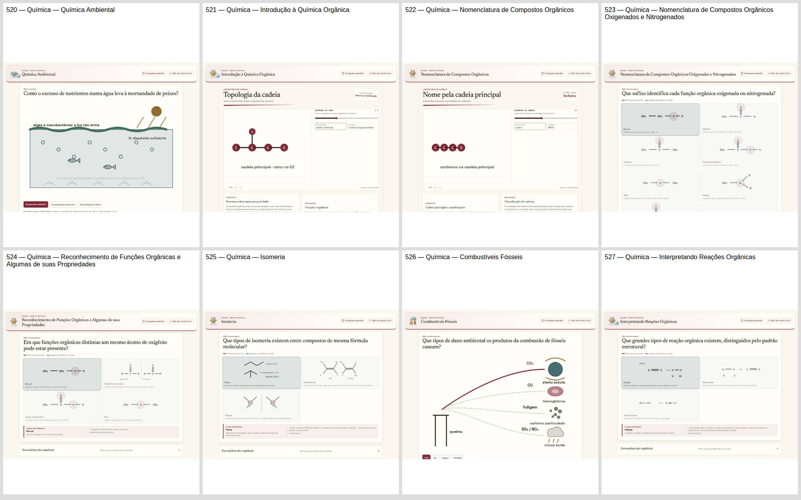

### Folha 143 — 1440 px / light

- summary-quimica-reacoes-de-substituicao
- summary-quimica-reacoes-de-adicao
- summary-quimica-reacoes-de-oxidacao-em-hidrocarbonetos
- summary-quimica-alcoois
- summary-quimica-acidos-graxos-e-esterificacao
- summary-quimica-transesterificacao-alcoolise
- summary-quimica-acidez-e-basicidade-pka
- summary-quimica-polimeros

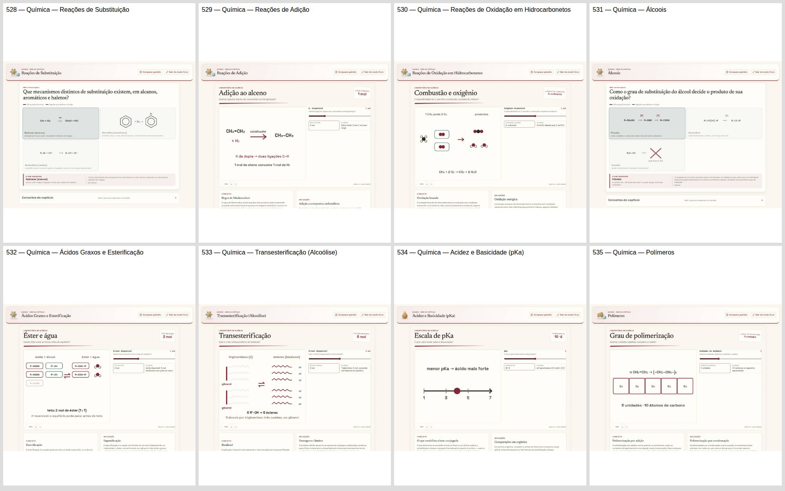

### Folha 144 — 1440 px / light

- summary-quimica-dispersoes
- summary-quimica-efeitos-coligativos
- summary-quimica-termoquimica-i
- summary-quimica-termoquimica-ii
- summary-quimica-cinetica-quimica
- summary-quimica-introducao-ao-estudo-das-pilhas-e-baterias
- summary-quimica-eletroquimica-de-processos-espontaneos
- summary-quimica-eletroquimica-de-processos-nao-espontaneos

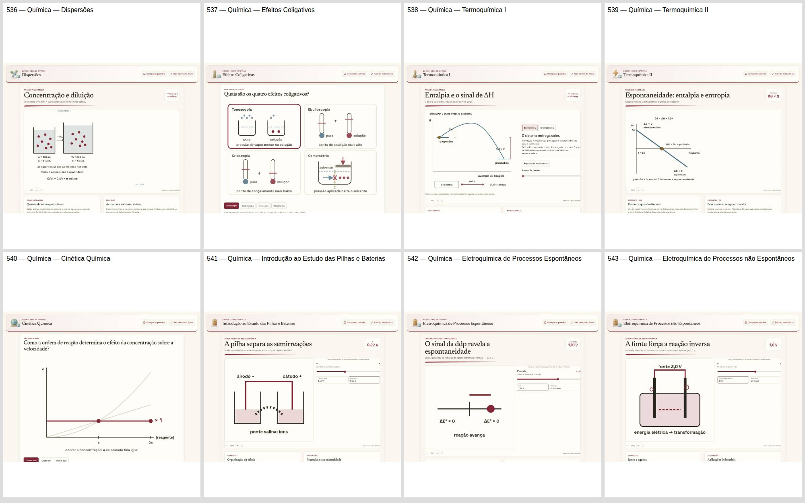

### Folha 145 — 1440 px / light

- summary-quimica-aspectos-quantitativos-da-eletroquimica-e-metalurgia
- summary-quimica-deslocamento-de-equilibrio
- summary-quimica-equilibrios-ionicos
- summary-quimica-equilibrios-ionicos-ii
- qui-equilibrio-acidificacao
- mat-probabilidade-contagem
- geo-bonus-demografico
- summary-filosofia-o-nascimento-da-filosofia-do-mito-ao-logos

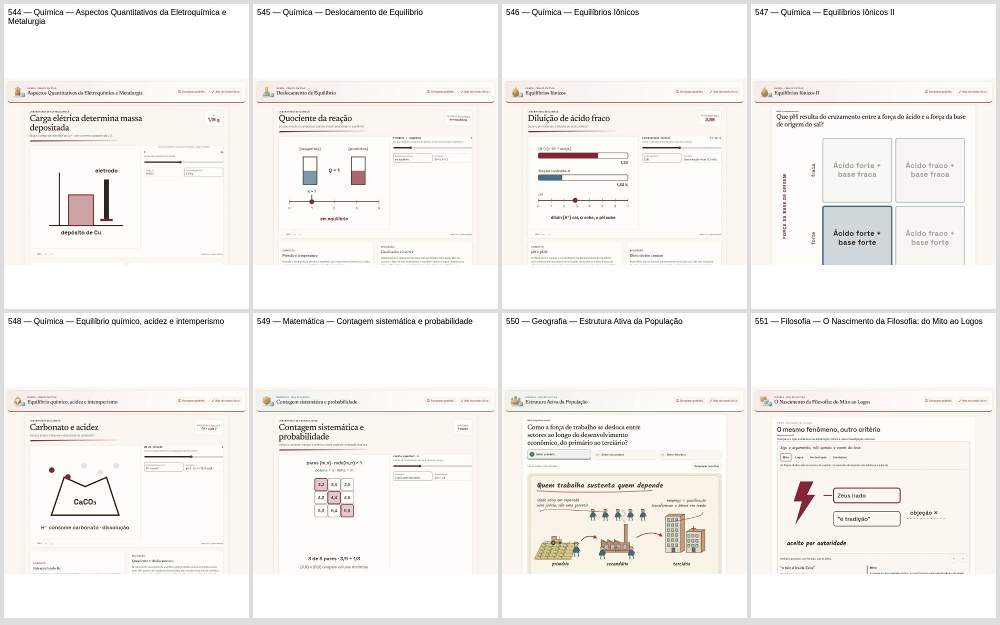

### Folha 146 — 1440 px / light

- summary-filosofia-os-filosofos-da-physis-tales-anaximandro-e-anaximenes
- summary-filosofia-heraclito-e-parmenides-o-ser-e-o-devir
- summary-filosofia-os-sofistas-e-a-crise-da-verdade
- summary-filosofia-o-metodo-socratico-e-a-maieutica
- summary-filosofia-a-teoria-das-ideias-de-platao
- summary-filosofia-o-mito-da-caverna
- summary-filosofia-a-alegoria-da-linha-dividida-e-o-conhecimento
- summary-filosofia-logica-e-metafisica-aristotelicas

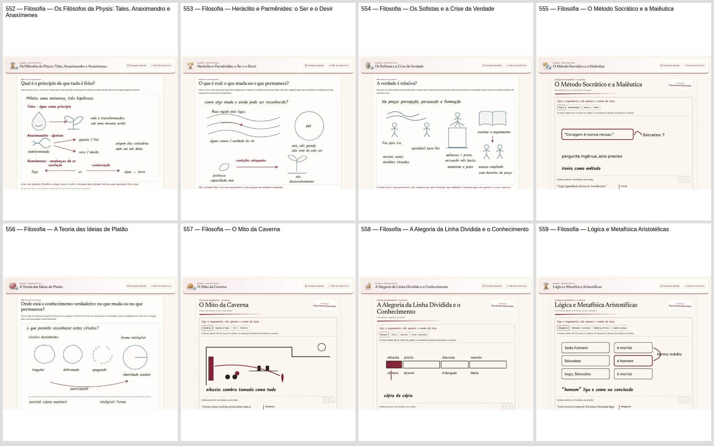

### Folha 147 — 1440 px / light

- summary-filosofia-a-etica-a-nicomaco-e-a-doutrina-do-meio-termo
- summary-filosofia-politica-aristotelica-o-homem-como-animal-politico
- summary-filosofia-patristica-e-santo-agostinho
- summary-filosofia-escolastica-e-santo-tomas-de-aquino
- summary-filosofia-a-relacao-entre-fe-e-razao
- summary-filosofia-descartes-e-o-metodo-a-duvida-hiperbolica
- summary-filosofia-racionalismo-continental-espinosa-e-leibniz
- summary-filosofia-empirismo-britanico-locke-berkeley-e-hume

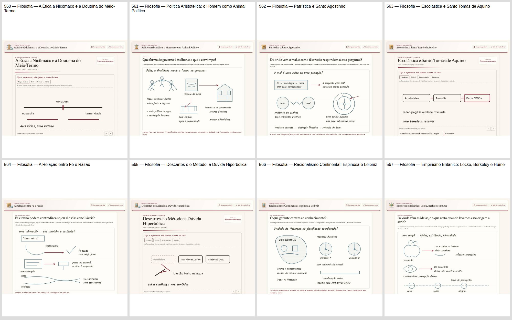

### Folha 148 — 1440 px / light

- summary-filosofia-a-critica-de-hume-a-causalidade
- summary-filosofia-hobbes-e-o-estado-de-natureza
- summary-filosofia-locke-e-os-direitos-naturais
- summary-filosofia-rousseau-e-a-vontade-geral
- summary-filosofia-o-ideal-iluminista-de-razao-e-progresso
- summary-filosofia-a-critica-da-razao-pura
- summary-filosofia-a-etica-kantiana-e-o-imperativo-categorico
- summary-filosofia-hegel-e-a-dialetica

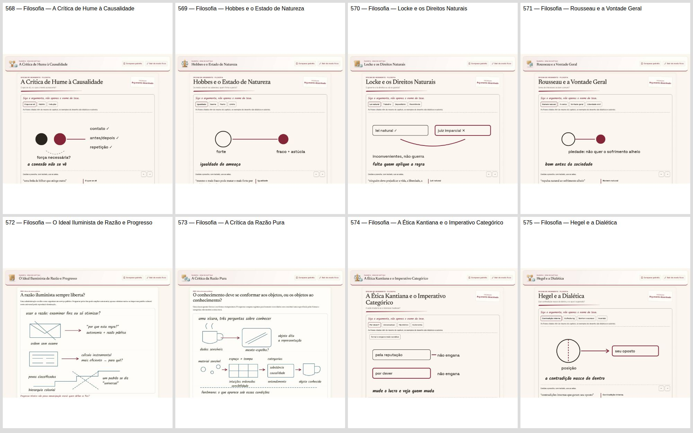

### Folha 149 — 1440 px / light

- summary-filosofia-o-materialismo-historico
- summary-filosofia-alienacao-e-mais-valia
- summary-filosofia-a-luta-de-classes-na-filosofia-marxista
- summary-filosofia-nietzsche-e-a-critica-aos-valores-morais
- summary-filosofia-o-existencialismo-de-sartre
- summary-filosofia-a-escola-de-frankfurt-e-a-industria-cultural
- summary-filosofia-foucault-e-as-relacoes-de-poder
- summary-filosofia-justica-e-direitos-humanos

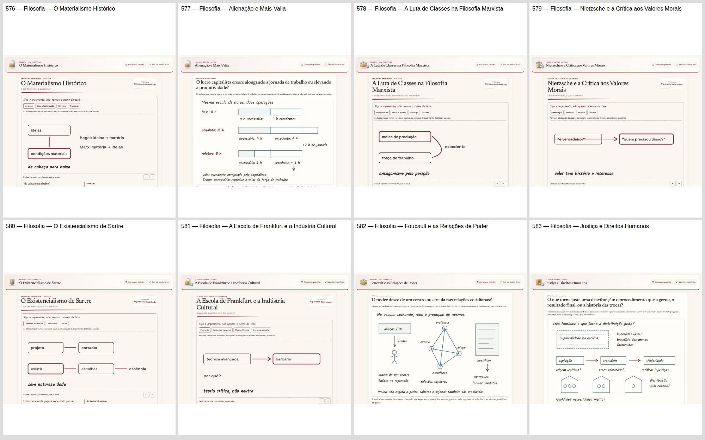

### Folha 150 — 1440 px / light

- summary-filosofia-etica-aplicada-e-bioetica
- summary-filosofia-filosofia-politica-contemporanea
- summary-sociologia-o-contexto-historico-do-surgimento-da-sociologia
- summary-sociologia-o-que-e-o-fato-social
- summary-sociologia-sociologia-e-senso-comum
- summary-sociologia-solidariedade-mecanica-e-solidariedade-organica
- summary-sociologia-anomia-e-coesao-social
- summary-sociologia-educacao-e-socializacao-em-durkheim

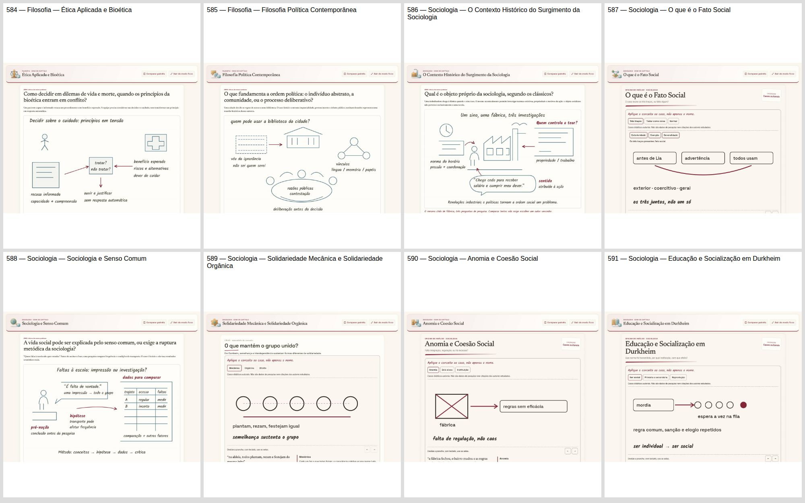

### Folha 151 — 1440 px / light

- summary-sociologia-modo-de-producao-e-estrutura-social
- summary-sociologia-ideologia-e-alienacao
- summary-sociologia-a-luta-de-classes-na-analise-sociologica
- summary-sociologia-tipos-de-acao-social
- summary-sociologia-dominacao-e-poder-em-weber
- summary-sociologia-etica-protestante-e-o-espirito-do-capitalismo
- summary-sociologia-cultura-e-etnocentrismo
- summary-sociologia-identidade-e-diferenca

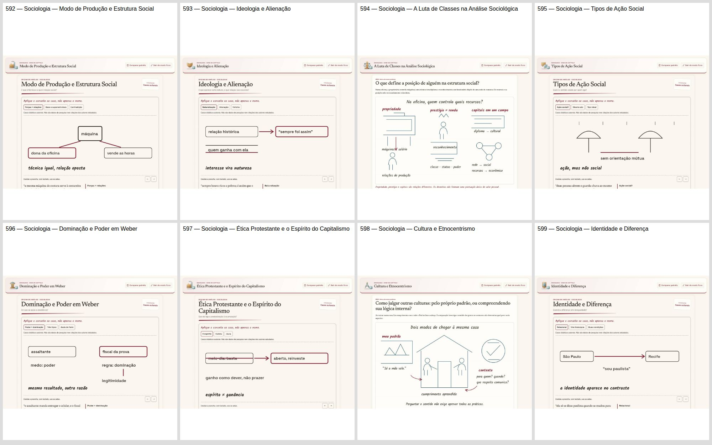

### Folha 152 — 1440 px / light

- summary-sociologia-multiculturalismo-e-relativismo-cultural
- summary-sociologia-classes-sociais-e-mobilidade-social
- summary-sociologia-desigualdade-racial-no-brasil
- summary-sociologia-desigualdade-de-genero
- summary-sociologia-divisao-social-do-trabalho
- summary-sociologia-transformacoes-no-mundo-do-trabalho
- summary-sociologia-precarizacao-e-uberizacao-do-trabalho
- summary-sociologia-movimentos-sociais-classicos-e-contemporaneos

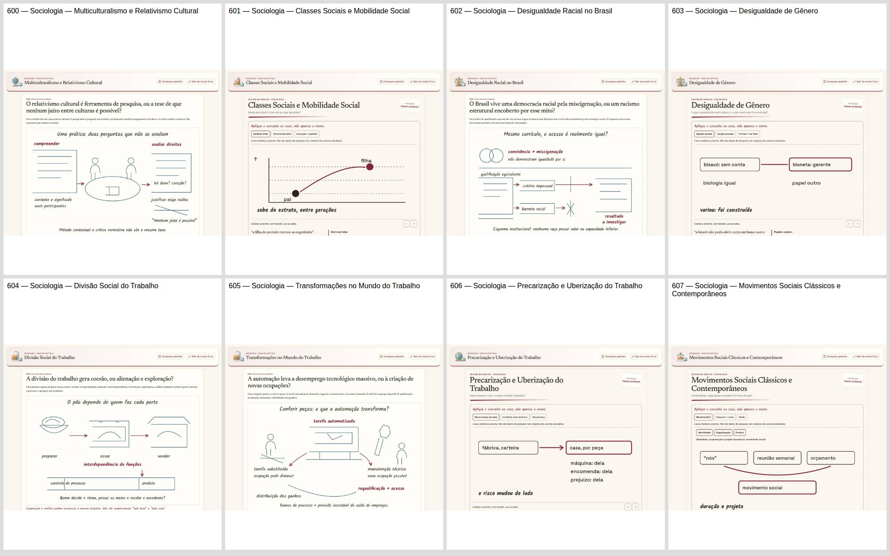

### Folha 153 — 1440 px / light

- summary-sociologia-cidadania-e-direitos
- summary-sociologia-democracia-e-participacao-politica
- summary-sociologia-globalizacao-economica-e-cultural
- summary-sociologia-o-estado-nacao-na-era-global
- summary-sociologia-a-sociedade-da-informacao

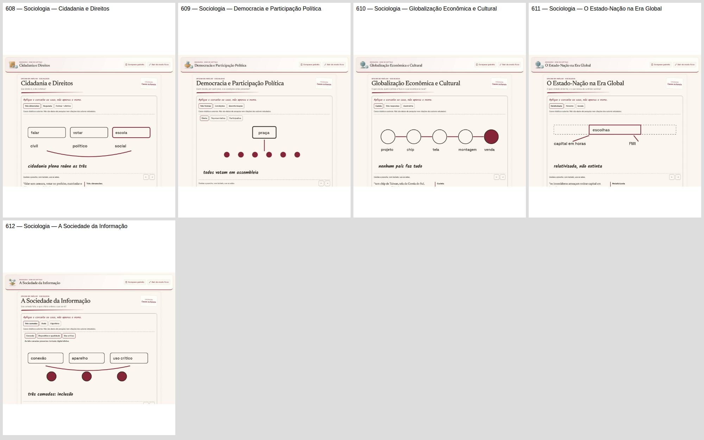
