# Galeria — Entrega B

29 composições em 1.366 px, tema claro e movimento reduzido. A passagem, o esquema e a anotação são capturados juntos. As variantes de paródia e ironia aparecem após suas composições iniciais. Os estados restantes constam na matriz do navegador.

## Text Comprehension: Taxonomy and Terminology

ID: `summary-lingua-inglesa-text-comprehension-taxonomy-and-terminology` · configuração: `taxonomy-hierarchy`

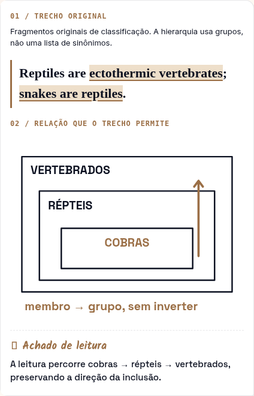

## Text Comprehension: Songs and Poems

ID: `summary-lingua-inglesa-text-comprehension-songs-and-poems` · configuração: `poetry-reading`

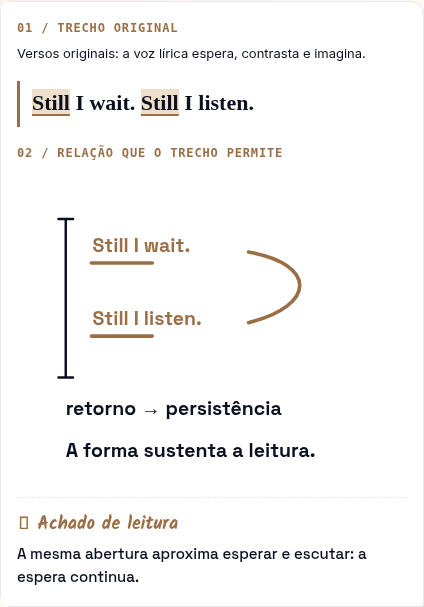

## Text Comprehension: Calories and Energy

ID: `summary-lingua-inglesa-text-comprehension-calories-and-energy` · configuração: `quantity-language`

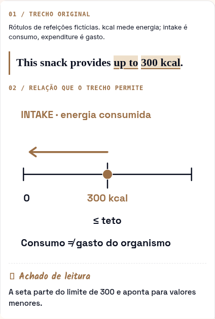

## Text Comprehension: Earthquakes

ID: `summary-lingua-inglesa-text-comprehension-earthquakes` · configuração: `modal-certainty`

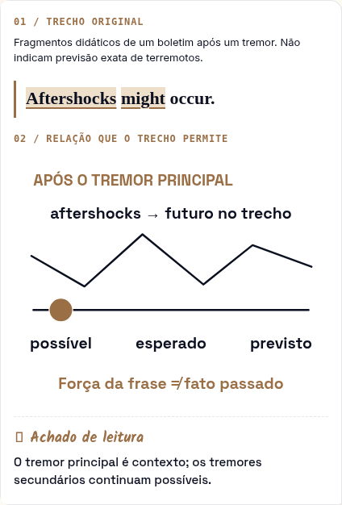

## Text Comprehension: Hurricanes

ID: `summary-lingua-inglesa-text-comprehension-hurricanes` · configuração: `hurricane-forecast`

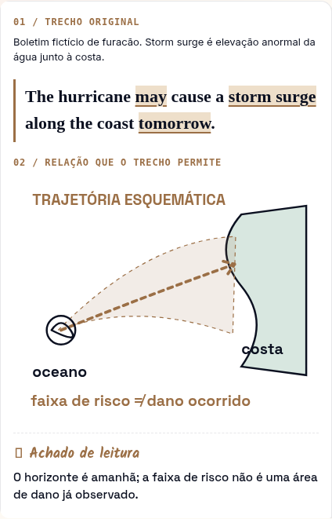

## Text Comprehension: Ecology (Greenhouse Gases)

ID: `summary-lingua-inglesa-text-comprehension-ecology-greenhouse-gases` · configuração: `cause-connectors`

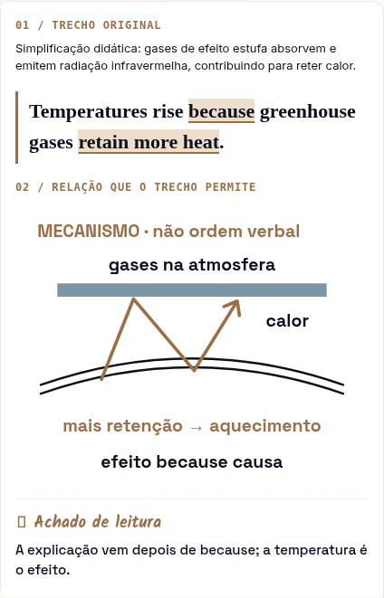

## Text Comprehension: Pollution

ID: `summary-lingua-inglesa-text-comprehension-pollution` · configuração: `pollution-connectors`

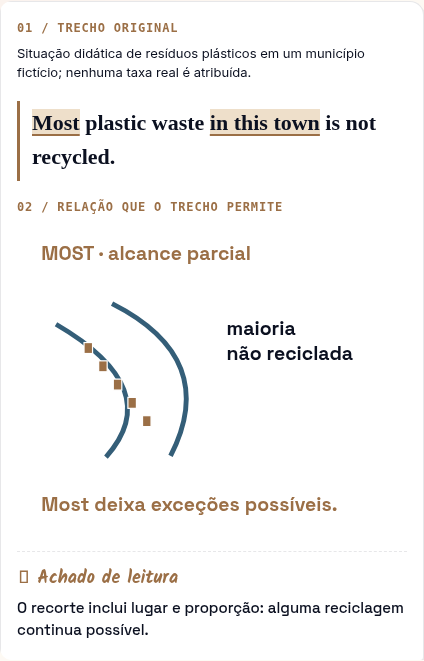

## Text Comprehension: The Human Brain

ID: `summary-lingua-inglesa-text-comprehension-the-human-brain` · configuração: `research-claims`

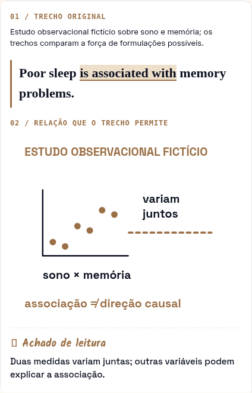

## Text Comprehension: Global Warming

ID: `summary-lingua-inglesa-text-comprehension-global-warming` · configuração: `warming-evidence`

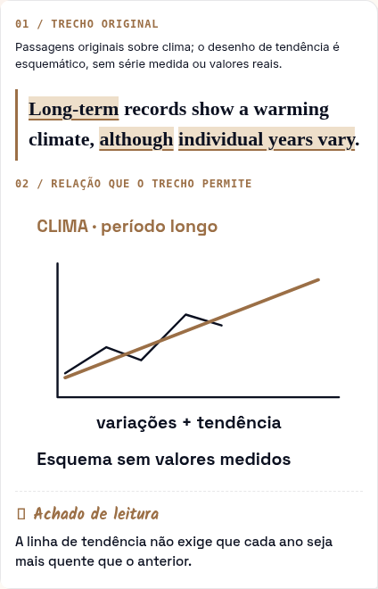

## Text Comprehension: Novels/Short Stories

ID: `summary-lingua-inglesa-text-comprehension-novels-short-stories` · configuração: `narrative-inference`

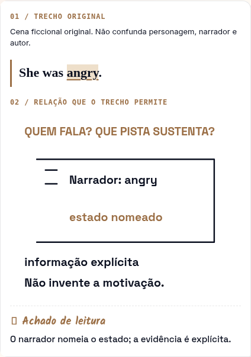

## Text Comprehension: Bacteria

ID: `summary-lingua-inglesa-text-comprehension-bacteria` · configuração: `bacteria-context`

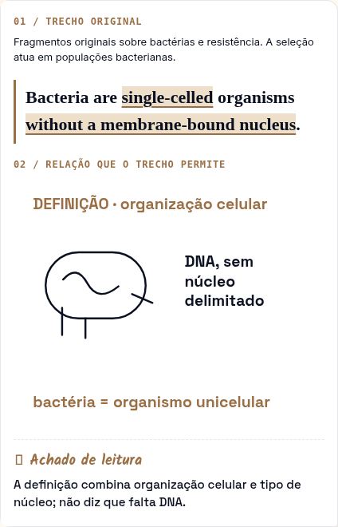

## Text Comprehension: Viruses

ID: `summary-lingua-inglesa-text-comprehension-viruses` · configuração: `comparison-signals`

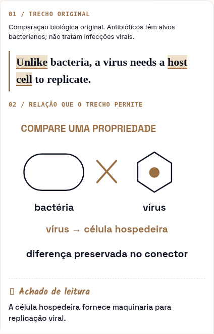

## Text Comprehension: Discrimination Against Women

ID: `summary-lingua-inglesa-text-comprehension-discrimination-against-women` · configuração: `stance-language`

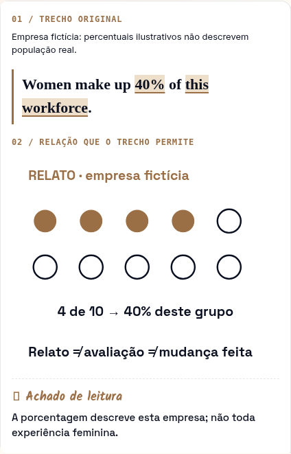

## Text Comprehension: Women Empowerment

ID: `summary-lingua-inglesa-text-comprehension-women-empowerment` · configuração: `empowerment-language`

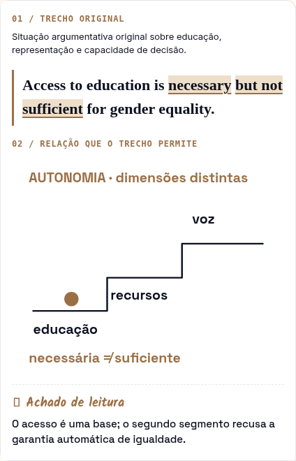

## Text Comprehension: Digital Technology

ID: `summary-lingua-inglesa-text-comprehension-digital-technology` · configuração: `digital-conditions`

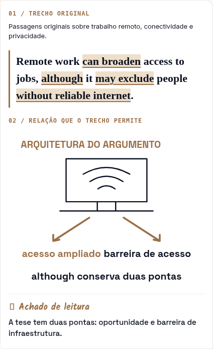

## Text Comprehension: Health – Probiotics

ID: `summary-lingua-inglesa-text-comprehension-health-probiotics` · configuração: `probiotic-evidence`

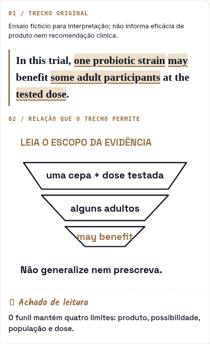

## Text Comprehension: Stem Cells

ID: `summary-lingua-inglesa-text-comprehension-stem-cells` · configuração: `stem-cell-trials`

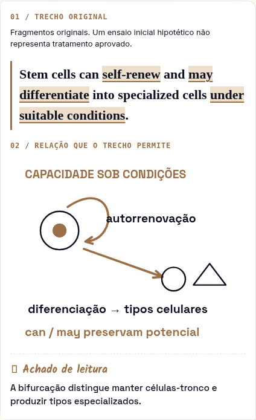

## Fatores de Textualidade

ID: `summary-entendimento-de-texto-fatores-de-textualidade` · configuração: `textuality`

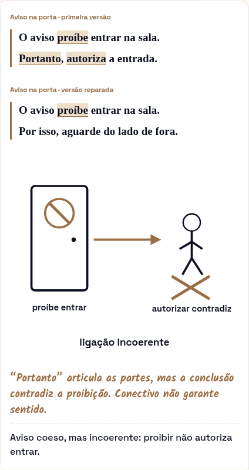

## Os Dois Níveis da Leitura

ID: `summary-entendimento-de-texto-os-dois-niveis-da-leitura` · configuração: `levels`

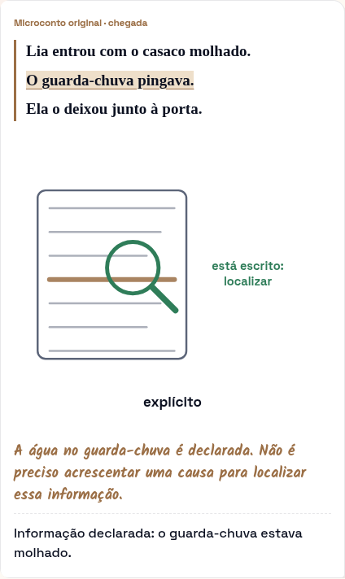

## Intertextualidade e Interdiscursividade

ID: `summary-entendimento-de-texto-intertextualidade-e-interdiscursividade` · configuração: `intertext`

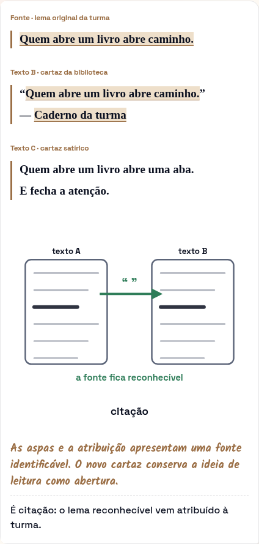

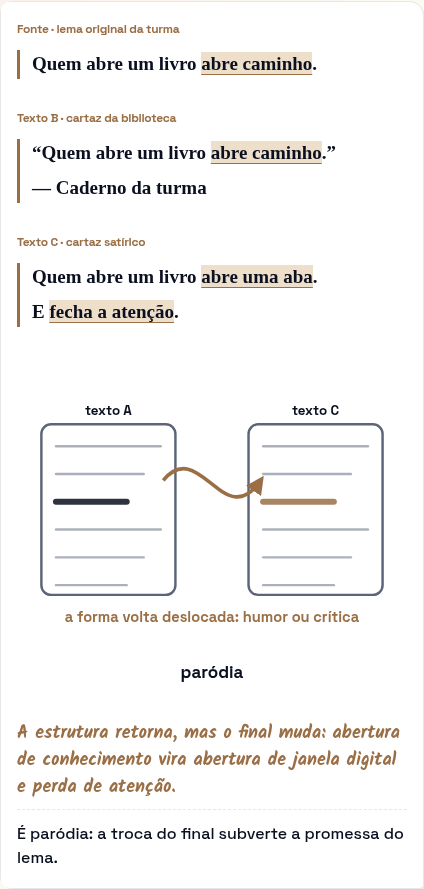

## Gêneros Textuais

ID: `summary-entendimento-de-texto-generos-textuais` · configuração: `genres`

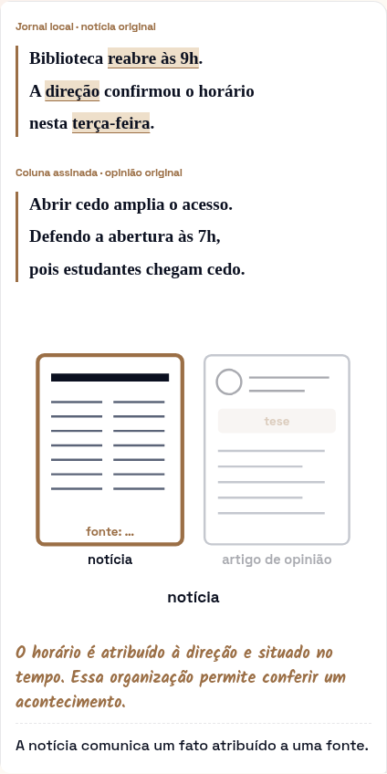

## Gêneros Narrativos e Níveis de Compreensão

ID: `summary-entendimento-de-texto-generos-narrativos-e-niveis-de-compreensao` · configuração: `narrative`

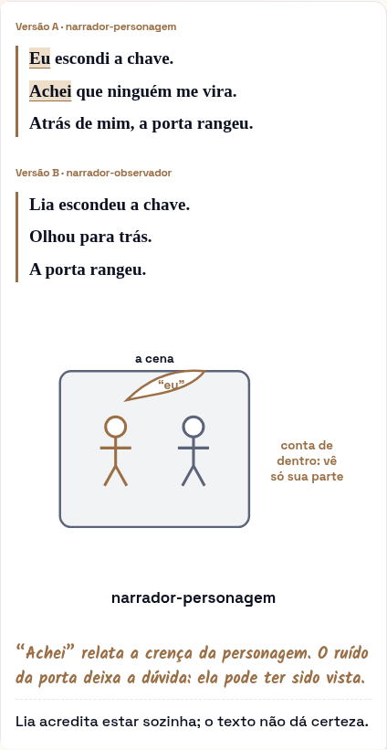

## Gêneros não Verbais: Fundamentos de Leitura

ID: `summary-entendimento-de-texto-generos-nao-verbais-fundamentos-de-leitura` · configuração: `nonverbal`

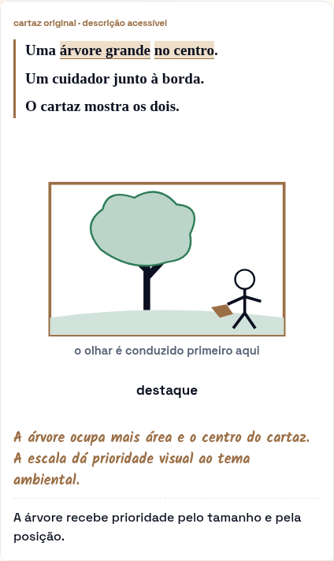

## Funções da Linguagem

ID: `summary-entendimento-de-texto-funcoes-da-linguagem` · configuração: `functions`

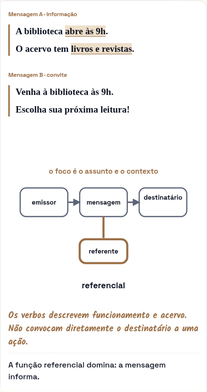

## Função Poética e Linguagem Literária

ID: `summary-entendimento-de-texto-funcao-poetica-e-linguagem-literaria` · configuração: `poetic`

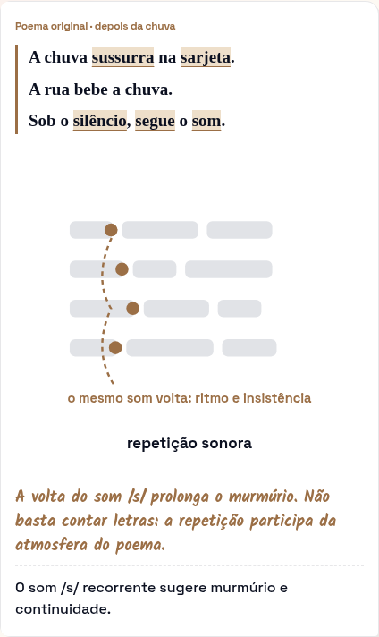

## Figuras de Linguagem

ID: `summary-entendimento-de-texto-figuras-de-linguagem` · configuração: `figures`

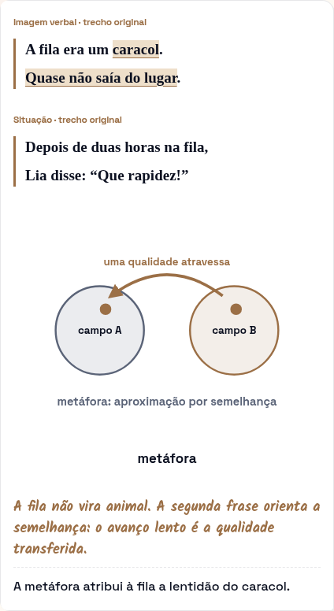

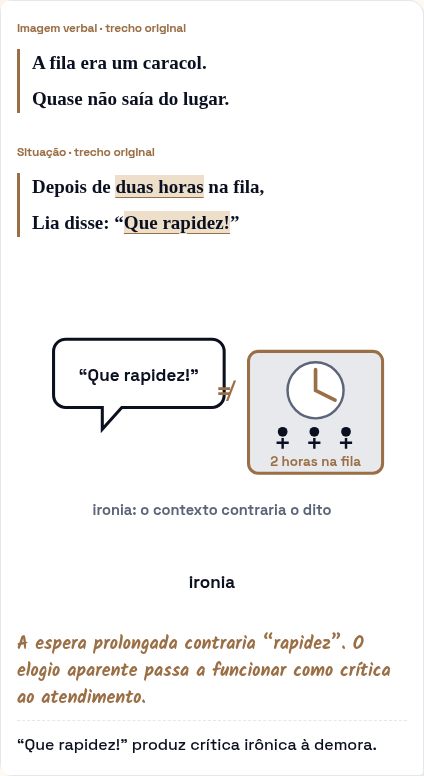

## Modelos de Leitura e Distorções Interpretativas

ID: `summary-entendimento-de-texto-modelos-de-leitura-e-distorcoes-interpretativas` · configuração: `distortions`

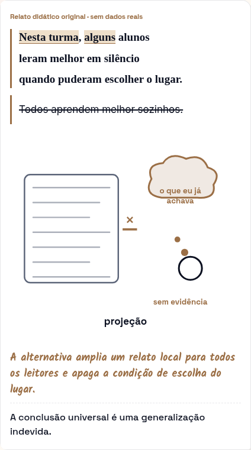

## Leitura de Textos Cômicos

ID: `summary-entendimento-de-texto-leitura-de-textos-comicos` · configuração: `comic`

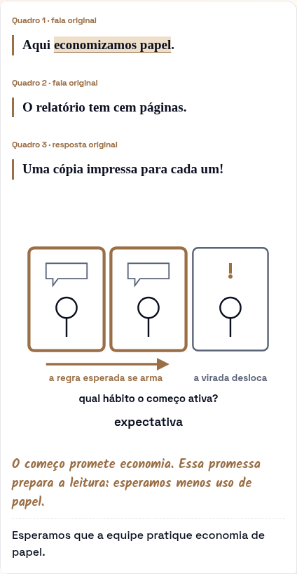

## Tecnologias Digitais da Informação e Comunicação (TDIC): Impactos Sociais

ID: `summary-entendimento-de-texto-tecnologias-digitais-da-informacao-e-comunicacao-tdic-impactos-sociais` · configuração: `tdic`

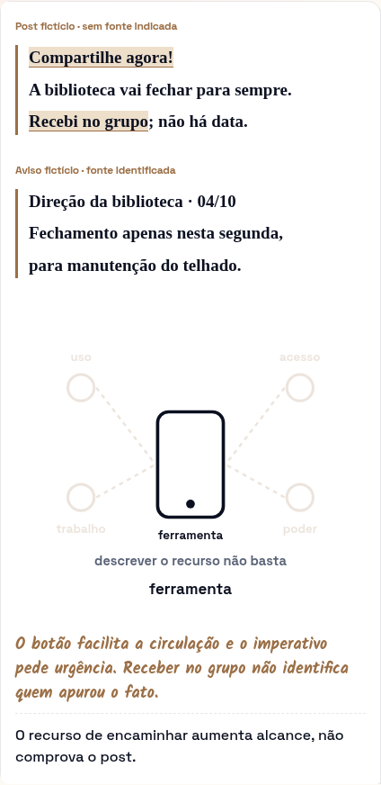
