# Capturas de viewport — Entrega F

Celular claro/reduzido e desktop escuro/normal. A prancha possui pan interno; a captura não contém toda a página. Estados e modificadores de todas as larguras estão nos resultados JSON.

## A Arte e suas Linguagens

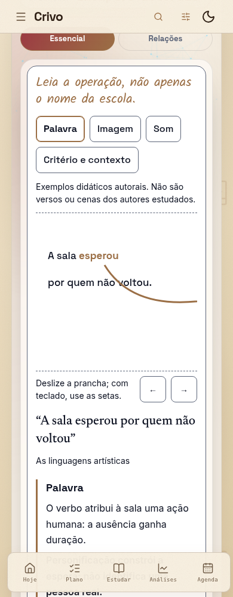

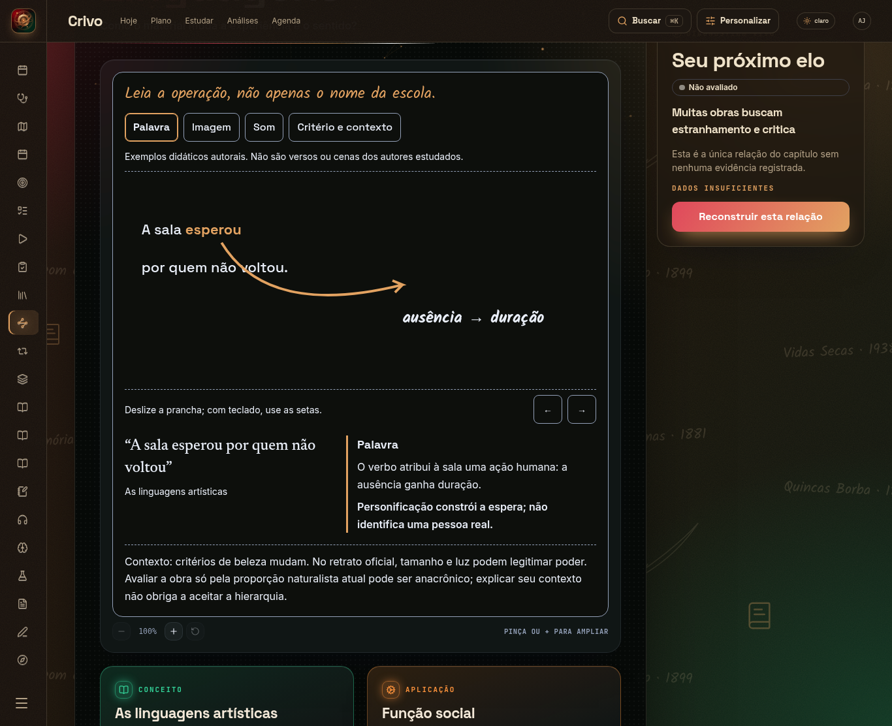

## Texto Literário x Texto não Literário

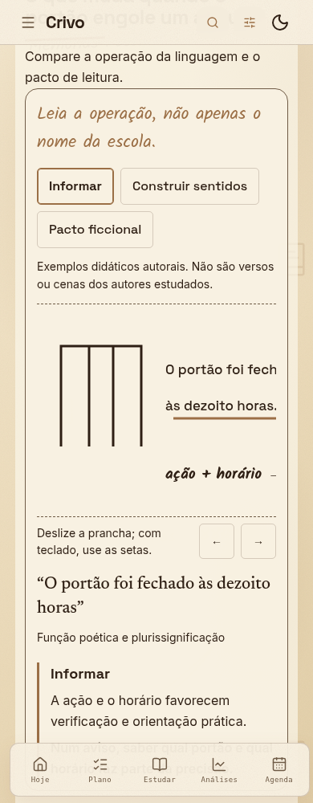

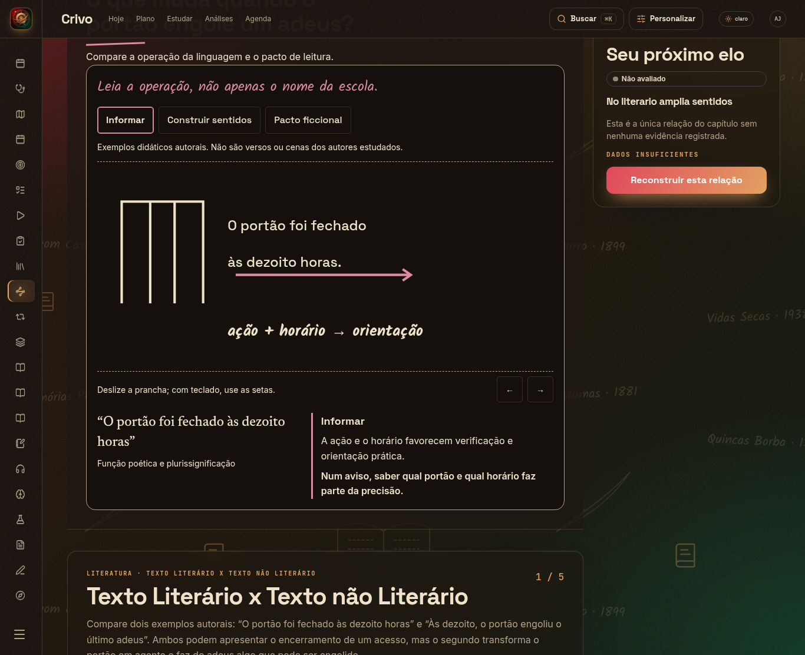

## Trovadorismo e Humanismo

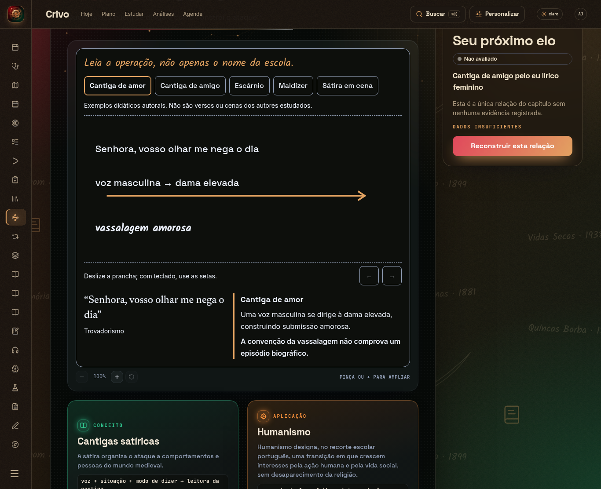

## Renascimento e Camões

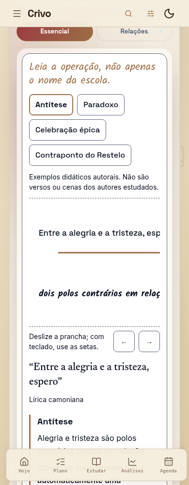

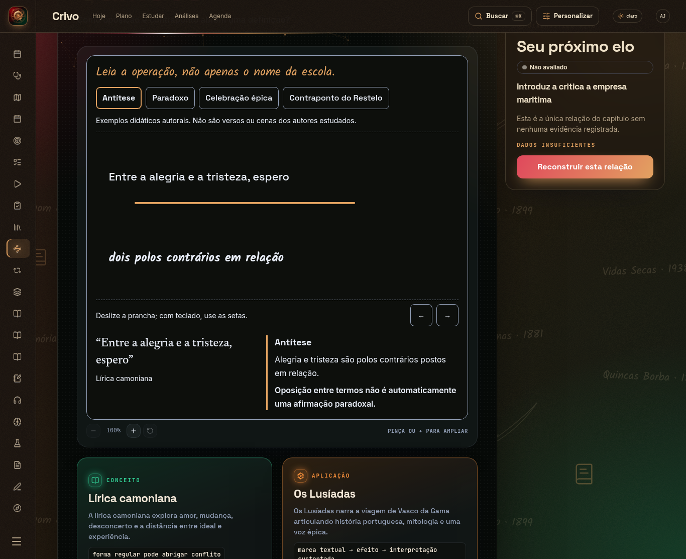

## Brasil: Primeiros Registros

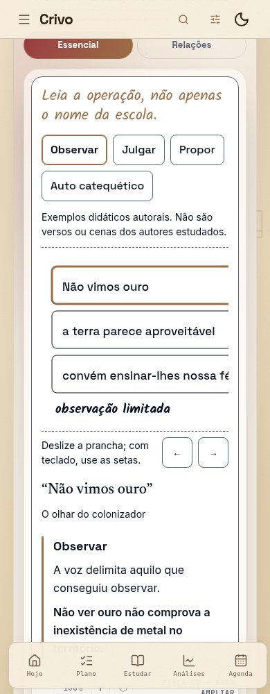

## A Estética Barroca

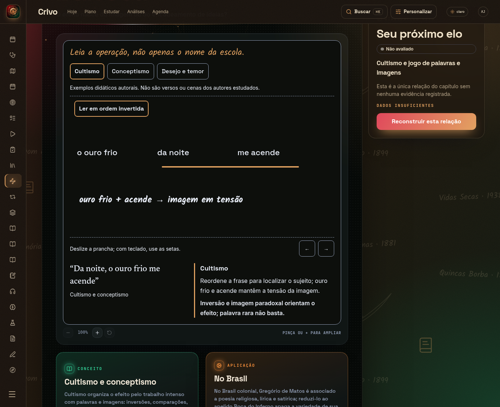

## A Estética Neoclássica

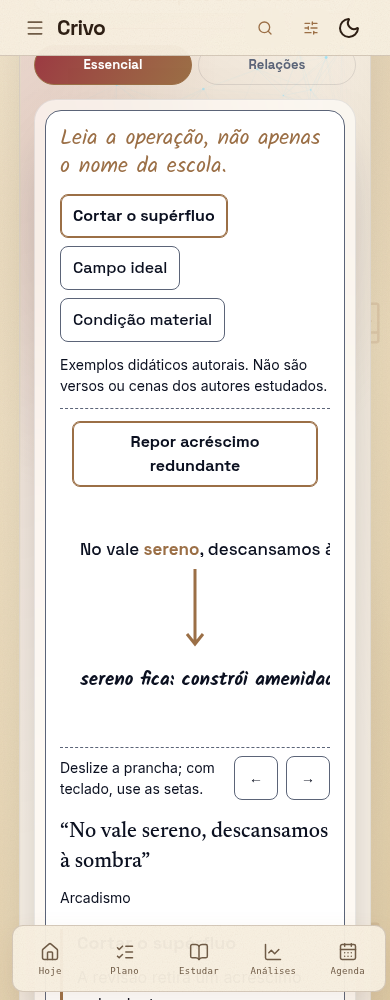

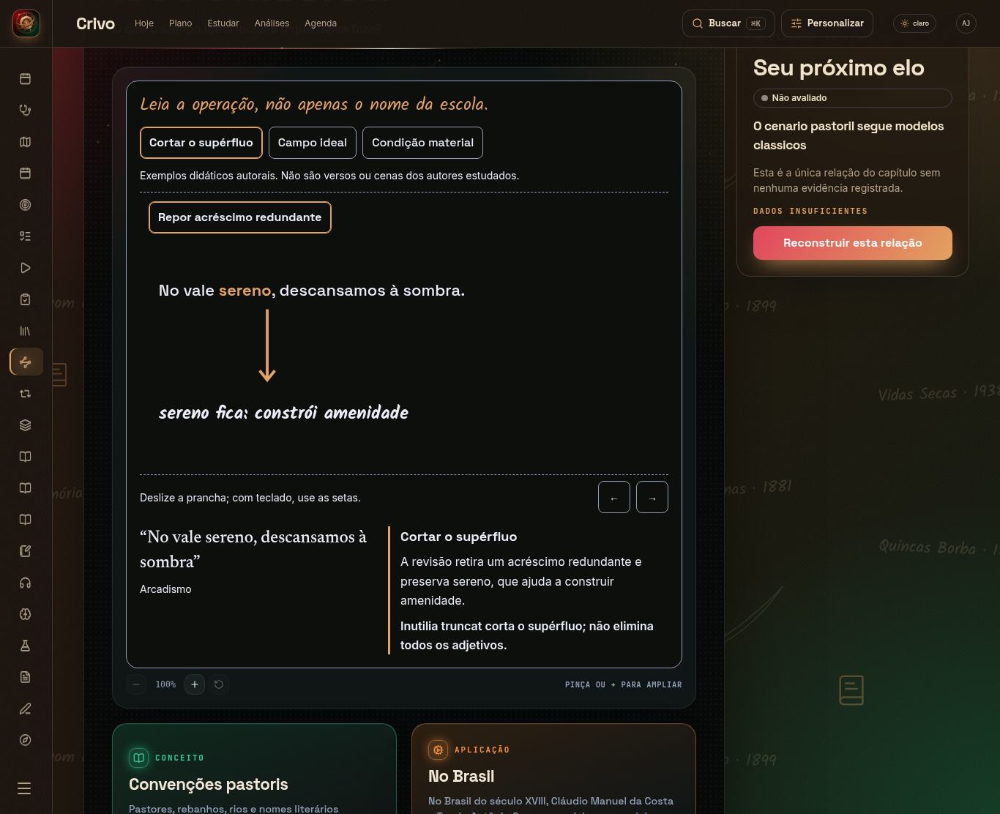

## Elementos da Narrativa

