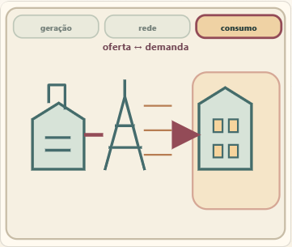
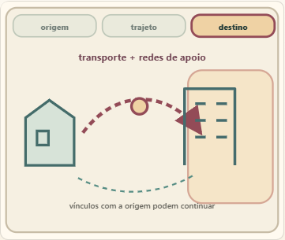
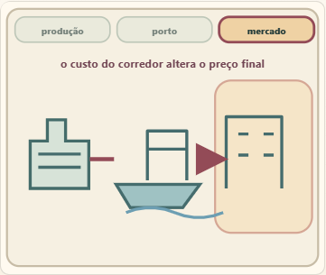
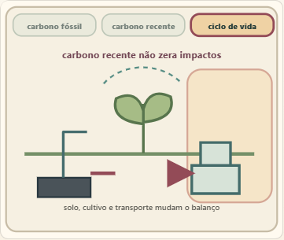

# Capturas de quatro instrumentos geográficos

Quatro capítulos × larguras 360, 375, 390, 768 e 1440 px × temas claro e escuro = 40 capturas. `audit.json` registra a leitura e os erros; `accessibility.json` registra as oito varreduras WCAG A/AA.

As figuras são esquemas didáticos. O instrumento mostra os recortes, observações, conclusões e cautelas do capítulo abaixo da figura.
