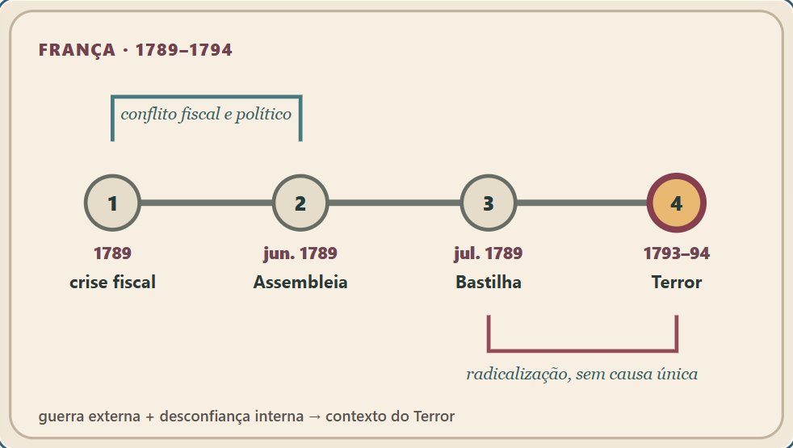
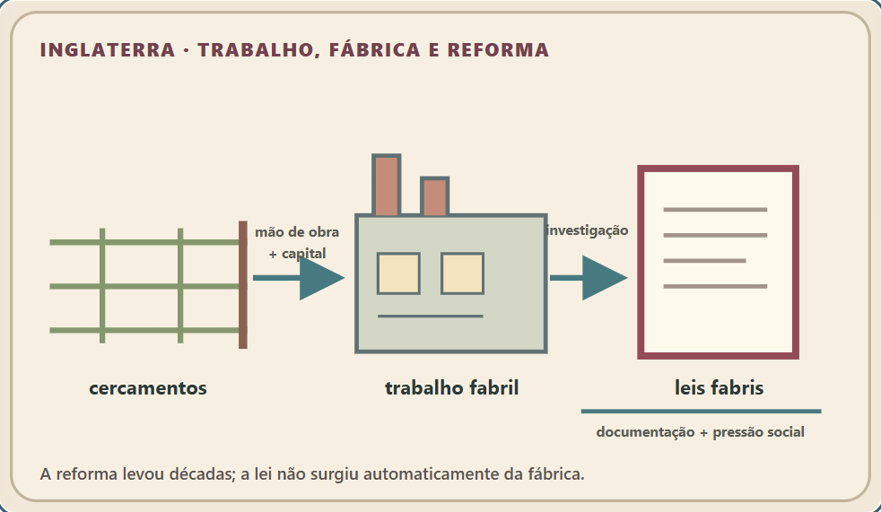
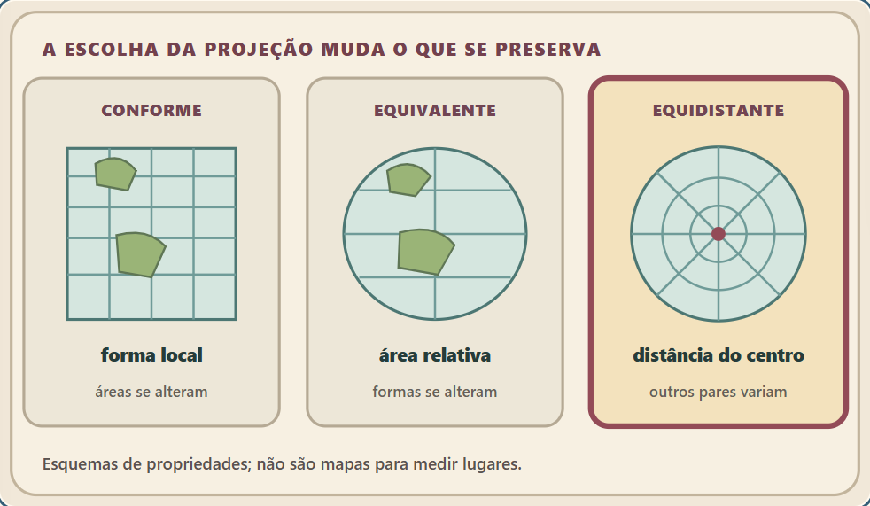
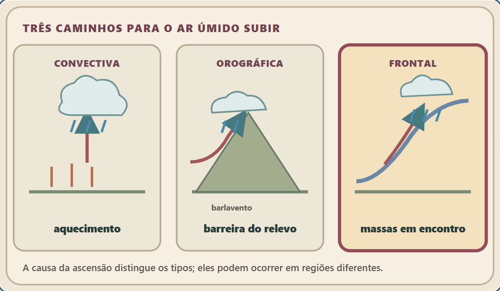

# Capturas do primeiro lote de História e Geografia

Quatro capítulos × cinco larguras (360, 375, 390, 768 e 1440 px) × dois temas = 40 capturas. `audit.json` guarda seleção, pan pelo teclado, overflow e erros; `accessibility.json` guarda as oito varreduras WCAG A/AA em 375 px.

## História

## Geografia

Os esquemas são uma camada de explicação, não mapas para leitura métrica ou documentos históricos reproduzidos. O texto de diagnóstico e as citações literais ficam abaixo de cada figura na interface.
